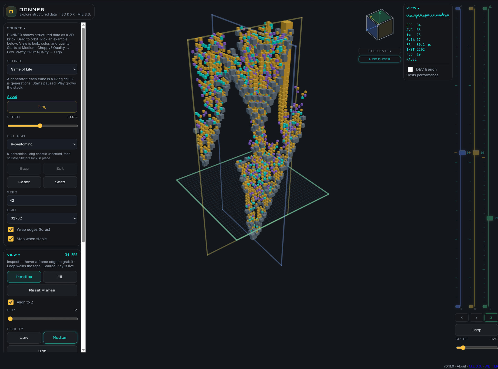

# DONNER

**Explore structured data in 3D and XR.**

A browser tab is the app. No install, no plugin, no desktop wrap.
Laptop, phone, headset — same page.

**Live:** [https://donner.mess.engineering/](https://donner.mess.engineering/)

AR and XR tested on **Pixel 11 Pro** and **Quest 3**.

> Explore in DONNER. Analyze in BLITZ.

DONNER is the 3D/XR explorer in **[WETTER](https://wetter.mess.engineering)**.
BLITZ is the 2D analysis sibling. They share datasets, not a GUI.

## Open it

Three examples in Source, on the left.

- **Game of Life** — *live generator.* Each cube is a living cell. Z is
  generations.
- **Lighter Ignition** — static event-camera counts of a lighter strike.
- **Brain MRI** — static example T1 atlas.

Drag to orbit. Scroll to zoom. Drop a `.npy` count cube onto the volume.
On a phone, pinch. On Quest, grab the volume in the room.

## Author

Philipp Mattern  
[M.E.S.S. – Mattern Engineering & Software Solutions](https://mess.engineering)

GPL-3.0. Example-cube notices: [`data/NOTICE.md`](data/NOTICE.md).
Architecture and local serve: [`architecture.md`](architecture.md).
