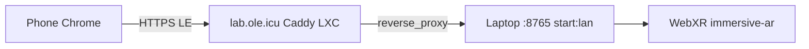

# DONNER

**WETTER** is a modular framework for structured processing, exploration, and
analysis of large experimental imaging datasets.

**Live overview:** [wetter.mess.engineering](https://wetter.mess.engineering)

**This repository** is **DONNER** — browser-native scientific 3D/XR
exploration for structured data, beside **BLITZ**.

> Explore in DONNER. Analyze in BLITZ.

> WOLKE finds it. DONNER explores it. BLITZ analyzes it.

DONNER and BLITZ may consume the same datasets or sidecars. They do not
share a GUI and stay separate applications. DONNER is a parallel app, not
a pipeline stage:

```text
Raw / Sensor Data
        |
        v
DAMPF → KEIM → WOLKE
                  |
           +------+------+
           |             |
           v             v
        DONNER          BLITZ
       Explore          Analyze
       3D / XR        2D / Stats
```

The HTML+JS scene **is** the product window (demo, phone, AR, XR).
Three.js is the current engine, not the name. A compiled desktop wrap
comes only when local files or a sidecar exist — not as an empty EXE
around `index.html`. Do not fold DONNER into BLITZ/PyQtGraph.

---

## What it is

**DONNER** (Dimensional Observation & Navigation: N-dimensional
Exploration & Rendering) is a browser-native scientific 3D/XR explorer
for structured data. It is not primarily an event-camera viewer.

| Source | Shape today |
|--------|-------------|
| Conway (demo shell) | `x, y, generation, state` |
| Count stack | `x, y, t, count` (EVT `.npy`) |
| MNI 152 | dense `x, y, z` intensity (count-cube path) |

MRI as a dedicated source kind / `ScalarVolume` is **later**. The public
T1 is still a dense count cube: Source → **MNI 152**
(`data/mni152_stack.npy`, symlink into `datasets/MRT/`). Native grid,
occupancy ~47 %, enclosed voxels culled so INST stays a hull (~140k).
Do not embed NiiVue. Do not add a NIfTI parser in the browser. SHIP
volumes under `datasets/MRT/` stay local working data (not git). ICBM
terms still apply — do not vendor the `.npy` on GitHub.

Conway is a teaching dataset, deterministic source, visual demo, and
performance benchmark — not the product identity. A count stack is the
first event-camera path. The renderer does not know whether a point came
from a cellular automaton, a sensor, or a volume file.

> Images aren't just pixels — they are structured data.

DONNER extends that idea: **matrix → volume / time series → explorative
3D (XR-A tabletop in; marker next)**.

## Axes (X, Y, Z)

For Conway and event-camera XYT cubes, **X and Y are the playfield**
(cell or sensor) and **Z is time** — the vertical stack. **Now** is
**Z = 0**: past below, newer slices (ghost) above. The playhead
(`tFocus`) walks that stack; it does not move the volume.

That mapping is a **source default**, not a core invariant. MRI/CT
volumes are spatial on all three axes. A later Dataset Contract will
carry axis role, unit, and spacing so the renderer does not hardcode
Z = time. Today the playhead can already walk **X, Y, or Z**.

| Axis | XYT default | On screen |
|------|-------------|-----------|
| **X** | playfield column | on the focus plane |
| **Y** | playfield row | on the focus plane |
| **Z** | time | vertical stack; **Z slider** (desktop: right, max at top; phone: bottom, max at the right) |

Three.js is Y-up internally. Product `(X, Y, Z)` is stored as world
`(X, Z, Y)`. UI, HUD, and docs always mean **product** X/Y/Z. Do not call
time “Y” in user-facing copy.

The numbered coordinate frame is **off**. Numbered axes with units return
later. Time is **not** a 3D gizmo on that frame: scrub with the
**Z stack slider**, like a 3D slicer through the generation stack
(desktop: max at the top, past at the bottom; phone: max at the right).
One tick per stored step.

## Run

Static files, no build step, no backend. ES modules need a local HTTP server
(opening `index.html` as `file://` will not load the import map).

```bash
cd DONNER
npm start
# python3 scripts/serve-http.py --bind 127.0.0.1  (also GET /stream-npy)
```

Open [http://127.0.0.1:8765/](http://127.0.0.1:8765/). Source → **Ignition**
loads `data/ignition_stack.npy`; **MNI 152** loads the native-grid T1 hull
(`data/mni152_stack.npy`). Both are symlinks into `datasets/` in the
WETTER-Suite layout. Load .npy and Stream are later live ingest (hidden
from Source).

```bash
# from DONNER/, if a demo file is missing:
mkdir -p data
ln -sfn ../datasets/EVT/ignition_stack.npy data/ignition_stack.npy
ln -sfn ../datasets/MRT/mni152_stack.npy data/mni152_stack.npy
```

Re-convert the T1 from `mni152.nii.gz` (native stride) with the recipe in
[`architecture.md`](architecture.md#mri-volume-later).

```bash
npm test    # unit tests (Node 18+)
```

### Phone on the LAN

`npm start` binds loopback only. For a phone on the same Wi-Fi, bind all
interfaces:

```bash
cd DONNER
npm run start:lan
# python3 scripts/serve-http.py --bind 0.0.0.0  (also GET /stream-npy)
```

Find the desktop LAN address, then open **http** (not https) on the phone
for orbit-only. Do not use `localhost` on the phone — that is the phone
itself.

```bash
hostname -I
# or: ip -4 addr show
```

Example: `http://192.168.178.30:8765/`

Phone and desktop must be on the same WLAN. If the page does not load,
check the firewall for port 8765, or that the address still matches
`hostname -I` (it can change). Fonts load from `mess.engineering`; without
internet the app still runs, with system fonts.

### HTTPS / WebXR (`lab.ole.icu`)

WebXR needs HTTPS. The lab door is **`https://lab.ole.icu/`**: a Caddy LXC
with Let’s Encrypt, reverse-proxying the laptop `npm run start:lan`
listener (`192.168.178.30:8765`). DNS `lab.ole.icu` is LAN-only. Do not
use `pve.ole.icu:8006`. The Caddyfile lives on the CT, not in this repo.



```bash
cd DONNER
npm run start:lan
curl -I https://lab.ole.icu/
# expect HTTP/2 200 while the laptop is serving
```

On the phone, open the same URL. **AR** is shown only when
`navigator.xr` supports `immersive-ar` (Android Chrome). A Chrome update
often resets **Augmented reality** for the site (lock icon → Site
settings) or fails the check if `Permissions-Policy:
xr-spatial-tracking=(self)` is missing. `npm run start:lan` and
`start:https` send that header; Caddy on `lab.ole.icu` should pass it
through (or set it on the CT). Without AR, the orbit viewer is unchanged.

If the LXC is down, local **mkcert** is the fallback:

```bash
cd DONNER
# once: install mkcert, then trust its CA on the phone
#   $(mkcert -CAROOT)/rootCA.pem
npm run start:https
```

That issues `certs/dev.pem` if missing (gitignored) and serves **https** on
port 8765, all interfaces. Open the printed `https://<lan-ip>:8765/` URL.
If the LAN IP changes, `npm run cert` again.

## Stage 1 (this tree)

- B3/S23 Conway from BLITZ (rules, wrap, seeds)
- Default seed: R-pentomino, started paused (Play to run). Blinker is the occupancy lesson if you pick it.
- Instanced cubes, Depth along the time axis (product **Z**)
- Speed, Depth (wake length), **Gap** (lattice spacing; 0 packs faces), play / pause / step / reset
- Playhead via the **slice stack** (default Z = time; X/Y optional). Desktop: beside the HUD, max at top; phone: bottom timeline
- Axis-colored playfield frames (inset playhead, smaller clips); grab an **edge** to move that plane (no numbered overlay, no hover hairlines)
- CAD viewcube, rail slot left of the View card (desktop orbit only): a face is a fitted 2D ortho cut with that plane's frame and grid; wheel zooms, Shift+wheel pages; the same face pages the stack; zoom/pan stay in the cut; **B** restores 3D. **Planes** under the cube (default on) shows or hides 3D frames.
- Parallax on/off (perspective vs orthographic at the current look). Align to Z pins XY and still pans along Z.
- Lighting is a **headlamp**: key/fill follow the view (orbit and AR walk). No Light slider. View **Quality** Low / Medium / High (default High) drops to unlit cubes and a pixel-ratio cap on weak GPUs.
- **Yaw** (AR): after place, overlay Yaw / swipe orients the pillar, then walk.
- **Play / Loop** and **Speed** under the slice rails (above the footer). Conway Play is Live View; MNI / Ignition Loop walks the marked axis. AR overlay keeps Play after spawn.
- Edit mode: tap cells inside the frame (Now only)
- Orbit / zoom / pan, including touch
- Display HUD (FPS, AVG, 1%/0.1% lows, sparkline, instances) on the right; Conway GEN / LIVE / RATE only while Conway Play is on. FPS uses raw frame time. Software rasterizers warn **SOFTWARE**.
- **Depth** is the live wake. **Pause** inspects the RAM tape (fog off; Z slab clips which gens are cubes; axis-colored planes and clips). **Fit** frames that slab; Z then moves only the plane. **Play** is Live View. **Stop when stable** pauses after five generations in a short cycle (period 1–15: stills and oscillators, not a wrapping glider).
- Layers: display engine vs Conway source vs encoding slot (see architecture.md)
- One left rail: **Source** then **View** (desktop stacked accordion; phone the same folds). View holds look, Color coding, Size by age, Cube cap, FPS (stays on the fold when collapsed). **DEV Bench** is on the right View HUD (costs performance; off until checked). Source holds data and Conway presets including Random + Fill. Loop axis X/Y/Z sits under the rails and highlights that plane.
- Source switch: Conway, **Ignition**, **MNI 152**. **Load .npy** and **Stream** are later live ingest (hidden). Demos are `data/*.npy` symlinks.
- Dirty-state render loop: camera motion does not rebuild EventSoA
- XR-A: WebXR `immersive-ar` passthrough. Phone: enter is passthrough only (no brick). **Search Anchor** starts floor hit-test; tap the gold square to spawn. **Reset Anchor** despawns and returns to search. No auto-lock, no timeout, no viewer-front preview. **Z** lifts off the floor; **Size** scales; **Yaw** turns. **Stand** is hidden on the phone overlay. Outer bound frames are off for the session. **AR** only if the device supports it. Phone chrome is the DOM overlay (IMU window). Quest (XR-C-0): no in-world menu and no Search / Reset Anchor button (Exit AR to place again); grab a frame to slide the volume; thumbstick yaws; both grips pinch size.

**Not in this tree yet:** Fibonacci, EVT3-in-browser, NPZ, polarity/occupancy/states encodings, Dataset Contract / ScalarVolume, NIfTI parser, DONNER backend, packed WOLKE selection / `viewer_index`, XR-B marker, XR-C-1 hands, QR door+spawn, points renderer. Public preview host `donner.mess.engineering` is later.

## Architecture

See [`architecture.md`](architecture.md), [`docs/gui.md`](docs/gui.md),
and [`docs/related.md`](docs/related.md) (Conway is the demonstrator,
not the product. Links found while looking around, not influences).

Three.js r180 is vendored under `vendor/three/` (MIT). socket.io-client
v4.8.1 is vendored under `vendor/socket.io/` (MIT) for the WOLKE
viewer. DONNER is GPL-3.0, same family as BLITZ.

## Author

Philipp Mattern
[M.E.S.S. – Mattern Engineering & Software Solutions](https://mess.engineering)
