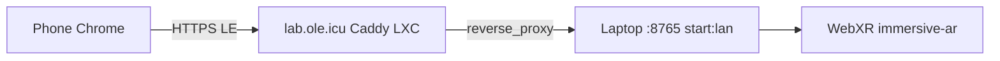

# DONNER

**WETTER** is a modular framework for structured processing, exploration, and
analysis of large experimental imaging datasets.

**Live overview:** [wetter.mess.engineering](https://wetter.mess.engineering)

**This repository** is **DONNER** — the space-time explorer beside **BLITZ**.
BLITZ inspects scientific matrices in 2D. DONNER explores the same class of
structured data as a 3D volume, with time as the third axis.

The core WETTER pipeline is unchanged:

```text
Raw Data → DAMPF → KEIM → WOLKE → BLITZ
```

DONNER is a parallel app, not a pipeline stage: **BLITZ & DONNER**.
Explore in DONNER; analyze in BLITZ. They share a data source, not a GUI.

The HTML+JS scene **is** the product window (demo, phone, later WebXR).
Three.js is the current engine, not the name. A compiled desktop wrap
comes only when local files or a sidecar exist — not as an empty EXE
around `index.html`. Do not fold DONNER into BLITZ/PyQtGraph.

---

## What it is

**DONNER** (Dynamic Observation and Navigation of Nonuniform Event
Representations) renders sparse space-time events in the browser.

| Source | Event |
|--------|--------|
| Conway (v1) | `x, y, generation, state` |
| Count stack | `x, y, t, count` (EVT `.npy`) |

Conway is the first demonstrator — deterministic, in-browser, no files.
A count stack is the first event-camera path: the same cubes, a different
source. The renderer does not know whether a point came from a cellular
automaton or a sensor.

> Images aren't just pixels — they are structured data.

DONNER extends that idea: **matrix → time series → space-time volume →
explorative 3D (XR-A session in; hit-test next)**.

## Axes (X, Y, Z)

DONNER labels axes the scientific way. **X and Y are the playfield** (cell
or sensor). **Z is time** — the vertical stack. The focus plane is **Z = 0**:
past below, newer slices (ghost) above.

| Axis | Meaning | On screen |
|------|---------|-----------|
| **X** | playfield column | on the focus plane |
| **Y** | playfield row | on the focus plane |
| **Z** | time | vertical stack; **Z slider** (desktop: right, Now at top; phone: bottom, Now at the right) |

Three.js is Y-up internally. Product `(X, Y, Z)` is stored as world
`(X, Z, Y)`. UI, HUD, and docs always mean **product** X/Y/Z. Do not call
time “Y” in user-facing copy.

The numbered coordinate frame sits on the **right** of the volume (away from
the control sheet). Hovering the plane draws two thin lines from the cell
to the X and Y axes. Time is **not** a 3D gizmo on that frame: scrub with
the **Z stack slider**, like a 3D slicer through the generation stack
(desktop: Now at the top, past at the bottom; phone: Now at the right).
One tick per stored step.

## Run

Static files, no build step, no backend. ES modules need a local HTTP server
(opening `index.html` as `file://` will not load the import map).

```bash
cd DONNER
npm start
# same as: python3 -m http.server 8765 --bind 127.0.0.1
```

Open [http://127.0.0.1:8765/](http://127.0.0.1:8765/). Source → **Count stack**
loads `data/ignition_stack.npy` (symlink to `../datasets/EVT/` in the
WETTER-Suite layout). Or use **Load .npy**.

```bash
# from DONNER/, if the demo file is missing:
mkdir -p data
ln -sfn ../datasets/EVT/ignition_stack.npy data/ignition_stack.npy
```

```bash
npm test    # unit tests (Node 18+)
```

### Phone on the LAN

`npm start` binds loopback only. For a phone on the same Wi-Fi, bind all
interfaces:

```bash
cd DONNER
npm run start:lan
# same as: python3 -m http.server 8765 --bind 0.0.0.0
```

Find the desktop LAN address, then open **http** (not https) on the phone
for orbit-only. Do not use `localhost` on the phone — that is the phone
itself.

```bash
hostname -I
# or: ip -4 addr show
```

Example: `http://192.168.178.30:8765/`

Phone and desktop must be on the same WLAN. If the page does not load,
check the firewall for port 8765, or that the address still matches
`hostname -I` (it can change). Fonts load from `mess.engineering`; without
internet the app still runs, with system fonts.

### HTTPS / WebXR (`lab.ole.icu`)

WebXR needs HTTPS. The lab door is **`https://lab.ole.icu/`**: a Caddy LXC
with Let’s Encrypt, reverse-proxying the laptop `npm run start:lan`
listener (`192.168.178.30:8765`). DNS `lab.ole.icu` is LAN-only. Do not
use `pve.ole.icu:8006`. The Caddyfile lives on the CT, not in this repo.



```bash
cd DONNER
npm run start:lan
curl -I https://lab.ole.icu/
# expect HTTP/2 200 while the laptop is serving
```

On the phone, open the same URL. **AR** is shown only when
`navigator.xr` supports `immersive-ar` (Android Chrome). Without AR, the
orbit viewer is unchanged.

If the LXC is down, local **mkcert** is the fallback:

```bash
cd DONNER
# once: install mkcert, then trust its CA on the phone
#   $(mkcert -CAROOT)/rootCA.pem
npm run start:https
```

That issues `certs/dev.pem` if missing (gitignored) and serves **https** on
port 8765, all interfaces. Open the printed `https://<lan-ip>:8765/` URL.
If the LAN IP changes, `npm run cert` again.

## Stage 1 (this tree)

- B3/S23 Conway from BLITZ (rules, wrap, seeds)
- Default teaching seed: Blinker (glider is the XY-motion case)
- Instanced cubes, Depth along the time axis (product **Z**)
- Decay, speed, Depth (wake length), play / pause / step / reset
- Playhead via the **Z stack** (desktop: beside the HUD, Now at top; phone: bottom timeline, Now at the right)
- Gold playfield frame; numbered X/Y on the right; hover hairlines, cell and cube outlines
- Bird-eye: orthographic top view of the focus plane
- Play / Pause outside the sheet (desktop under the Z rail; phone bottom center)
- Edit mode: tap cells inside the frame (Now only)
- Orbit / zoom / pan, including touch
- Display HUD (FPS, AVG, 1%/0.1% lows, sparkline, instances) separate from Conway source HUD (generation, live, rate); FPS uses raw frame time. Software rasterizers warn **SOFTWARE**.
- **Depth** is the live wake. **Pause** inspects the RAM tape (fog off; Z slab clips which gens are cubes; cyan plane, gold cuts). **Fit** frames that slab; Z then moves only the plane. **Play** is Live View. **Stop when stable** pauses a still or empty board after five identical grids (not a wrapping glider).
- Layers: display engine vs Conway source vs encoding slot (see architecture.md)
- Two left sheets: **View** (display + encoding + bench) and **Source** (Conway or count stack). Phone: View ▸ / Source ▸.
- Source switch: Conway ↔ EVT count cube (`.npy`). Demo: `data/ignition_stack.npy`. **Load .npy** for other stacks.
- Dirty-state render loop: camera motion does not rebuild EventSoA
- XR-A session: WebXR `immersive-ar` passthrough; volume world-locked ~0.8 m in front of the viewer (tabletop scale). **AR** only if the device supports it. Hit-test / tap-to-place is next.

**Not in this tree yet:** Fibonacci, EVT3-in-browser, NPZ, polarity/occupancy/states encodings, backend, streaming, BLITZ sync, plane hit-test, XR-B/C, points renderer.

## Architecture

See [`architecture.md`](architecture.md), [`docs/gui.md`](docs/gui.md),
and [`docs/related.md`](docs/related.md) (Conway is the demonstrator;
DONNER is the event viewer. Links found while looking around, not
influences).

Three.js r180 is vendored under `vendor/three/` (MIT). DONNER is GPL-3.0,
same family as BLITZ.

## Author

Philipp Mattern
[M.E.S.S. – Mattern Engineering & Software Solutions](https://mess.engineering)
