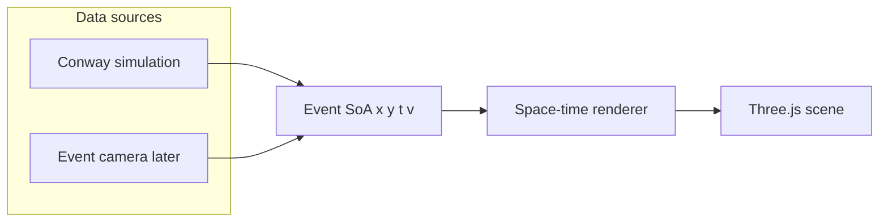
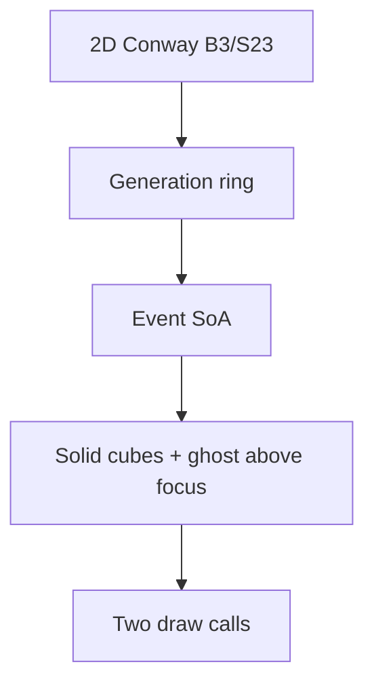
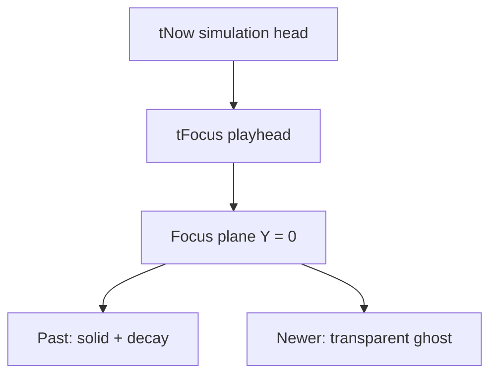
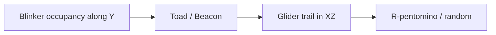

# DONNER architecture

DONNER is a static browser app: **data source → events → space-time renderer**.
It is an **event viewer**. Conway is the v1 demonstrator — a cheap generator
of `(x, y, t, v)` — not the product. The later source is an event camera.
The renderer must not know which source produced a point.







Paint/edit applies only when `tFocus === tNow`. Scrubbing is view-only.

## Mapping

| Concept | Conway | Event camera (later) | World axis |
|---------|--------|----------------------|------------|
| Spatial | cell `x, y` | sensor `x, y` | X, Z |
| Time | generation | timestamp | Y (focus plane at 0; past below, newer above) |
| Value | alive = 1 | polarity | `v` |
| Dynamics | still / osc / transit / warmup | later (not this classifier) | `k` (color); time stays on Y |

Conway **seeds** the volume and is a GPU/browser load generator. It is
not the destination. Live demos target event-camera streams
(`x, y, timestamp, polarity`) through the same SoA. Still / oscillator /
transit and the 5×5 motion gate live in `src/dynamics.js` as a **Conway
adapter**. Do not treat that legend as the event-camera product: polarity,
rate, and other encodings attach later. The renderer only consumes packed
events (`x, y, t, v, k, s`).

Time is not a fake spatial dimension: it is the third axis of a space-time
volume. **Start with a blinker**, not a glider: the pattern sits still in
XZ and oscillates along Y. A glider is the later case — a trajectory
through the volume (motion in XZ plus time).

Present sits at generation `tNow`. The **focus plane** is `tFocus`
(`tNow` minus a scrub offset) and is always world `Y = 0`. Older slices
sit below; newer slices sit **above as a transparent ghost** so the
focused generation stays readable. Decay weights the past under the
plane; **history** is the window instantiated from the simulation head.

This split matches the later event-camera design:

- **Time window** — which interval exists in the buffer
- **Focus / playhead** — which slice is the working plane
- **Decay** — how strongly older events below that plane fade
- **Color** — worldline class (still / oscillator / transit / warmup), not age

Hue is not used for time. An oscillator **oscillates in occupancy** along
Y: cyan cubes appear and vanish; the off phase is empty, not a second
color. A still life is a gold pillar. A glider is a BLITZ-red **transit
tube** — the curve through XZ+Y. Occupancy of one pixel is not enough:
a spaceship overlapping a cell for a few gens looks still/osc on that
worldline. Still/osc require the 5×5 neighborhood centroid to stay put
(net shift over two generations). Translating activity is always
transit. Generations `t = 0, 1` are **warmup** (gray). Cube **scale**
follows Stability **None / Time / Focus**. Decay is brightness only.

Default seed is **Blinker**, Stability **Time**. Teaching order: Blinker →
Toad / Beacon → Glider → R-pentomino / soup.



## Later: on-volume focus

Scrub focus by dragging the **time axis** in the scene while paused: taller
corner posts on the playfield frame plus a small XYZ gizmo (spatial X/Z,
time = world Y). Out of scope until that interaction is designed against
OrbitControls.

## Later: nerd FPS HUD

Replace the numeric FPS/FR lines with a M.E.S.S. homepage-style nerd overlay:
sparkline of recent frame times plus rolling averages (and maybe 1%/0.1%
lows). Purpose: see until which grid/history/instance count the browser stays
stable. Do not block Conway/stability work on this.

## Later: bird-eye view

A button (or camera preset) that looks **straight down** onto the focus
plane with an **orthographic** camera: no perspective, no parallax. The
current generation reads as a flat 2D grid. Out of scope until occupancy
along Y is readable without it.

## Later: isolation / observation mode

Pick one grid cell `(x, y)`. Dim the rest of the volume to a faint
transparent field. Keep that cell's **worldline pillar** fully lit through
time so a side-on view shows only one column. Complements bird-eye (whole
plane, top-down) rather than replacing it.

## Modules

| File | Role |
|------|------|
| `src/conway.js` | B3/S23, seeds, wrap — port of BLITZ `blitz/data/conway.py` |
| `src/dynamics.js` | Worldline class still / oscillator / transit |
| `src/spacetime.js` | Generation ring → `EventSoA` (`x, y, t, v, k`) |
| `src/focus.js` | `tFocus` vs `tNow` (scrub clamp) |
| `src/renderer.js` | Solid + ghost instanced cubes; focus frame |
| `src/main.js` | Scene, loop, edit/paint, camera |
| `src/ui.js` | HUD controls |

BLITZ **Ember** decay is a 2D grayscale trail and is **not** used here.
DONNER decay is visual weight along the time axis.

Random soup uses `mulberry32`. It is **not** bit-identical to NumPy's
generator in BLITZ. Patterns (glider, blinker, toad, beacon, R-pentomino,
Gosper gun) match BLITZ cell for cell.

## Renderer contract

The cube renderer is the first implementation, not the only one. A later
points / shader path should keep:

```text
setEvents(soa, { tFocus, decay, timeScale, width, height, cellSize })
```

`EventSoA` is packed typed arrays. Newest slices fill first so the present
is kept if instance capacity is exceeded (`truncated` flag in the HUD).

No WebSocket, no BLITZ sync, no EVT3 decode in the browser. Those attach
behind the same SoA later:

```text
Event camera → sidecar → standardized events
                          ├─ BLITZ (dense stack)
                          ├─ DONNER (space-time 3D)
                          └─ DONNER XR (same scene)
```

## Performance envelope

Instanced cubes: one mesh, up to 200 000 instances. Default 32×32 × 48
generations is tens of thousands of cubes at typical Life density.
Scale the grid and history from the HUD; treat Conway as a synthetic
load generator before real event streams.

## Stages

1. **Conway 3D** — this tree
2. **Event camera** — `x, y, t, polarity` point cloud
3. **XR** — same scene on Meta Quest 3 (WebXR)
4. **Integration** — optional sidecar / BLITZ-synced views

## WETTER context

```text
Image → matrix
Matrix → dynamic state
Time series → space-time volume
Event stream → sparse space-time point cloud
Browser / XR → explore that structure
```

## Related work

DONNER is an event viewer. Conway is only the v1 generator of sparse
events. Stacking Life along a time axis is not a new picture, and it is
not the product. See [`docs/related.md`](docs/related.md) — things found
while looking around, not influences. The internal Life reference while
the demonstrator is in the tree is Wolfram 2025 (same page); it is not a
spec for DONNER.
