# DONNER architecture

DONNER (Dimensional Observation & Navigation: N-dimensional Exploration
& Rendering) is a static browser app: **source adapter → volume →
renderer**. It is a **scientific 3D/XR explorer** for structured data,
not primarily an event-camera viewer. Conway is the demo-shell generator
of `(x, y, t, v)` — not the product. Event-camera stacks, dense volumes,
and later streams share the same display. The renderer must not know
which source produced a point.

**Explore in DONNER. Analyze in BLITZ.**
**WOLKE finds it. DONNER explores it. BLITZ analyzes it.**
DONNER is a parallel app, not a pipeline stage and not a 3D mode of
BLITZ. Both consume the same structured dataset; they do not share a GUI.

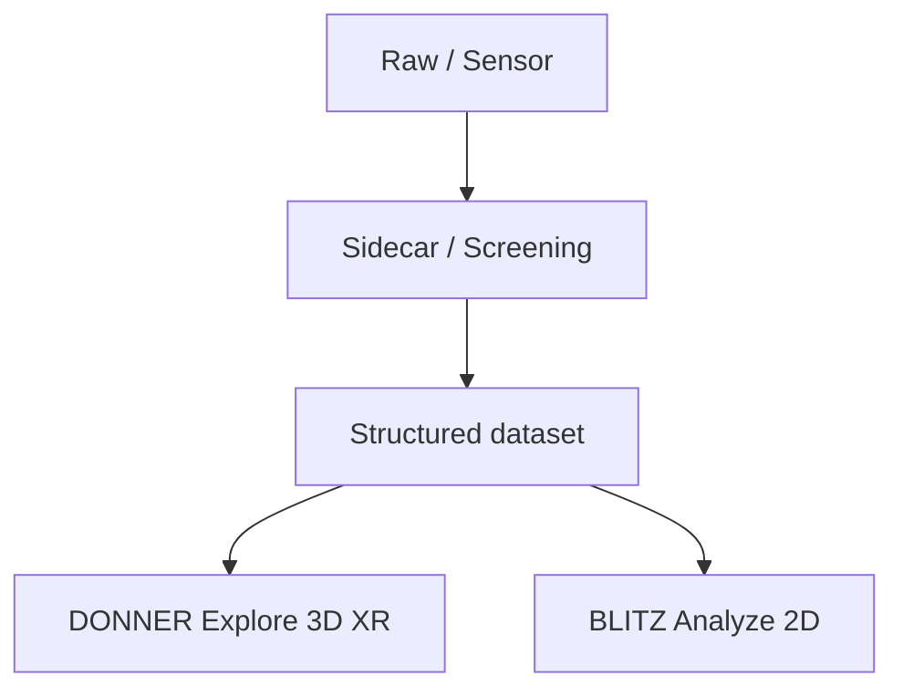

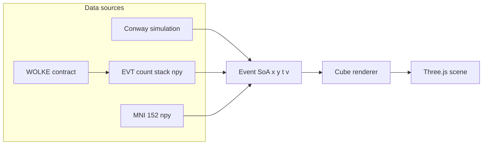

## Now vs later

**Now (runtime):** source addon → encoding adapter → `EventSoA` → cube
renderer. `CountVolume` keeps event-count semantics (non-negative
integers, occupancy). Conway / count / MNI still unpack into the same
SoA. The demo shell may offer Conway, Load `.npy`, Stream, and AR/XR;
that showcase UI is not the internal architecture.

**Later (after a public preview):** a Dataset Contract so axis roles,
units, spacing, affine, and value semantics are not hardcoded.
`ScalarVolume` for generic scientific volumes (MRI/CT, including
negative Hounsfield units). Point renderer for large sparse clouds.
WETTER Viewer Contract (packed selection / `viewer_index`). See
[Later: Dataset Contract](#later-dataset-contract).

Do not start that contract, `ScalarVolume`, or a PointRenderer in the
same slice as finishing XR-C or shipping a public preview.

## Serve

Static files. ES modules need HTTP (`file://` will not load).

```bash
npm start             # http://127.0.0.1:8765/
npm run start:lan     # phone on the same Wi-Fi
npm test
```

WebXR needs HTTPS. Lab door: `https://lab.ole.icu/` (Caddy →
`start:lan`). Fallback: `npm run start:https` (mkcert). Servers send
`Permissions-Policy: xr-spatial-tracking=(self)`.

GitHub Pages: `.github/workflows/pages.yml` after the repo is public (or
GitHub Pro). `.nojekyll` keeps vendor paths. Door: `?src=ignition`,
`?src=mni152`, `?quality=high`.

## Layers

DONNER is the **display engine**. Conway is a **source addon**. Color and
cube fill are an **encoding slot** the active addon fills — not Life
identity baked into the renderer.

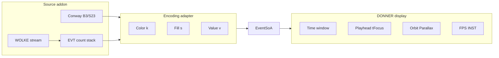

| Layer | Owns | UI now |
|-------|------|--------|
| **Display** | Orbit, Parallax, Align to Z, Quality (Low/Medium/High), headlamp (view-locked on Medium/High), CAD gizmo, Hide center / Hide outer (viewcube), three slice rails (X/Y/Z), loop axis under the rails, Play/Loop + Speed under the rails, shade (Hull/Ghost/Cuts), Depth (live wake), cache tape, FPS/INST, Color coding, Conway Size by age, Cube cap | Sheet **View** + right display HUD + rails. **DEV Bench** is on the right HUD. |
| **Source** | Kind switch. Game of Life / Lighter Ignition / Brain MRI (ids `conway` / `ignition` / `mni152`). Conway: Pattern, Random Fill, Seed, Wrap, Grid, Step, Reset, Edit. File/stream ingest later (hidden). Loading spinner on source/cube switch. Visitor blurb + About. | Sheet **Source** (config, top of the left rail) |
| **Encoding** | Color LUT (`k`) and fill (`s`). Conway: still/osc/unsettled/base + Size by age (Start fill, Tail gens). Count: integer rungs via **Scale** (DONNER / Gray / Inferno / Plasma / Turbo); color only, no size-by-count. Polarity later. | Color coding + Scale in the **View** sheet. LUT in `src/encoding.js` |

**Play / Loop** and **Speed** sit under the slice rails (above the footer),
not in Source. AR overlay still has Play after spawn. Loop axis X/Y/Z
is the **highlighted** playhead (same as grabbing that plane). Ghost
solids that plane. Hull+Loop grows a potato from the axis origin through
the playhead and hides the +side plus clip edges. Cuts already shows
three slices. For Conway, **Play** is Live View:
the generator runs, the playhead stays at Now, the Z stack is locked
(`LIVE`); GEN / LIVE / RATE appear in a small overlay only while that
Play is on. **Pause** is Inspect. A **count stack** or **MNI 152** opens
in Inspect; the button reads **Loop** and scrubs the marked axis inside
the clips. Dense MRI gold starts at full extent. Shade (Hull / Ghost /
Cuts) is the same peek logic for MRI and Ignition.

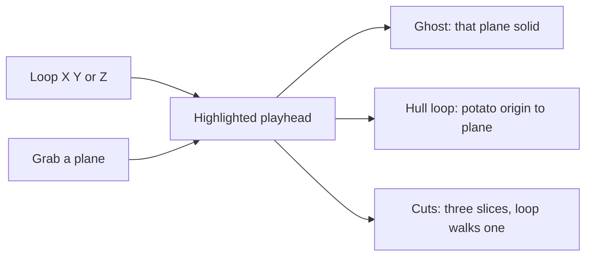

**Depth** is live-only GPU wake (hidden
in Inspect). **Decay** is off (Z/time fade later / opt-in; cache is
viewer-owned). When on it would fade toward the oldest drawn slice
(live: back of Depth; inspect: tape start).

The cube renderer indexes `k` through `src/encoding.js` (`CONWAY_KIND_HEX` or
`countKindHex`, `encodingFill`). Do not move GEN into Encoding.

The left chrome is one stacked rail, not two persistent columns:

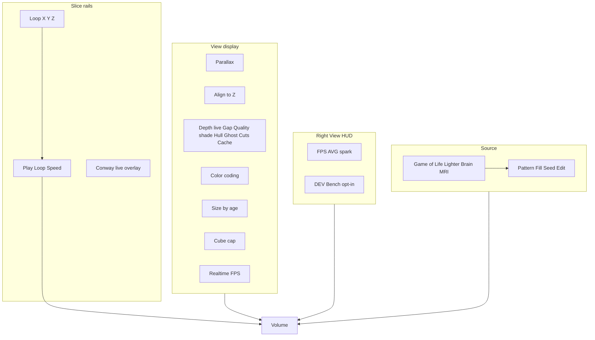

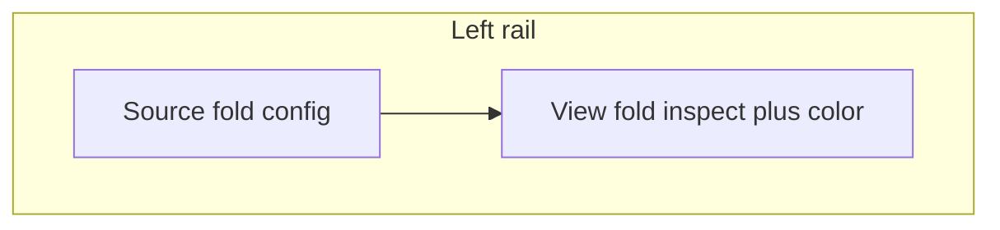

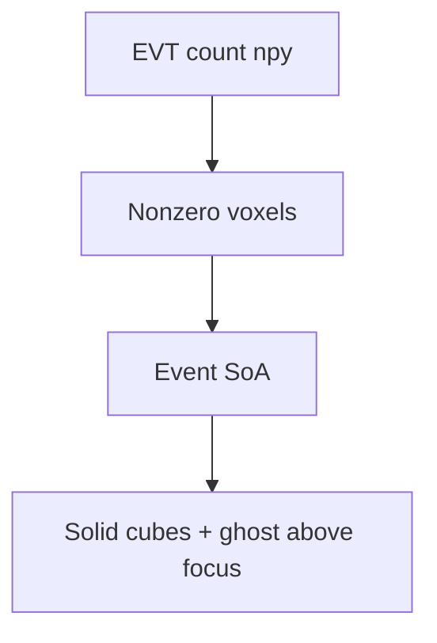

A **WOLKE-contract viewer** is another way to get that cube. Socket.IO
only announces `send_file_message`. The browser then GETs same-origin
`/stream-npy?u=…`; `scripts/serve-http.py` (and HTTPS) pulls the `.npy`
from the sidecar on the laptop so Chrome Local Network Access / CORS
cannot hide the body. The EVT sidecar already speaks this protocol
(`http://127.0.0.1:5055`, token `evt`). Packed selection and
`viewer_index` are not this slice.

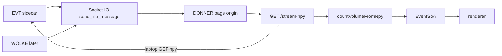

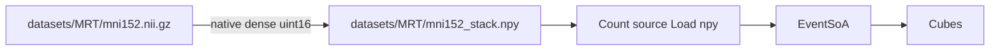

MRI is a **later** source addon, not a second product. A public T1
is converted to a count-shaped `.npy` (see
[MRI volume (later)](#mri-volume-later)). There is no NIfTI parser in the
browser. Source → **MNI 152** loads the native-grid hull.

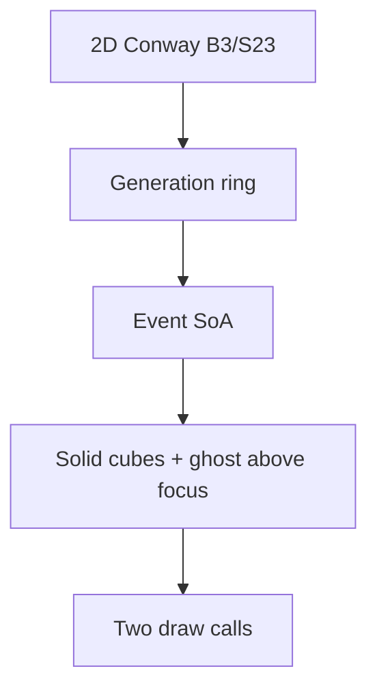

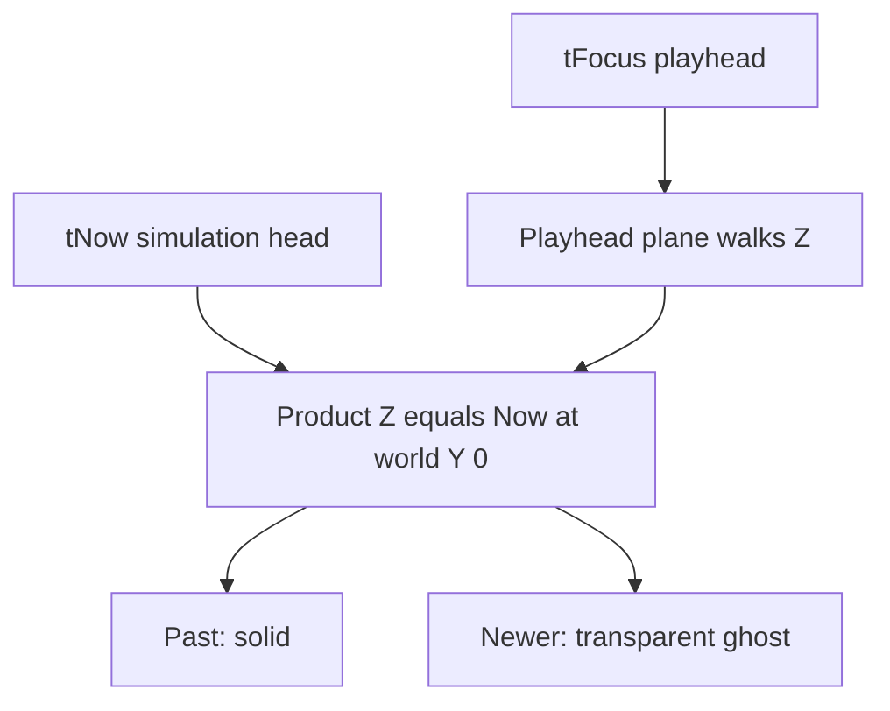

Paint/edit applies only when `tFocus === tNow`. Scrubbing is view-only.
Bird-eye is gone: **Parallax** off is orthographic at the current look.
A CAD viewcube **face** is a 2D cut (ortho, that product axis, one plane).
Orbit away from the axis restores the 3D slab. Worldline
isolation is deferred (later: rectangle select). Scrub the **stack**
(desktop: right, Now/max at the top; phone: bottom, Now/max at the right)
along Z (time, default) or X/Y, or Shift+wheel. Inspect adds two **slab**
handles: samples outside the band are not drawn. On X/Y, cells inside the
band fade from the playhead plane (ghost) and vanish at the clip grips unless
the viewcube cut is on. **Decay** is off (later / opt-in along Z/time
only; it does not drive that spatial fade).

## Mapping

Product axes **default for Conway and EVT count stacks** are **X, Y =
playfield**, **Z = time**. Three.js is Y-up, so the engine stores product
`(X, Y, Z)` as world `(X, Z, Y)`. UI copy always uses product names.

This is an XYT **source default**, not a core invariant. Dense MRI is
spatial on X, Y, and Z; the playhead can already walk any axis. Do not
bake “Z is time” into a future core. Axis role belongs on a later
Dataset Contract.

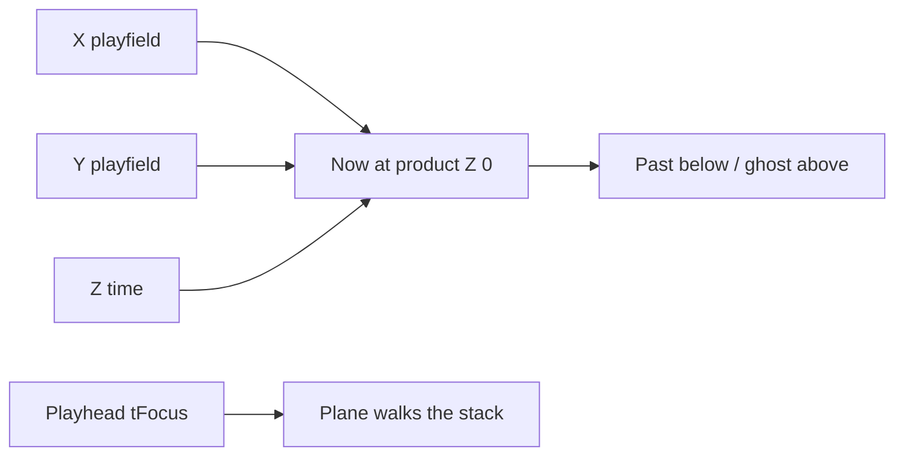

| Concept | Conway | Count stack | Product axis | Engine (Three.js) |
|---------|--------|-------------|--------------|-------------------|
| Spatial | cell `x, y` | sensor `x, y` | X, Y | world X, Z |
| Time | generation | bin index (Δt slice) | Z (Now at 0; playhead walks the stack) | world Y |
| Value | alive = 1 | integer count | — | `v` |
| Color coding | still / osc / unsettled / base | count rung (not this classifier) | `k` (color); time stays on Z | `k` |

Conway **seeds** the volume and is a GPU/browser load generator. It is
not the destination. The first event-camera path is an EVT **count** cube
(`(T, H, W)` uint16, events per pixel per Δt) unpacked into the same SoA.
Polarity / occupancy / states encodings and live streams attach later.
Still / oscillator / moving / unsettled and the 5×5 motion gate live in
`src/dynamics.js` as a **Conway adapter**. Do not treat that legend as the
event-camera product. The renderer only consumes packed events
(`x, y, t, v, k, s`).

Time is not a fake spatial dimension: it is the third axis of a space-time
volume. **Start with a blinker**, not a glider: the pattern sits still in
XY and oscillates along Z. A glider is the later case — a trajectory
through the volume (motion in XY plus time).

Present sits at generation `tNow` and is always product **Z = 0** (engine Y = 0).
The **playhead** is `tFocus` (`tNow` minus a scrub offset): a plane that
moves through that still stack, same contract as X/Y. Older slices sit
below Now; newer slices sit **above as a transparent ghost**
so the live generation stays readable. Depth is the live wake (how many
slices are cubes while the generator runs — the control formerly labeled
History / Window). Older
gens fall off the live volume when the run passes Depth. They stay on
the RAM tape; **Pause** draws that whole tape.

This split matches the later event-camera design:

- **Depth** — live GPU budget (wake). Hidden while Inspect (count stacks
  load already-complete, so they open in Inspect).
- **Playhead (Z stack)** — Conway Live: locked at Now. Inspect / count:
  position on the tape. Count **Play** auto-scrubs that playhead.
- **Decay** — later / opt-in Z fade. Off: even brick.
- **Encoding** — color and fill from the source adapter (Conway: worldline
  class still / oscillator / unsettled / base; count: integer rungs)

Hue is not used for time. An oscillator **oscillates in occupancy** along
Z: cyan cubes appear and vanish; the off phase is empty, not a second
color. A still life is a gold pillar. Soup and one-shot births are violet
**unsettled**. Occupancy classifies each `(x, y)` worldline in place.
Translating ships read as still/osc on the cells they cross. **Base** (gray) is
generations `t = 0, 1` and the first cube of each `(x, y)` worldline.
Cube **scale** follows **Size by age** from `s` stamped on each Conway
slice (run-length along Z). **Start** is fill at age 0; **Tail** is gens
until full. Off = equal cubes. Count / MNI keep
uniform occupancy size; color carries the integer ramp.
Decay is brightness only (off in the UI).

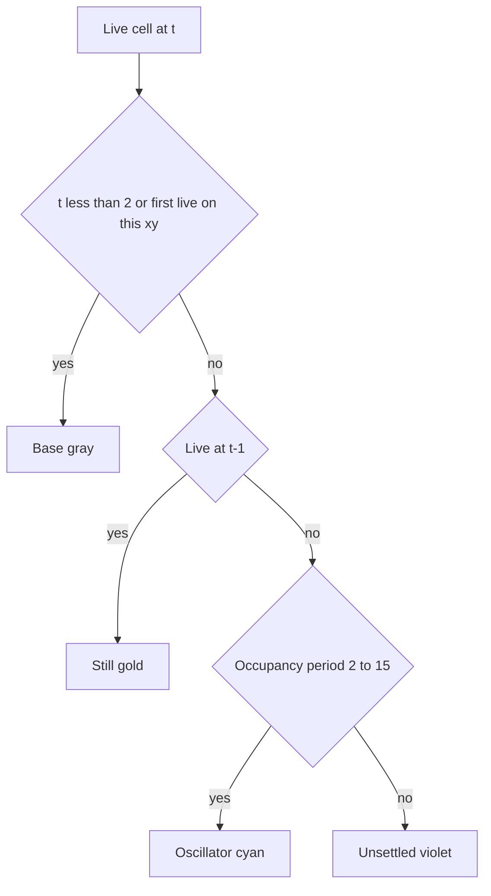

Default seed is **R-pentomino**, started **paused**. Size by age on.
Oscillator lesson if you pick it: Blinker → Toad / Beacon → Glider.

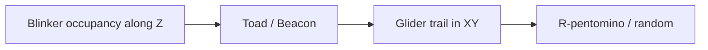

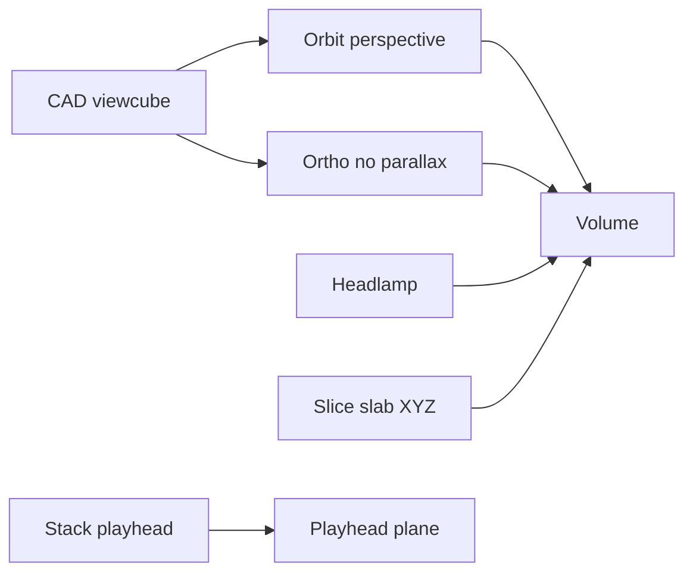

Orbit (browser) rotates around the **time axis** through the playfield
origin when **Align to Z** is on; the pivot height is whatever **Fit**
(or boot) last set. Right-drag still **slides along Z** (XY stays pinned).
Turn Align to Z off for free pan. **Parallax** off keeps the
look and switches to an orthographic camera. **Fit**
frames the camera between the clip cuts. Scrubbing the Z playhead
or the Z clips then slides those planes through the brick; the volume
and the orbit height do not jump. X/Y already behaved that way.

## Slice stack

The HUD has **three** rails (X, Y, Z). Each rail is its own
`clampSlab(near, focus, far)`. Crop is the **AABB** intersection of the
three clip windows. A voxel is drawn only when
`x ∈ [xLo,xHi] ∧ y ∈ [yLo,yHi] ∧ t ∈ [tLo,tHi]`. **Now** stays on Z.
Live (Conway Play) is still Z-locked: one rail, clips off.

The **active** rail (last HUD touch or in-scene drag) is the highlighted
playhead; the other two are hinted. Clip rings sit on **all three** axes
in the matching axis color (X cornflower, Y maize, Z mint). Playhead
rings are inset from the AABB so the three axes do not share one wire;
clip rings sit well inside so they do not share a side with an X/Y/Z
playhead. If a clip index equals the playhead, that
clip is hidden. Playhead bars are thicker and brighter. Hover a **frame
edge** (~28 px screen rim, **move** cursor) to light that ring and grab it; fills are not
hit targets. Drag follows the axis in **screen space** (a grazing look cannot
explode X/Y). **Hide center** hides playhead frames and the slice grid;
**Hide outer** hides clip / bound frames (viewcube shortcuts on desktop).
A viewcube cut still shows the current plane.
The right-hand rails stay as a dimmer second path.

A viewcube **face** is a true 2D cut: orthographic, fitted to that
rectangle, one playhead plane with **that plane's frame and cell grid**
(other axes and clips off). Wheel zooms; **Shift+wheel** pages the
stack. Right-drag pans in the plane. A click on the cut does nothing.
`B` or a left-drag orbit leaves to perspective and the slab immediately;
zoom and pan stay in the cut.

Inspect shade:

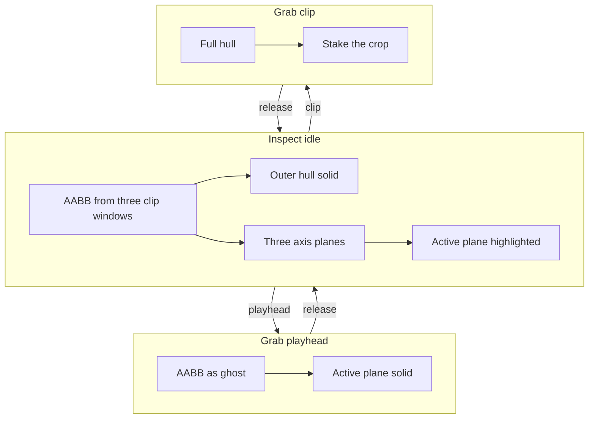

| Mode | Idle | Playhead drag | Clip drag |
|------|------|---------------|-----------|
| **Hull** (default) | AABB outer hull solid | Temporary peek (ghost hull + solid plane) | Stays hull (stake the box) |
| **Ghost** | AABB ghost, active plane solid | unchanged | Hull while dragging |
| **Cuts** (`triple`) | Three cut planes solid, no hull | unchanged | Hull while dragging |

Hold-to-Ghost applies to a **playhead** grab in Hull. A **clip** grab always
shows the hull so the crop is readable. Shade does **not** change by source
(MRI vs Ignition): dense volumes still emit the cached hull as glass during
a peek, plus occupied voxels on the active plane. Ghost/Cuts emit interiors
only if they sit on a playhead plane. Cuts never emits the hull.

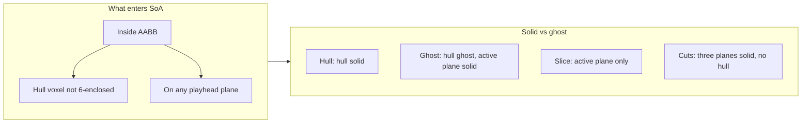

Desktop: three vertical rails on the right, **max at the top of Z**.
Phone: three horizontal tracks (max at the right). AR overlay
stays Z-only. Count / MNI **Play** walks the Source **loop axis**
(default Z), independent of the viewcube.

Inspect generations outside the AABB are **not drawn**. **Fit** frames
that box. **Reset Planes** opens the clips and centers the three playheads (does not
move the camera; does not run when switching to Cuts). Load, pattern
change, and source change start on that pose.
Live: only the Z playhead exists (locked at Now). Fog
is **off** while Inspect so a zoomed-out brick stays lit; Live keeps
distance fog.

## Parallax, gizmo, Align to Z, yaw, light

**Parallax** (default on, keyboard `B`) is perspective. Off copies the
current pose onto an orthographic camera so you can look from the side
without a vanishing point. Escape turns parallax back on. `B` alone does
**not** hide the slab (technical drawing). A viewcube **face** sets
`planeLock`: that product axis, ortho fitted to the slice rectangle,
that plane's frame and cell grid only. Wheel zooms; Shift+wheel pages;
clicking the **same face** pages the stack (does not refit). Right-drag
pans. A click on the cut does nothing. `B` leaves the cut.

A CAD **viewcube** is a 144 px **rail slot** immediately left of the View
HUD card (desktop orbit only). Six axis-colored **face frames** (X
cornflower, Y maize, Z mint), a rim, and X/Y/Z labels on the + faces.
Hover lights the face; click enters the 2D cut. Clicking the **same face**
pages like Shift+wheel (zoom/pan stay). **Hide center** / **Hide outer**
under the cube hide playhead+grid vs clip frames (default both visible).
Wheel zooms, right-drag
pans, Shift+wheel pages. `B` restores perspective and the drawn slab.
The stack
slider stays in the cut.
The cube is omitted on phone / coarse pointer (orbit + the slice
stack stay) and in AR. The desktop View card heading collapses the
telemetry (`View ▾` / `View ▸`).

**Align to Z** (default on) pins orbit XY to the playfield origin; Fit
sets the height. Right-drag still translates along Z. Off allows
screen-space pan. Ortho always pans.

**Yaw** is **AR-only**: after place, rotate the pillar on the table around
product Z (overlay slider or swipe). Gen 0 stays put. Then walk with the
phone. Desktop orbit does **not** yaw the volume — that looked like a
second camera orbit.

**Light** is a **headlamp**: key and fill sit in camera space, so the
facing side of the brick stays lit in desktop orbit and in AR walk.
Hemisphere stays world sky-up. There is no Light slider and no Shift-drag
azimuth. View **Quality** Low turns the cubes unlit (`MeshBasic`) and
zeros the lights; Medium/High keep the headlamp. AR **Yaw** after place
is unchanged. A visible sun gizmo is later (backlog).

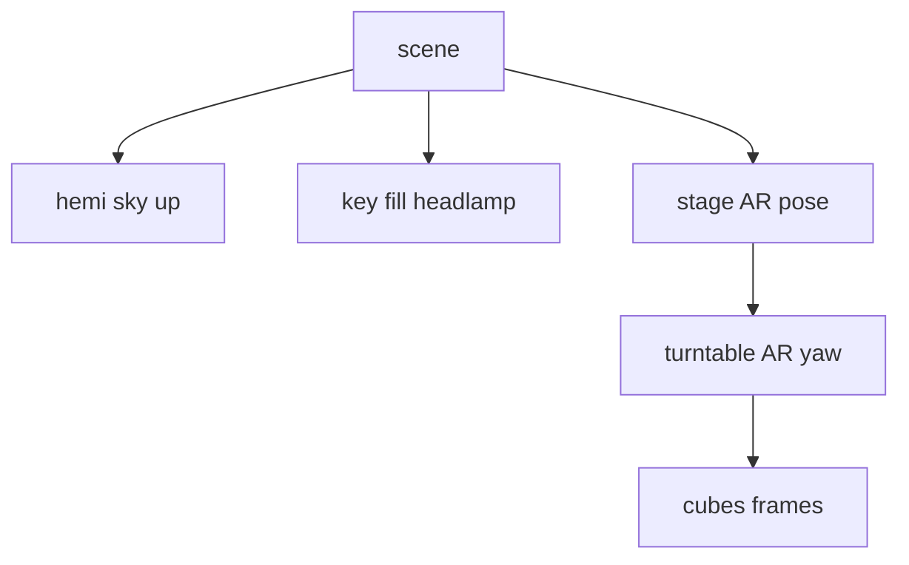

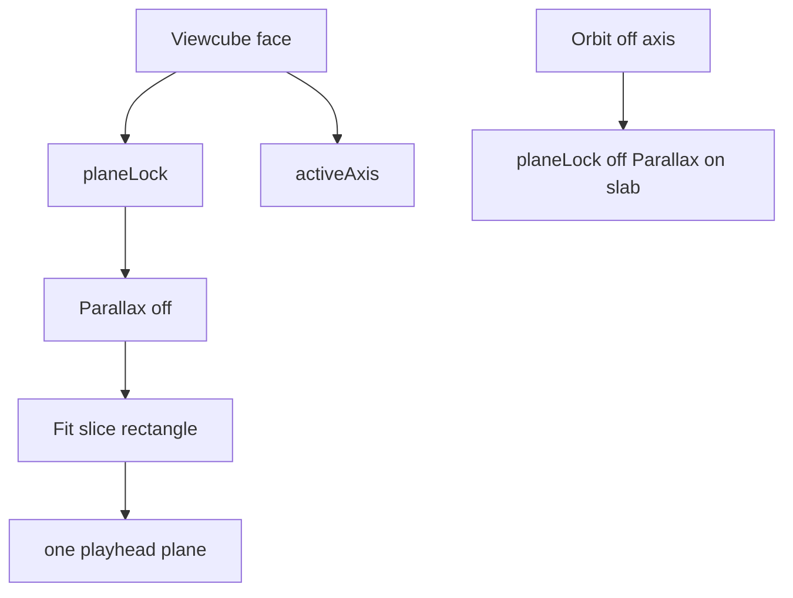

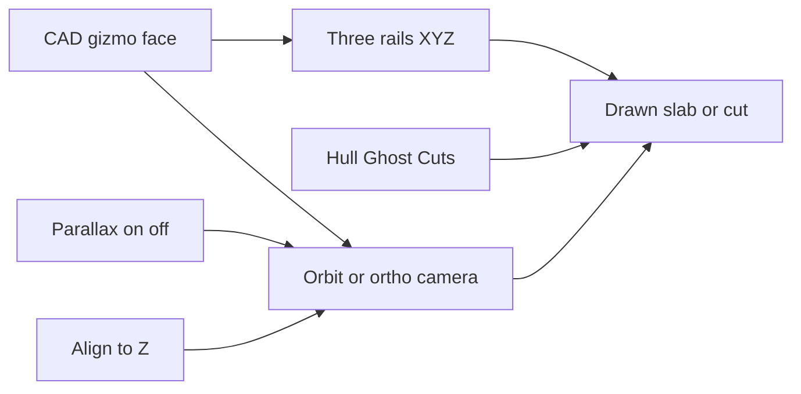

## Isolation / observation

Deferred. Double-click isolation is off. Later: rectangle select on the
playfield (see [backlog.md](backlog.md)). Numbered axes with units also
return later; the viewer does not draw the coordinate overlay, hairlines,
or cube hover outlines. Edit paint on the Z playfield is unchanged.

## Display HUD vs source HUD

Desktop: one View telemetry card plus **three** slice rails to their right.
Play / Loop, Speed, and loop axis sit under the rails. Conway live stats
appear only while Conway Play is on.
The View card heading collapses the display stats.
Phone: FPS chip (tap expands the View card); three horizontal tracks
and Source | View folds. No viewcube.

```mermaid
flowchart TB
  subgraph desktop [Desktop]
    sheetD[Source fold then View fold]
    volD[Volume]
    hudD[View HUD]
    zD[X Y Z vertical rails]
    sheetD --> volD
    hudD --> zD
  end
  subgraph phone [Phone]
    volP[Volume]
    zP[Three horizontal tracks Z max at right]
    barP[Source and View folds]
    chipP[FPS chip]
    volP --> zP
    zP --> barP
  end
```

- **Display** — sparkline of recent frame times, FPS, rolling **AVG**,
  **1%** / **0.1%** lows (mean of the slowest 1% / 0.1% of a ~1000-frame
  window), FR, INST (`trunc` if capped), FOC, PLAY/PAUSE, ORTHO. Frame
  times are raw; the 100 ms clamp is simulation catch-up only, so FPS is
  not stuck at 10 on a slow GPU. Long tab-hidden gaps are skipped.
  Cliff-finder: scale Depth until FPS and 1% low hold. A clear
  software rasterizer adds **SOFTWARE**. Path timers are an opt-in **DEV
  Bench** checkbox on the right View HUD (`src/bench.js`), off the hot
  path until checked. The left View sheet stays display controls.
- **Source overlay** — Conway Play only: GEN, LIVE, RATE (generations/s,
  not frame rate), EDIT. Ignition / MNI do not show those lines.

The Z stack is a tick rail, not a HUD card: the bar and the generation
beside the handle. Ends are **absolute** generations (oldest
kept … live end), not −N. Live, that span is the wake (Depth). Viewing the
tape, that span is the recording. Ticks stride so a long tape does not
grow the DOM.

## Modules

| File | Role |
|------|------|
| `src/conway.js` | B3/S23, seeds, wrap — port of BLITZ `blitz/data/conway.py` |
| `src/dynamics.js` | Worldline occupancy class still / oscillator / unsettled / base |
| `src/spacetime.js` | Generation ring → `EventSoA` (`x, y, t, v, k`) |
| `src/focus.js` | `tFocus` vs `tNow` (scrub clamp) |
| `src/frame.js` | Playhead/clip insets, screen-space edge pick (~28 px rim) |
| `src/axes.js` | Product X/Y/Z vs engine; `zWorldY`; slice stack; tick labels |
| `src/coords.js` | Unwired numbered X/Y frame and hairlines (units later) |
| `src/observe.js` | Cell pick from world XZ (edit hover; isolation later) |
| `src/view.js` | Perspective ↔ orthographic (parallax) |
| `src/fade.js` | Decay along Z (time); ghost-hull fade along the active plane |
| `src/orbit.js` | Fit / XY pin; world Y anchored at Now |
| `src/turntable.js` | AR object yaw around product Z |
| `src/headlamp.js` | View-locked key/fill pose (desktop orbit and AR walk) |
| `src/quality.js` | View Quality Low / Medium / High (DPR cap, unlit, ACES) |
| `src/door.js` | Public `?src=` / `?quality=` allow-list (no arbitrary .npy URLs) |
| `src/gizmo.js` | CAD viewcube (desktop rail slot left of View; click-to-snap) |
| `src/gizmo-layout.js` | Viewcube CSS box and product-axis face mapping |
| `src/npy.js` | NumPy `.npy` v1/v2 reader (count cubes) |
| `src/count.js` | Sparse count volume → `EventSoA` |
| `src/wolke.js` | WOLKE viewer contract: Socket.IO notify + same-origin `/stream-npy` GET |
| `scripts/stream_proxy.py` | Allowlisted sidecar fetch mixed into the static HTTP/HTTPS servers |
| `src/encoding.js` | Color LUT and fill for packed `k` / `s` (Conway and count) |
| `src/bench.js` | Path timers, GPU/software probe, Conway load presets |
| `src/renderer.js` | Solid + ghost instanced cubes; focus frame; hover outlines |
| `src/main.js` | Scene, loop, dirty flags, edit/paint, camera, slice slab |
| `src/hud.js` | Display vs source HUD copy; frame-time sparkline; 1%/0.1% lows |
| `src/ui.js` | Two left sheets (View / Source), transport Play, slice stack |

BLITZ **Ember** decay is a 2D grayscale trail and is **not** used here.
DONNER decay is visual weight along the time axis.

Random soup uses `mulberry32`. It is **not** bit-identical to NumPy's
generator in BLITZ. Patterns (glider, blinker, toad, beacon, R-pentomino,
Gosper gun) match BLITZ cell for cell.

## Renderer contract

The cube renderer is the first implementation, not the only one. A later
points / shader path should keep:

```text
setEvents(soa, { tFocus, decay, fadeSpan, timeScale, width, height, cellSize, voxelGap, isolate, activeAxis, aabb, foci, shade, sliceOnly, stabMode })
```

Color `k` and fill `s` are encoding fields. The renderer indexes
`src/encoding.js` (`CONWAY_KIND_HEX` or `countKindHex`, `encodingFill`)
and does not import Conway dynamics.

View **Gap** (`voxelGap`) is display lattice spacing: pitch =
`cellSize × (1 + gap)`. Cube edge stays `cellSize × fill`. Gap **0**
packs faces (occupancy fill is 1). Slider max is **5**. Orbit dolly-out
(and camera far / ortho min-zoom) is computed at that limit so a wide
Gap still fits. Frames and picking use the same pitch.
AR places that same local layout; Size still maps 32 cube edges to 40 cm,
so opening Gap grows the brick on the table.

`EventSoA` is packed typed arrays. Newest slices fill first so the present
is kept if instance capacity is exceeded (`truncated` flag in the HUD).

No DONNER backend, no EVT3 decode in the browser, no packed-selection /
`viewer_index` sync. A **WOLKE-contract viewer** (`src/wolke.js`) may
connect to the EVT sidecar or WOLKE: Socket.IO announces
`send_file_message`, the page GETs `/stream-npy` (allowlisted loopback /
RFC1918 only), then the count adapter unpacks EventSoA. Cubes do not
ride the socket. Restart `npm start` / `start:lan` after pulling this
so the proxy exists; `python3 -m http.server` will not.

```text
Event camera → sidecar → count cube .npy
                          ├─ BLITZ (dense stack)
                          ├─ DONNER (space-time 3D; file or stream)
                          └─ DONNER XR (same scene)
```

File format is not the runtime contract. A **source adapter** unpacks
`.npy` count cubes (`src/npy.js` + `src/count.js`) into `EventSoA`. A
monolithic NPZ is still a transport container — do not teach the renderer
to read NPZ. Polarity / occupancy / states views of the same ON/OFF
planes are later encodings, not extra parsers.

Keep `CountVolume` for event-count semantics. Do not stretch it into a
generic scientific volume (CT Hounsfield units can be negative; MRI is
float intensity). A later **ScalarVolume** owns that path.

## Later: Dataset Contract

Not this slice. Public preview first. Then, before many more sources:

```mermaid
flowchart TB
  src[Source]
  adapter[Source adapter in DONNER]
  contract[Dataset Contract]
  core[DONNER core]
  rend[Renderer]
  src --> adapter --> contract --> core --> rend
  rend --> desk[Desktop]
  rend --> mob[Mobile]
  rend --> ar[AR]
  rend --> xr[XR]
```

A dataset describes at least: id, name, kind, shape, axes (label, role,
unit, spacing), transform / affine, value semantics (dtype, unit, range),
and payload. Examples: event camera `Z → temporal, µs`; CT
`X/Y/Z → spatial, mm`, value Hounsfield; MRI value intensity.

**Source adapter** (in DONNER): Conway, NPY, event count, later scalar
volume, WOLKE. **Sidecar / bridge** (outside): EVT3, DICOM, NIfTI,
screening, stream. DONNER does not decode every proprietary format in
the browser.

```text
NPY / NPZ / WOLKE / sidecar / stream
        → adapter → Dataset Contract → DONNER
```

NPY stays a WETTER interchange. NPZ and an optional `dataset.json`
manifest are later transport, not the runtime. The demo shell can keep
several adapters; a productive deploy can expose one source and a
thinner UI.

WOLKE’s current viewer protocol (`send_file_message`, `file_name`,
`index`, later `__selection__.npy` / `viewer_index`) should become a
**WETTER Viewer Contract** shared with BLITZ — not a BLITZ-only API.

```mermaid
flowchart TB
  wolke[WOLKE]
  contract[WETTER Viewer Contract]
  donner[DONNER Explore]
  blitz[BLITZ Analyze]
  wolke --> contract
  contract --> donner
  contract --> blitz
```

XR-B AprilTag comes after this contract exists. A marker may carry
dataset identity (resolved via WOLKE / sidecar — never secrets in the
tag) and a spatial origin (pose, metric scale).

## Delivery (product / renderer / shells)

**DONNER** is the product: structured volume, focus plane, isolation, XR.
**Three.js cubes** are the current engine, not the name. A later points /
shader path — or a native GPU backend if WebGL/WebGPU is *measured* to
fail — keeps `setEvents(...)`. A volume-texture pass is only if dense
scalar volumes justify it. Do not port DONNER into BLITZ/PyQtGraph.
Do not start a second renderer before a public preview is usable.

Three shells around the same core, in order, not in parallel:

```mermaid
flowchart TB
  subgraph product [DONNER product]
    src[Source Conway or EVT]
    soa[EventSoA]
  end
  subgraph engine [Renderer swappable]
    three[Three.js cubes now]
    later[Points shader or native GPU later]
  end
  subgraph shells [Shells]
    demo[Static demo URL]
    desk[Desktop wrap later]
    xr[WebXR immersive-ar]
  end
  src --> soa
  soa --> three
  soa --> later
  three --> demo
  three --> desk
  three --> xr
```

1. **Now — demo shell:** static HTML+JS. That is Stage 1, not a deficit.
2. **Later — desktop wrap:** only once local files / sidecar exist (WOLKE-style
   host, or a thin WebView). Empty `DONNER.exe` around `index.html` is not
   worth it today.
3. **XR shell:** same Three.js scene, WebXR. Native OpenXR/Unity only if
   WebXR fails the lab case.

## Wake vs RAM tape

**Play** is Live View: generator runs, playhead = Now, Z locked (`LIVE`).
The drawn volume is a **wake** of **Depth** cubes. **Pause** is Inspect:
the viewer opens its RAM tape (proto-file). Z is gen 0 … cached Now;
**the whole tape can be cubes** (Depth is hidden). A **Z slab** clips
which generations are instantiated (cyan playhead, gold cut rings in the
volume). Fog is off; zoom out to see the brick. Play jumps back to live
Now — it does not replay the tape. Source **Stop when stable** (default
on) pauses Live into Inspect after five Conway generations whose grid
repeats with period 1…15 (still life, blinker, pulsar ash). Wrapping
gliders have a much longer period and keep running.

```mermaid
flowchart LR
  step[Conway step]
  step --> cyc{Grid equals a stored grid p 1 to 15}
  cyc -->|no| reset[Reset streak]
  cyc -->|yes| hold[Streak plus 1]
  hold --> five{Streak is 5}
  five -->|yes| inspect[Pause into Inspect]
```

```mermaid
flowchart LR
  live[Play Live View] --> wake[Wake Depth cubes]
  live --> tape[RAM tape viewer buffer]
  wake --> liveZ[Z locked at Now]
  live -->|Pause| inspect[Inspect full tape]
  inspect --> recZ[Z = tape from 0]
  recZ -->|Play| liveZ
```

```text
Live (Play)
              |-- Depth --|
GEN 0 ........ [ oldest |||||||| Now ]   Z = LIVE

Inspect (Pause)
[ 0 |||||||||||||||||||||||||||| tape Now ]
 all cached slices are cubes; Z only moves the plane
```

**Decay** is off in the UI (later / opt-in). When on it fades to 0 at
the **oldest drawn slice**. Live that is the back of Depth; Inspect that
is gen 0 (or the tape start). Off = even brick.

Cache status lives in View. Conway Source does not own Depth, Decay, or
the tape. Caps: 4096 gens or 400 000 cells, then `full` (recording from
the start stops). Reset starts a new tape. Changing Depth resizes the
wake ring only. The instance cap (View **Cube cap**, default 200 000)
still newest-first (`trunc` in the HUD) if Inspect is denser than the GPU
envelope.

Color coding defaults on for teaching. Conway **Size by age** defaults on
(Start 0.5, Tail 16).

## Dirty state

The animation loop (`setAnimationLoop`) no longer rebuilds the volume every
frame. XR frames come from the same callback.

```mermaid
flowchart TB
  raf[setAnimationLoop]
  cam[camera dirty]
  look[instance look]
  hull[hull occupancy]
  plane[plane occupancy]
  src[source dirty]
  enc[encoding dirty]
  data[dataset dirty]
  raf --> cam
  raf --> look
  raf --> hull
  raf --> plane
  raf --> src
  raf --> enc
  raf --> data
  cam --> renderOnly[render only]
  look --> setEv[re-stamp instances from cached SoA]
  hull --> fillHull[fillHullSoA plus hull mesh]
  plane --> fillPlane[fillPlaneSoA plus solid mesh]
  src --> fill[live fillSoA plus setEvents]
  enc --> setEv
  data --> boot[bootWorld]
```

| Dirty | Typical cause | Work |
|-------|---------------|------|
| camera | Orbit, damping | `renderer.render` only |
| instance look | Gap, Size by age / Start / Tail | Re-stamp hull and/or plane meshes from the cached SoAs. Inspect Hull playhead does not. |
| hull occupancy | Clip, Hull↔Ghost, Hull+Loop potato | `fillHullSoA` + hull InstancedMesh. Not the playhead in Ghost. |
| plane occupancy | Ghost / Cuts / peek playhead | `fillPlaneSoA` (LRU + prefetch ±2) + solid mesh. Ghost fade is a shader uniform. |
| source | Conway step, paint, live wake | Live `fillSoA` + full `setEvents`. |
| encoding | Color coding on/off | Re-stamp from cached SoAs |
| dataset | Grid, pattern, reset | `bootWorld` (new tape) |
| ring | Depth | wake `GenerationRing.resize` (keep newest slices) |

An internal `forceFullRebuild` flag (off) still restores every-frame `fillSoA` +
`setEvents` for A/B. P2 does **not** yet append a single generation into the
SoA or upload a GPU subrange — it refills the live wake or the inspect
tape. Incremental append is the next cut if dense Random + Color coding stays
hitchy while playing.

Hover/`eventAt` runs only when the hovered cell, focus, or SoA changes.

Path-timer `now` is **this frame**. Skipped paths record 0 (`work rend` ⇒ `soa`
0). `bound CPU soa` vs `bound GPU fill`
compares wall-clock frame time to the CPU paths. A paused 50k-cube volume
on a retina canvas (DPR 2, ~2500²) can sit at ~24 FPS with `rend` CPU
0.3 ms: that is fill-rate, not classification. View **Quality** Low drops
pixel ratio to 1 and switches cubes to unlit `MeshBasic`; it does not
change SoA work. Antialias is frozen at WebGL context create (recreate is
XR-unsafe). Auto quality from Bench metrics is later.

## Performance envelope

Instanced cubes: one mesh, default 200 000 instances (View **Cube cap**
up to 4 000 000). Conway is the synthetic
load generator. Realtime FPS is in View (and the display HUD). Software
rasterizers still warn **SOFTWARE** on the FPS chip.

GPU timer queries: detect `EXT_disjoint_timer_query_webgl2` and show `n/a`
or `ext`. Do not treat CPU `rend` as GPU time.

View **Quality** is a manual preset (default **Medium** on the public
door). `?quality=high` is the prettier path. `powerPreference:
"high-performance"` is only a hint — Chrome on a hybrid laptop can still
pick the Intel iGPU while Firefox reports NVIDIA.

```mermaid
flowchart LR
  q[View Quality]
  q --> low[Low unlit DPR 1]
  q --> med[Medium Lambert DPR 1.25]
  q --> high[High Lambert ACES DPR 2]
```

| Preset | Cubes | Pixel ratio cap | Tone map | Fill light |
|--------|-------|-----------------|----------|------------|
| Low | Unlit `MeshBasic` | 1 | Off | Off |
| Medium | Lambert headlamp | 1.25 | ACES | On |
| High | Lambert headlamp | 2 (1.5 coarse / headset) | ACES | On |

If the unmasked renderer string matches llvmpipe, SwiftShader, Microsoft
Basic Render Driver, or GDI Generic, the View HUD and FPS chip warn
**SOFTWARE**. Missing unmasked strings are **unknown**, not a GPU claim.

### Historical Node CPU (`fillSoA`, avg of 8, 2026-08-31)

Not FPS. Classification only, no Three.js. Neighborhood 5×5 was a
motion-gate plaything (now removed); the row is kept as a cost record.

| Case | `fillSoA` |
|------|-----------|
| Teaching 32 Blinker, color coding on | ~1.3 ms (144 events) |
| Same, color coding off | ~0.02 ms |
| Desktop 64 Blinker, color coding on | ~1.5 ms (300 events) |
| 64 Random, Depth 100, color coding on, neighborhood 5×5 (removed) | ~315 ms (≈30k events) |
| Same, color coding off | ~0.14 ms |
| 64 Random, color coding off | ~0.2 ms (≈51k events) |
| Same soup if visible = resident = 1000, color coding on | ~2.3 s and SoA truncates at 200k |

Takeaway: occupancy Color coding is cheap; the old 5×5 gate dominated.
Depth stops the 200k cap. Camera-only frames skip `fillSoA`. Do not copy
these Node numbers as frame rate.

## MRI volume (later)

Anatomical MRI is a dense `(x, y, z)` cube. DONNER still consumes
`EventSoA` cubes — **not** a NIfTI viewer. Do **not** embed NiiVue (different
camera, chrome, and contract). Do not build a DICOM/PACS workstation.
A 3D-texture / raymarch “glass brain” is a later renderer behind the same
stage, only if a measured slab of cubes is not enough. Affine, spacing,
and a `ScalarVolume` (not `CountVolume`) are the next MRI/CT path — after
the Dataset Contract, not as a medical-imaging product.

There is **no** NIfTI parser in the browser. The public T1 is a one-shot
convert to the count interchange `(T, H, W)` uint16. Source → **MNI 152**
loads it. Count **Play** walks the **loop-axis** playhead (X, Y, or Z;
default Z; not the viewcube).
Clips start at **full extent**, focus in the
middle. Decay is off on dense stacks (a time-fade on anatomy is wrong).

```mermaid
flowchart TB
  dense[Dense mni152_stack npy]
  hull[Hull index cache at load]
  aabb[AABB crop]
  hullSoA[hull EventSoA]
  planeSoA[plane EventSoA]
  cache[plane index LRU]
  ghost[ghost InstancedMesh]
  solid[solid InstancedMesh]
  dense --> hull --> hullSoA --> ghost
  aabb -->|clip window| faces[Hull cache plus AABB faces]
  faces --> hullSoA
  aabb --> cache
  cache --> planeSoA --> solid
```

Inspect **Hull** playhead does not refill SoA: the cyan plane is a mesh, and the cube list is the cached surface. A clip crop is `_hull ∩ aabb` plus occupied voxels on the AABB faces (the new cut through interiors) — not a scan of every occupied cell. **Ghost** keeps that hull on the glass InstancedMesh and only rebuilds the solid playhead plane (`fillPlaneSoA`, ring-cached). Peek (hold playhead) is the same split. **Cuts** is the three planes (no hull). Plane indices are an LRU of 48 cuts plus prefetch of neighbors — not a copy of every MRI slice at load. Ghost distance fade is a shader uniform so hull instance buffers stay put while scrubbing.

**Public demo** (in git for Pages): `data/mni152_stack.npy` from
[niivue/niivue-demo-images](https://github.com/niivue/niivue-demo-images)
(BSD-2-Clause wrapper; derived from [ICBM 152 NLin 2009](https://www.bic.mni.mcgill.ca/ServicesAtlases/ICBM152NLin2009)).
Dense native grid `(215, 256, 207)` uint16, intensity 1…32 (~23 MB).
Visitor label **Brain MRI**. Notices in [`data/NOTICE.md`](data/NOTICE.md).
Local working copy may still live at `datasets/MRT/mni152_stack.npy`.

**SHIP working data** under `datasets/MRT/raw image/` and
`Segmentierungen/` stays on disk only. Do not copy subject NIfTIs or
masks into DONNER git.

**Cube budget** is occupancy, not INST. Ignition is ~70k cubes at **3 %**
fill — a sparse cloud. Native MNI is ~5.4M occupied at **47 %**;
`CountVolume.fillSoA` skips a voxel whose six neighbors are occupied
**and** inside the AABB, so idle Hull is ~140k surface cubes (under the
200k default cap). Those hull indices are cached at load; a full-brick
Hull fill copies the cache instead of walking 5.4M occupied cells.
Extra public `.npy` demos should stay sparse (many zeros), like Ignition.
Dense atlas bricks stay the exception.
Ghost keeps that hull on the GPU and rebuilds only the solid playhead
plane (LRU + prefetch). Cuts is the three planes (no hull). Play/Loop
steps the **loop-axis** playhead (default Z). Affine / RAS is ignored — the gizmo is array X/Y/Z.

Re-run the convert (numpy + gzip, no nibabel). From the WETTER-Suite
root:

```python
import gzip, struct
from pathlib import Path
import numpy as np

src = Path("datasets/MRT/mni152.nii.gz")
dst = Path("datasets/MRT/mni152_stack.npy")
raw = gzip.open(src, "rb").read()
dim = struct.unpack_from("<8h", raw[:348], 40)
off = max(352, int(struct.unpack_from("<f", raw[:348], 108)[0] or 352))
nx, ny, nz = int(dim[1]), int(dim[2]), int(dim[3])
vol = np.frombuffer(raw[off:off + nx * ny * nz], dtype=np.uint8).reshape(
    (nx, ny, nz), order="F"
)
stack = np.ascontiguousarray(np.transpose(vol, (2, 1, 0)))
mx = int(stack.max())
out = np.zeros(stack.shape, dtype=np.uint16)
if mx > 0:
    q = np.clip(np.round(stack.astype(np.float64) * 32.0 / mx), 0, 32).astype(
        np.uint16
    )
    q[(stack > 0) & (q == 0)] = 1
    out = np.ascontiguousarray(q)
np.save(dst, out)
```

Next (not this tree): a dedicated MRI encoding / source kind, or a volume
texture pass. Not a NIfTI-in-browser parser first. See
[backlog.md](backlog.md).

## Stages

```mermaid
flowchart LR
  s1[Stage1 Conway]
  p1[P1 Instrument]
  p2[P2 DirtyState]
  xra[XR-A session]
  p3[P3 Cross platform]
  pts[Point renderer later]
  s1 --> p1 --> p2 --> xra --> p3 --> pts
```

1. **Conway 3D** — this tree (P1 timers + P2 dirty/window are in)
2. **Event camera** — count-stack `.npy` is in (same SoA), including a
   WOLKE-contract stream from the EVT sidecar (Socket.IO notify + HTTP
   GET). Polarity / occupancy / states encodings, packed selection,
   `viewer_index`, and EVT3-in-browser are later. An anatomical MRI cube
   is also later: same `.npy` interchange, not a NIfTI parser — see
   [MRI volume (later)](#mri-volume-later).
3. **XR** — same scene, WebXR only. **XR-A is opened** (phone ceiling):
   passthrough first (no brick). **Search Anchor** starts floor hit-test
   (gold reticle on a horizontal floor plane; tap to spawn). The first
   detected plane is **not** auto-committed, and a timeout does not lock.
   **Reset Anchor** despawns and returns to search (overlay chrome taps
   are guarded so Reset does not immediately re-place; a passthrough tap
   still places). After lock, **Z** lifts the brick off the floor;
   **Size** scales; **Yaw** turns it on the floor. **Stand** is hidden on
   the phone overlay (renderer stand-axis stays for Quest). Outer bound /
   clip frames are forced off for the phone session and restored on Exit;
   center / playhead frames still draw after spawn. Phone chrome is the
   DOM overlay `#xr-overlay` (Search Anchor / Play / Z / Size / Yaw /
   Reset Anchor / Exit), not `document.body`. The overlay is 0×0 in orbit
   so it does not cover the WebGL canvas; it expands for the session.
   Overlay tap-guard is chrome only (passthrough taps still place).
   **Quest must not request `dom-overlay`:** a fullscreen overlay root
   covers passthrough even when CSS is transparent. Three.js is told
   `local` if `local-floor` is missing, and `XRWebGLLayer` instead of
   projection layers. **XR-C-0:** no in-world Play/stand/Exit plate
   (unreadable). Thumbstick yaws; both grips pinch size; grab a bounding
   frame to slide the volume in the room. Headset-only — phone `screen`
   overlay is unchanged. Quest has no Search / Reset Anchor button; Exit
   AR and enter again to place on another plane. XR-B marker, hand
   tracking, and wrist attach are later and do not gate C0. Detail in
   [backlog.md](backlog.md).
   Do not start a new renderer in the same slice as XR.
4. **Integration** — WOLKE-contract stream is in (sidecar / WOLKE →
   DONNER count cube). Later: Open in DONNER / send space-time ROI back
   to BLITZ. No shared widgets.

Product **Z** (time) already stands on the playfield plane, so a floor
is a natural origin. In phone AR the brick sits on that floor pose;
**Z** on the overlay lifts it off the floor. **Play** grows the tape
along time; clips crop in place. Phone orbit is still the non-AR
fallback. One codebase: feature-detect
`immersive-ar`, `renderer.xr.enabled`, pause orbit in session, keep
`setEvents(...)`. Phone HTTPS is **`https://lab.ole.icu/`** (Caddy →
laptop `start:lan`). The LAN/HTTPS servers send
`Permissions-Policy: xr-spatial-tracking=(self)` so Chrome Android still
allows WebXR after a browser update. mkcert (`npm run start:https`) is
fallback if the LXC is down. Do not use `pve.ole.icu:8006`. iOS Safari AR is not the
demo path unless `navigator.xr` actually supports it. Chrome later
(Source off the rail, thin View) is in [backlog.md](backlog.md) and is
not a gate for XR-A.

```mermaid
flowchart LR
  phone[Phone Chrome]
  lab[lab.ole.icu Caddy LXC]
  laptop["Laptop :8765 start:lan"]
  phone -->|HTTPS LE| lab
  lab -->|reverse_proxy| laptop
  laptop --> xr[WebXR immersive-ar]
  xr --> vol[Hit-test place on the floor]
```

```mermaid
flowchart TB
  enter[enterAr immersive-ar]
  idle[Passthrough no volume]
  search[Search Anchor]
  look[Look at the floor]
  place[Tap gold reticle to lock]
  reset[Reset Anchor]
  volume[stage then stand then turntable]
  overlay[XR-A DOM overlay screen]
  frames[Quest grab frame to slide volume]
  hands[XR-C-1 hand or grip later]
  marker[XR-B marker origin later]
  enter --> idle --> search --> look --> place --> volume
  volume --> overlay
  volume --> frames
  volume --> reset
  reset --> search
  frames --> hands
  place -.-> marker
```

| Slice | Placement | Device |
|-------|-----------|--------|
| **XR-A** | Passthrough only on enter (no brick); **Search Anchor** then floor reticle; tap to spawn; **Reset Anchor** despawns back to search; no auto-lock / timeout / viewer-front; **Z** height, Size, Yaw; Stand hidden on phone overlay; outer frames off in the session; center frames still draw. Phone ceiling: IMU window + DOM overlay. | Android Chrome; iPhone only if WebXR AR exists |
| **XR-B** | AprilTag or printed playfield (optional Conway seed) | Later; same phone AR; marker reused on Quest. Not a gate for C0. |
| **XR-C-0** | Headset still uses viewer-front until tap; phone Search overlay does not apply | Quest: no world HUD and no Search / Reset Anchor; Exit AR to place again; stick yaw; grip-pinch size; grab frame slides the volume; poke |
| **XR-C-1** | Same | Later: hands, wrist attach |

## WETTER context

```text
                  DATA SPACE
                      |
                      v
         DAMPF → KEIM → WOLKE
                      |
            +---------+---------+
            |                   |
            v                   v
         DONNER               BLITZ
       3D / XR Explore      2D / Analyze
            |                   |
            +---------+---------+
                      |
                   Insight
                      |
                new selection
```

DONNER: **Explore structured data in 3D & XR.**
BLITZ: **Analyze scientific image and matrix data.**

```text
Image → matrix
Matrix → dynamic state
Time series → space-time volume
Event stream → sparse space-time point cloud
Scalar volume → spatial XYZ (MRI/CT)
Browser / XR → explore that structure
```

## Related work

DONNER is a scientific 3D/XR explorer. Conway is only the v1 generator of
sparse events. Stacking Life along a time axis is not a new picture, and
it is not the product. Event-camera data is one source, not the identity. See [`docs/related.md`](docs/related.md) — things found
while looking around, not influences. The internal Life reference while
the demonstrator is in the tree is Wolfram 2025 (same page); it is not a
spec for DONNER.
