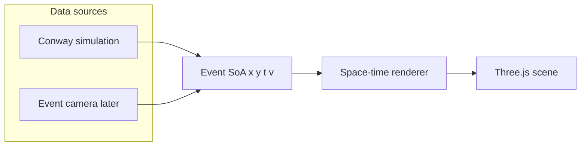
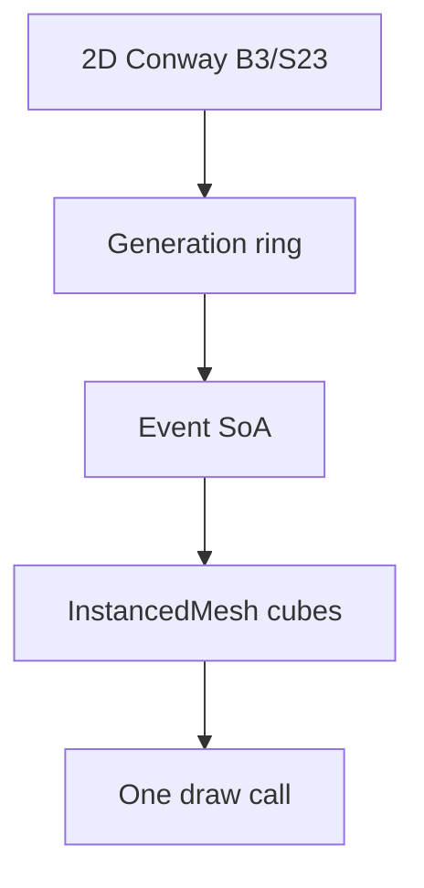

# DONNER architecture

DONNER is a static browser app: **data source → events → space-time renderer**.
The first source is Conway's Game of Life. The renderer must not know that.





## Mapping

| Concept | Conway | Event camera (later) | World axis |
|---------|--------|----------------------|------------|
| Spatial | cell `x, y` | sensor `x, y` | X, Z |
| Time | generation | timestamp | Y (present at Y = 0, past below) |
| Value | alive = 1 | polarity | reserved in `v` |

Time is not a fake spatial dimension: it is the third axis of a space-time
volume. A glider becomes a visible trajectory through that volume.

Present stays on the now-plane (`Y = 0`). Older slices sit at
`Y = (t - tNow) * timeScale` so the camera does not have to chase a growing
stack. Decay weights the past without deleting it; **history** is the window
(how many generations are instantiated).

This split matches the later event-camera design:

- **Time window** — which interval exists in the buffer
- **Decay** — how strongly older events inside that window fade

## Modules

| File | Role |
|------|------|
| `src/conway.js` | B3/S23, seeds, wrap — port of BLITZ `blitz/data/conway.py` |
| `src/spacetime.js` | Generation ring → `EventSoA` (`x, y, t, v`) |
| `src/renderer.js` | Instanced cubes; `setEvents(soa, view)` |
| `src/main.js` | Scene, loop, painting, camera |
| `src/ui.js` | HUD controls |

BLITZ **Ember** decay is a 2D grayscale trail and is **not** used here.
DONNER decay is visual weight along the time axis.

Random soup uses `mulberry32`. It is **not** bit-identical to NumPy's
generator in BLITZ. Patterns (glider, blinker, toad, beacon, R-pentomino,
Gosper gun) match BLITZ cell for cell.

## Renderer contract

The cube renderer is the first implementation, not the only one. A later
points / shader path should keep:

```text
setEvents(soa, { tRef, decay, timeScale, width, height, cellSize })
```

`EventSoA` is packed typed arrays. Newest slices fill first so the present
is kept if instance capacity is exceeded (`truncated` flag in the HUD).

No WebSocket, no BLITZ sync, no EVT3 decode in the browser. Those attach
behind the same SoA later:

```text
Event camera → sidecar → standardized events
                          ├─ BLITZ (dense stack)
                          ├─ DONNER (space-time 3D)
                          └─ DONNER XR (same scene)
```

## Performance envelope

Instanced cubes: one mesh, up to 200 000 instances. Default 32×32 × 48
generations is tens of thousands of cubes at typical Life density.
Scale the grid and history from the HUD; treat Conway as a synthetic
load generator before real event streams.

## Stages

1. **Conway 3D** — this tree
2. **Event camera** — `x, y, t, polarity` point cloud
3. **XR** — same scene on Meta Quest 3 (WebXR)
4. **Integration** — optional sidecar / BLITZ-synced views

## WETTER context

```text
Image → matrix
Matrix → dynamic state
Time series → space-time volume
Event stream → sparse space-time point cloud
Browser / XR → explore that structure
```
