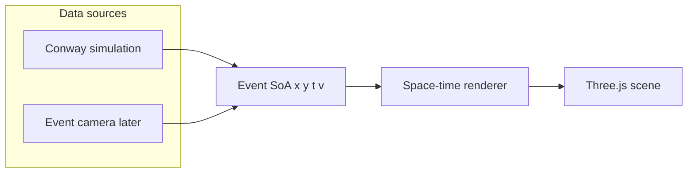
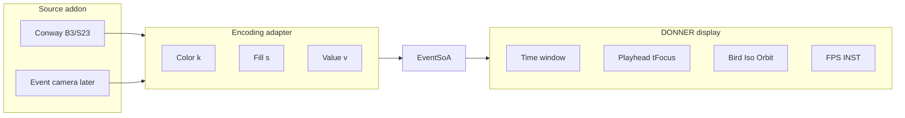
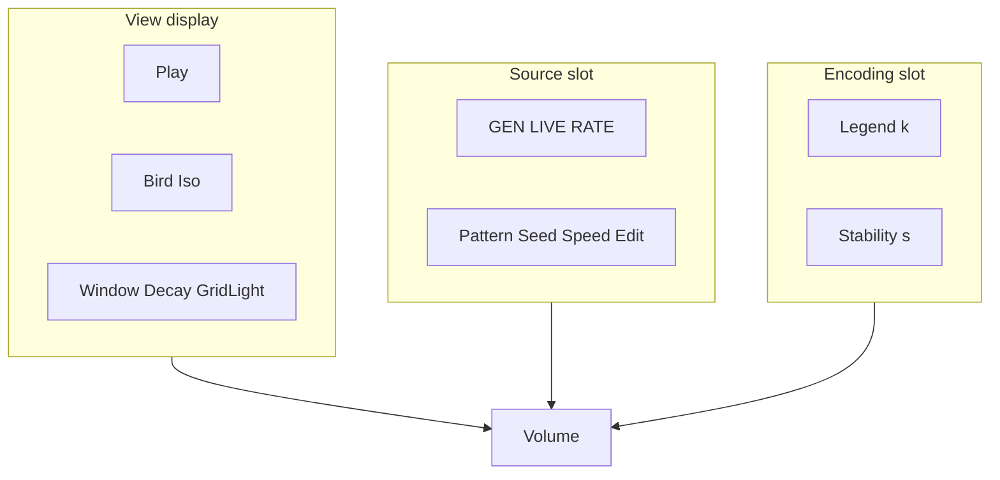
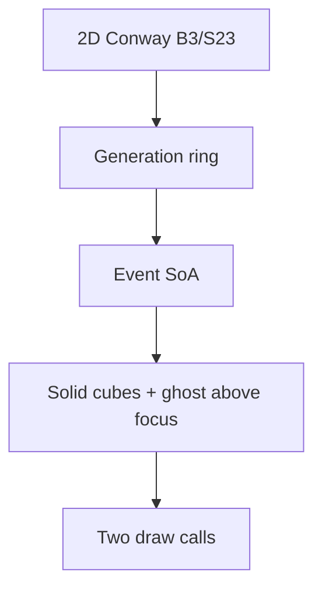
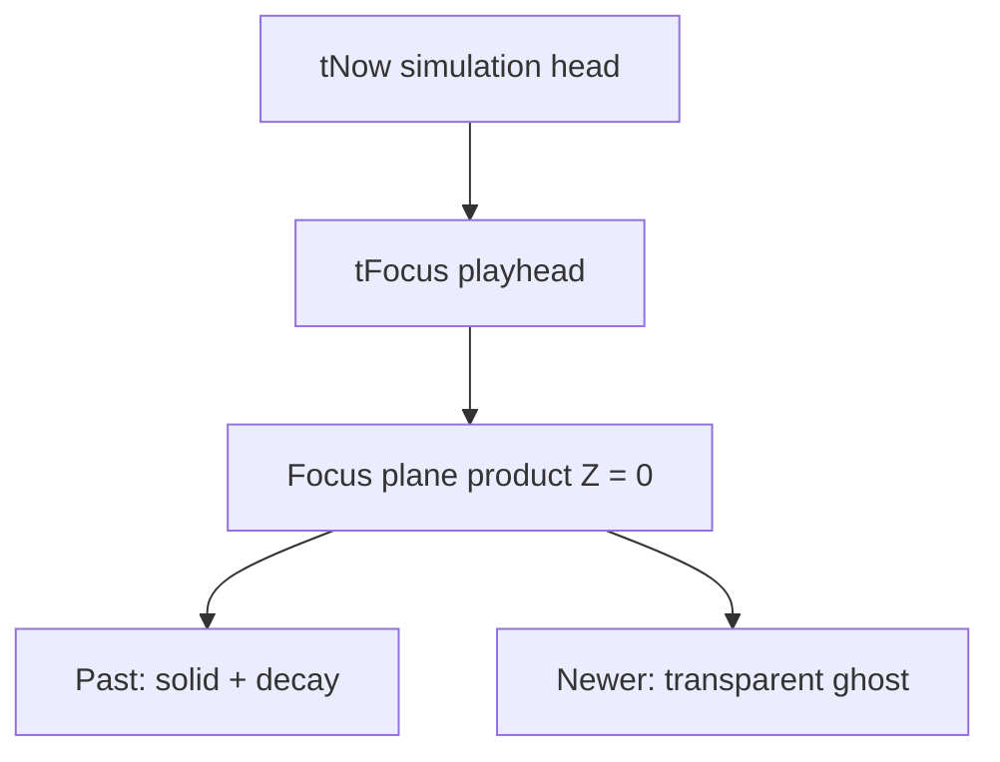
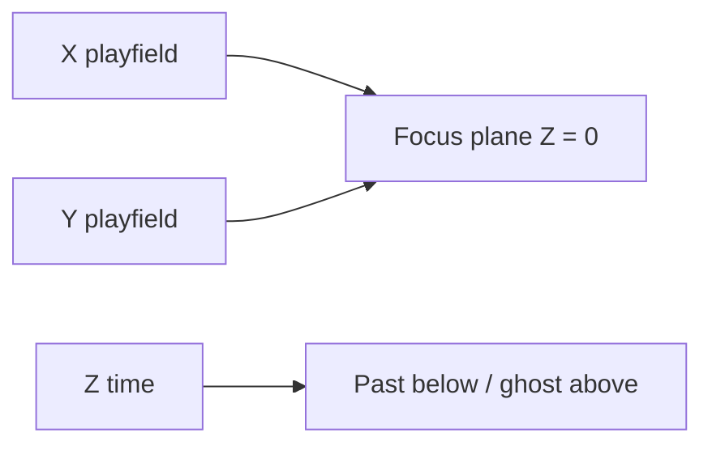
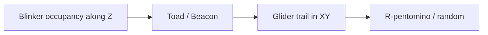
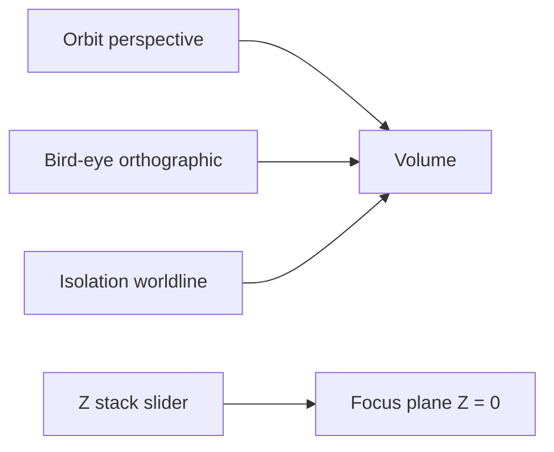
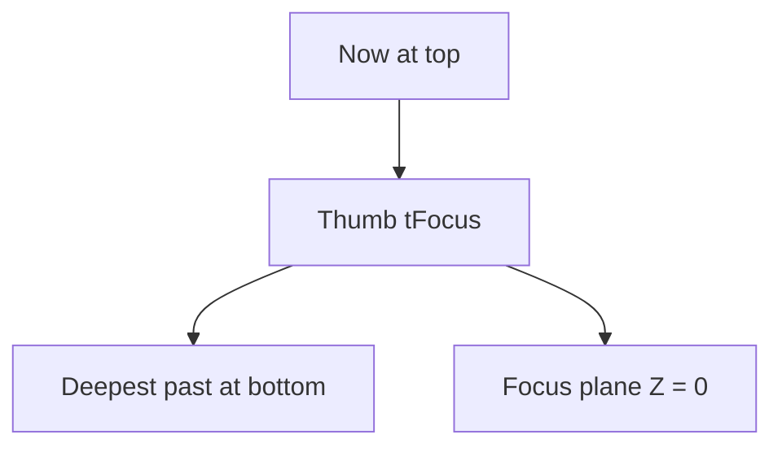

# DONNER architecture

DONNER is a static browser app: **data source → events → space-time renderer**.
It is an **event viewer**. Conway is the v1 demonstrator — a cheap generator
of `(x, y, t, v)` — not the product. The later source is an event camera.
The renderer must not know which source produced a point.



## Layers

DONNER is the **display engine**. Conway is a **source addon**. Color and
cube fill are an **encoding slot** the active addon fills — not Life
identity baked into the renderer.



| Layer | Owns | UI now |
|-------|------|--------|
| **Display** | Orbit, Bird, Iso, Z stack (playhead), Window (buffer span), Decay, Grid light, FPS/INST | Sheet **View** + right display HUD |
| **Source (Conway)** | Pattern, Seed, Wrap, Grid size, Speed, Step, Reset, Edit; HUD GEN / LIVE / RATE | Sheet **Source** + right source HUD. Swap later for file/stream + that source's stats |
| **Encoding** | Color LUT (`k`) and fill (`s` + modes). Conway: still/osc/transit + None/Time/Focus. Event later: polarity (other fill TBD). | Sheet block **Encoding** (legend + Stability). Renderer LUT still hardcoded. |

**Play** is one display button (advance the volume). While Conway is the
source, that same button also steps the generator. Do not split Run vs
Play until a recorded stream exists. **Window** is the instantiated time
span (not a Life log). The **Z stack** is the only playhead; there is no
Focus slider in the control sheet. Keyboard Home / `[` / `]` / Shift+wheel
still scrub.

The cube renderer should treat `k` as an index into an adapter LUT. Today
`CubeRenderer` still hard-codes Conway kind colors — a leak to close with
the encoding adapter, not by moving GEN into Encoding.

The left **control sheet** is the same three blocks as the model:







Paint/edit applies only when `tFocus === tNow`. Scrubbing is view-only.
Bird-eye looks straight down with an orthographic camera. Isolation keeps
one worldline. Scrub **Z** (time) with the right-hand stack slider
(Now at the top, deepest past at the bottom), or Shift+wheel.

## Mapping

Product axes are **X, Y = playfield**, **Z = time**. Three.js is Y-up, so
the engine stores product `(X, Y, Z)` as world `(X, Z, Y)`. UI copy always
uses product names. See README *Axes*.



| Concept | Conway | Event camera (later) | Product axis | Engine (Three.js) |
|---------|--------|----------------------|--------------|-------------------|
| Spatial | cell `x, y` | sensor `x, y` | X, Y | world X, Z |
| Time | generation | timestamp | Z (plane at 0; past below, newer above) | world Y |
| Value | alive = 1 | polarity | — | `v` |
| Dynamics | still / osc / transit / warmup | later (not this classifier) | `k` (color); time stays on Z | `k` |

Conway **seeds** the volume and is a GPU/browser load generator. It is
not the destination. Live demos target event-camera streams
(`x, y, timestamp, polarity`) through the same SoA. Still / oscillator /
transit and the 5×5 motion gate live in `src/dynamics.js` as a **Conway
adapter**. Do not treat that legend as the event-camera product: polarity,
rate, and other encodings attach later. The renderer only consumes packed
events (`x, y, t, v, k, s`).

Time is not a fake spatial dimension: it is the third axis of a space-time
volume. **Start with a blinker**, not a glider: the pattern sits still in
XY and oscillates along Z. A glider is the later case — a trajectory
through the volume (motion in XY plus time).

Present sits at generation `tNow`. The **focus plane** is `tFocus`
(`tNow` minus a scrub offset) and is always product **Z = 0** (engine Y = 0).
Older slices sit below; newer slices sit **above as a transparent ghost**
so the focused generation stays readable. Decay weights the past under the
plane; **Window** is the span instantiated from the simulation head
(the control formerly labeled History).

This split matches the later event-camera design:

- **Window** — which interval exists in the buffer
- **Playhead (Z stack)** — which slice is the working plane
- **Decay** — how strongly older events below that plane fade
- **Encoding** — color and fill from the source adapter (Conway: worldline
  class still / oscillator / transit / warmup, not age)

Hue is not used for time. An oscillator **oscillates in occupancy** along
Z: cyan cubes appear and vanish; the off phase is empty, not a second
color. A still life is a gold pillar. A glider is a BLITZ-red **transit
tube** — the curve through XY+Z. Occupancy of one pixel is not enough:
a spaceship overlapping a cell for a few gens looks still/osc on that
worldline. Still/osc require the 5×5 neighborhood centroid to stay put
(net shift over two generations). Translating activity is always
transit. Generations `t = 0, 1` are **warmup** (gray). Cube **scale**
follows Stability **None / Time / Focus**. Decay is brightness only.

Default seed is **Blinker**, Stability **Time**. Teaching order: Blinker →
Toad / Beacon → Glider → R-pentomino / soup.





## Z stack slider

Time is a **HUD slider** on the right of the telemetry cards, like a 3D
slicer through the generation stack — not a grabber on the 3D axes.
**Now** is a button at the top (`focusBack = 0`); the bottom is the
deepest stored past. The thumb is `tFocus`; the generation sits **beside
the handle**. A tick mark per stored step rasters the rail. Wheel over
the stack (or Shift+wheel on the canvas) still scrubs. There is no Focus
slider in the control sheet. X/Y numbers stay on the playfield frame;
there is no 3D Z shaft.



## Bird-eye view

**Bird** (keyboard `B`) swaps to an **orthographic** camera looking down
onto the focus plane: no perspective, no parallax, **focus slice only**
(the stack would otherwise collapse onto itself). Pan / pinch; Shift+wheel
still scrubs. Escape or Bird again returns to the saved orbit pose.

## Isolation / observation

**Iso** (keyboard `I`): tap a cell on the plane, or a cube in the volume.
The rest of the field drops to a faint transparent wash; that `(x, y)`
worldline stays fully lit. A thin gold column marks the pillar. Tap the
same cell or Iso / Escape to clear. Complements bird-eye (whole plane,
top-down) rather than replacing it.

## Display HUD vs source HUD

The right rail is two telemetry cards plus a thin Z stack to their right:

- **Display** — sparkline of recent frame times, FPS, rolling **AVG**, FR,
  INST (`trunc` if capped), FOC, PLAY/PAUSE, BIRD, ISO. Frame times are
  raw; the 100 ms clamp is simulation catch-up only, so FPS is not stuck
  at 10 on a slow GPU. Long tab-hidden gaps are skipped. Cliff-finder:
  scale Window / Grid until FPS holds.
- **Source (Conway)** — GEN, LIVE, RATE (generations/s, not frame rate),
  EDIT. Swap this block when an event source lands.

The Z stack is a tick rail (one mark per stored step), not a HUD card:
**Now**, the bar, the generation beside the handle, deepest past at the
bottom. 1%/0.1% lows are not drawn yet.

## Modules

| File | Role |
|------|------|
| `src/conway.js` | B3/S23, seeds, wrap — port of BLITZ `blitz/data/conway.py` |
| `src/dynamics.js` | Worldline class still / oscillator / transit |
| `src/spacetime.js` | Generation ring → `EventSoA` (`x, y, t, v, k`) |
| `src/focus.js` | `tFocus` vs `tNow` (scrub clamp) |
| `src/axes.js` | Product X/Y/Z vs engine; tick labels |
| `src/coords.js` | Right-side numbered X/Y frame and hover hairlines |
| `src/observe.js` | Isolation pick (world XZ → cell) |
| `src/view.js` | Perspective ↔ bird-eye camera |
| `src/encoding.js` | Color LUT and fill for packed `k` / `s` (Conway today) |
| `src/renderer.js` | Solid + ghost instanced cubes; focus frame; hover outlines |
| `src/main.js` | Scene, loop, edit/paint, camera |
| `src/hud.js` | Display vs source HUD copy; frame-time sparkline |
| `src/ui.js` | Control sheet and Z-stack bindings |

BLITZ **Ember** decay is a 2D grayscale trail and is **not** used here.
DONNER decay is visual weight along the time axis.

Random soup uses `mulberry32`. It is **not** bit-identical to NumPy's
generator in BLITZ. Patterns (glider, blinker, toad, beacon, R-pentomino,
Gosper gun) match BLITZ cell for cell.

## Renderer contract

The cube renderer is the first implementation, not the only one. A later
points / shader path should keep:

```text
setEvents(soa, { tFocus, decay, timeScale, width, height, cellSize, isolate, sliceOnly, stabMode })
```

Color `k` and fill `s` are encoding fields. The renderer indexes
`src/encoding.js` (`CONWAY_KIND_HEX`, `encodingFill`) and does not
import Conway dynamics. An event source will swap the LUT.

`EventSoA` is packed typed arrays. Newest slices fill first so the present
is kept if instance capacity is exceeded (`truncated` flag in the HUD).

No WebSocket, no BLITZ sync, no EVT3 decode in the browser. Those attach
behind the same SoA later:

```text
Event camera → sidecar → standardized events
                          ├─ BLITZ (dense stack)
                          ├─ DONNER (space-time 3D)
                          └─ DONNER XR (same scene)
```

## Performance envelope

Instanced cubes: one mesh, up to 200 000 instances. Default 32×32 × 48
generations is tens of thousands of cubes at typical Life density.
Scale the grid and Window from the HUD; treat Conway as a synthetic
load generator before real event streams.

## Stages

1. **Conway 3D** — this tree
2. **Event camera** — `x, y, t, polarity` point cloud
3. **XR** — same scene on Meta Quest 3 (WebXR)
4. **Integration** — optional sidecar / BLITZ-synced views

## WETTER context

```text
Image → matrix
Matrix → dynamic state
Time series → space-time volume
Event stream → sparse space-time point cloud
Browser / XR → explore that structure
```

## Related work

DONNER is an event viewer. Conway is only the v1 generator of sparse
events. Stacking Life along a time axis is not a new picture, and it is
not the product. See [`docs/related.md`](docs/related.md) — things found
while looking around, not influences. The internal Life reference while
the demonstrator is in the tree is Wolfram 2025 (same page); it is not a
spec for DONNER.
