# DONNER architecture

DONNER is a static browser app: **data source → events → space-time renderer**.
It is an **event viewer**. Conway is the v1 demonstrator — a cheap generator
of `(x, y, t, v)` — not the product. The later source is an event camera.
The renderer must not know which source produced a point.

**Explore in DONNER. Analyze in BLITZ.** DONNER is a parallel app, not a
pipeline stage and not a 3D mode of BLITZ. Both consume the same structured
dataset; they do not share a GUI.

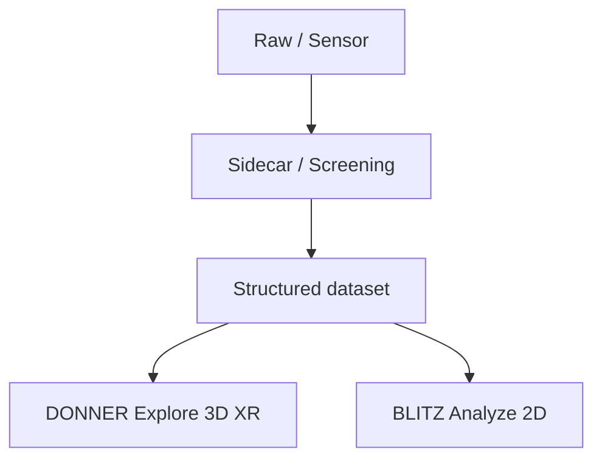

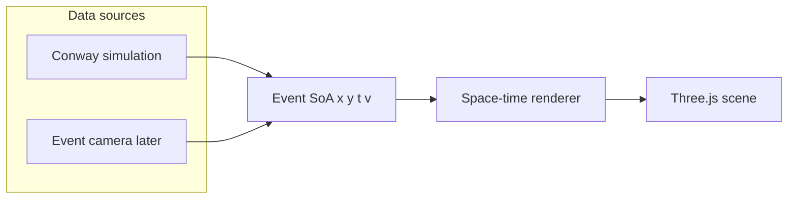

## Layers

DONNER is the **display engine**. Conway is a **source addon**. Color and
cube fill are an **encoding slot** the active addon fills — not Life
identity baked into the renderer.

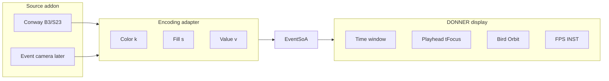

| Layer | Owns | UI now |
|-------|------|--------|
| **Display** | Orbit, Bird, Z stack, Play (Live/Inspect), Depth (live wake), Decay, cache tape, Grid light, FPS/INST | Sheet **View** + right display HUD; Play outside the sheets |
| **Source (Conway)** | Pattern, Seed, Wrap, Grid size, Speed, Step, Reset, Edit; HUD GEN / LIVE / RATE | Sheet **Source** (own left card) + right source HUD. Swap later for file/stream + that source's stats |
| **Encoding** | Color LUT (`k`) and fill (`s` + modes). Conway: still/osc/transit + None/Time/Focus. Event later: polarity (other fill TBD). | Block inside the **View** sheet (legend + Stability). LUT in `src/encoding.js` |
| **Bench** | Path timers, GPU/software probe, Neighborhood none/3×3/5×5, presets | Block inside the **View** sheet |

**Play** is one display button, always visible outside the sheets.
**Play** is Live View: the generator runs, the playhead stays at Now, the
Z stack is locked (`LIVE`). **Pause** is Inspect: the viewer opens its RAM
tape, Z is gen 0 … cached Now, and **every cached slice is drawn** (no
sliding Depth window — cubes must not pop in from nothing). Play from
Inspect jumps to live Now (no tape replay). **Depth** is live-only GPU
wake. **Decay** and the cache are viewer-owned. Decay is on/off: fade
toward the oldest drawn slice (live: back of Depth; inspect: tape start).

The cube renderer indexes `k` through `src/encoding.js` (`CONWAY_KIND_HEX`,
`encodingFill`). An event source will swap that LUT. Do not move GEN into
Encoding.

The left chrome is two sheets, not one mixed panel:

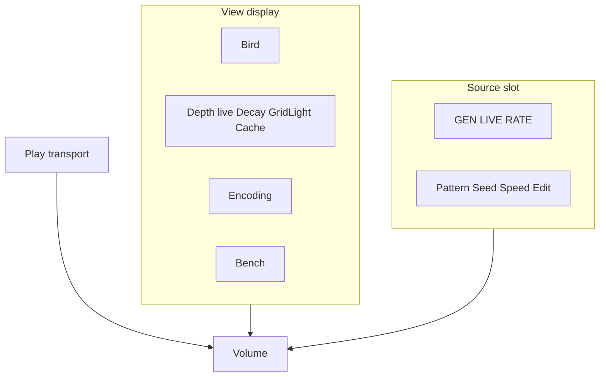

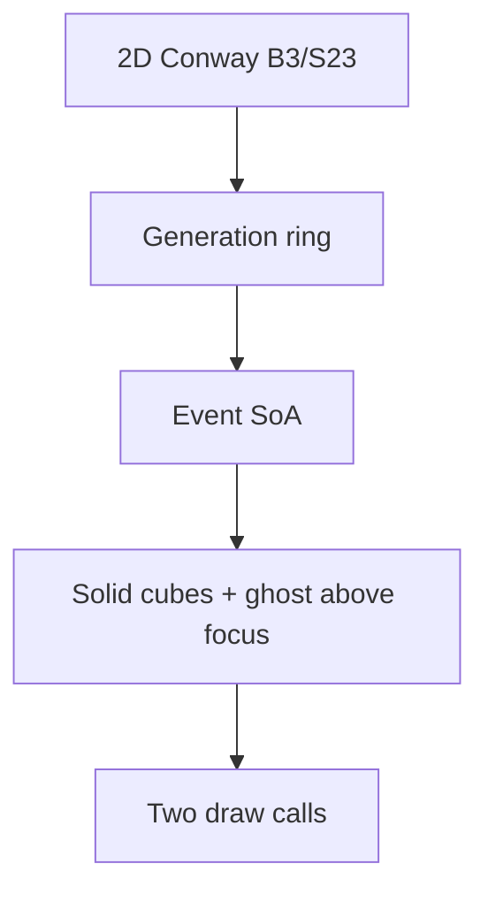

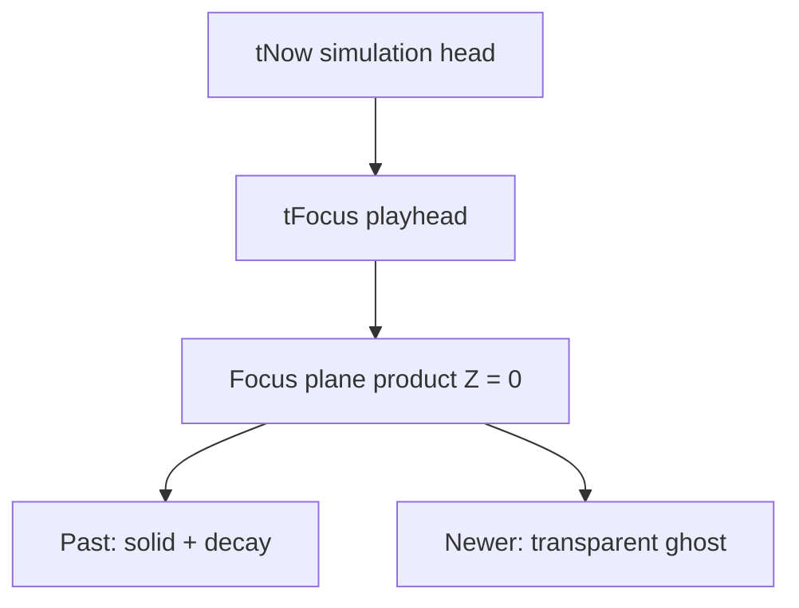

Paint/edit applies only when `tFocus === tNow`. Scrubbing is view-only.
Bird-eye looks straight down with an orthographic camera. Worldline
isolation is deferred (later: rectangle select). Scrub **Z** (time) with the stack
slider (desktop: right, Now at the top; phone: bottom, Now at the right),
or Shift+wheel. Inspect adds two **slab** handles: generations outside
the band are not drawn.

## Mapping

Product axes are **X, Y = playfield**, **Z = time**. Three.js is Y-up, so
the engine stores product `(X, Y, Z)` as world `(X, Z, Y)`. UI copy always
uses product names. See README *Axes*.

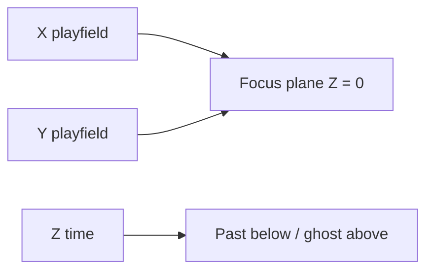

| Concept | Conway | Event camera (later) | Product axis | Engine (Three.js) |
|---------|--------|----------------------|--------------|-------------------|
| Spatial | cell `x, y` | sensor `x, y` | X, Y | world X, Z |
| Time | generation | timestamp | Z (plane at 0; past below, newer above) | world Y |
| Value | alive = 1 | polarity | — | `v` |
| Dynamics | still / osc / transit / warmup | later (not this classifier) | `k` (color); time stays on Z | `k` |

Conway **seeds** the volume and is a GPU/browser load generator. It is
not the destination. Live demos target event-camera streams
(`x, y, timestamp, polarity`) through the same SoA. Still / oscillator /
transit and the 5×5 motion gate live in `src/dynamics.js` as a **Conway
adapter**. Do not treat that legend as the event-camera product: polarity,
rate, and other encodings attach later. The renderer only consumes packed
events (`x, y, t, v, k, s`).

Time is not a fake spatial dimension: it is the third axis of a space-time
volume. **Start with a blinker**, not a glider: the pattern sits still in
XY and oscillates along Z. A glider is the later case — a trajectory
through the volume (motion in XY plus time).

Present sits at generation `tNow`. The **focus plane** is `tFocus`
(`tNow` minus a scrub offset) and is always product **Z = 0** (engine Y = 0).
Older slices sit below; newer slices sit **above as a transparent ghost**
so the focused generation stays readable. Decay weights the past under the
plane; **Depth** is the live wake (how many slices are cubes while the
generator runs — the control formerly labeled History / Window). Older
gens fall off the live volume when the run passes Depth. They stay on
the RAM tape; **Pause** draws that whole tape.

This split matches the later event-camera design:

- **Depth** — live GPU budget (wake). Hidden while Inspect.
- **Playhead (Z stack)** — Live: locked at Now. Inspect (Pause): position on the tape
- **Decay** — on: fade to 0 at the oldest drawn slice. Off: even brick.
- **Encoding** — color and fill from the source adapter (Conway: worldline
  class still / oscillator / transit / warmup, not age)

Hue is not used for time. An oscillator **oscillates in occupancy** along
Z: cyan cubes appear and vanish; the off phase is empty, not a second
color. A still life is a gold pillar. A glider is a BLITZ-red **transit
tube** — the curve through XY+Z. Occupancy of one pixel is not enough:
a spaceship overlapping a cell for a few gens looks still/osc on that
worldline. Occupancy-only (Neighborhood **None**, the default) is enough
for Blinker/Toad. Still/osc vs glider tubes need a 3×3 or 5×5 centroid
that stays put (net shift over two generations). Translating activity is
then transit. Generations `t = 0, 1` are **warmup** (gray). Cube **scale**
follows Stability **None / Time / Focus**. Decay is brightness only.

Default seed is **Blinker**, Stability **Time**. Teaching order: Blinker →
Toad / Beacon → Glider → R-pentomino / soup.

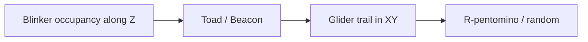

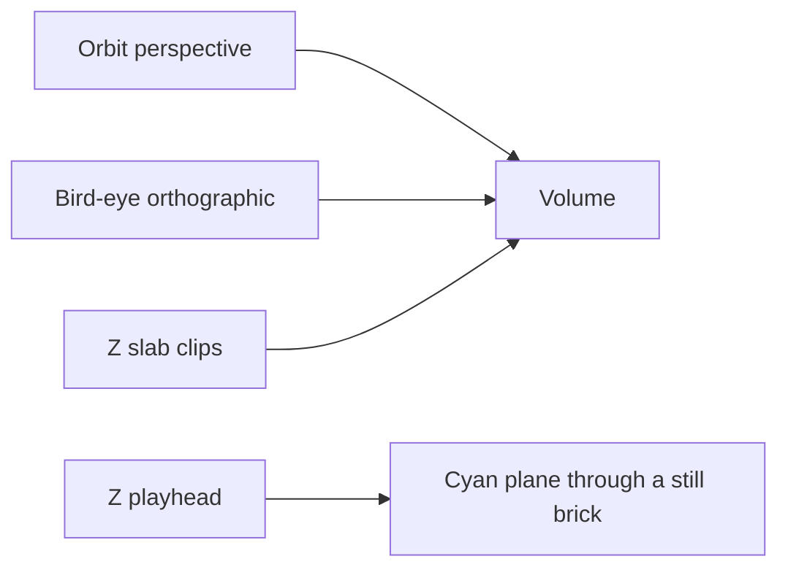

Orbit (browser) rotates around the **time axis** through the playfield
origin; the pivot sits at the mid-height of the drawn brick. **Fit**
frames the camera between the gold cuts. Scrubbing the cyan playhead
then slides the plane through that brick; the volume does not jump.

## Z stack slider

Time is a **HUD slider**, like a 3D slicer through the generation stack —
not a grabber on the 3D axes. **Now** is `focusBack = 0`; the far end is
the deepest stored past. The thumb is `tFocus`; the generation sits
**beside the handle**. A tick mark per stored step rasters the rail.
Wheel over the stack (or Shift+wheel on the canvas) still scrubs. There
is no Focus slider in the control sheet. X/Y numbers stay on the
playfield frame; there is no 3D Z shaft.

Desktop: vertical rail on the right, **Now at the top**, past at the
bottom. Phone: horizontal timeline at the bottom, **Now at the right**,
past at the left (the same stack, rotated).

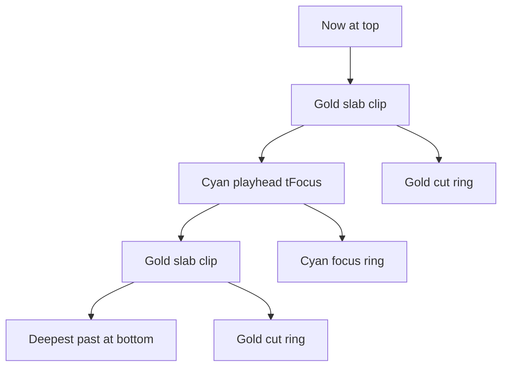

Inspect: generations outside the gold clips are **not drawn** (slicer
window). The focus plane is a **cyan** rectangle; the slab cuts are
**gold** rings (hidden when a cut sits on the playhead). **Fit** (View,
`F`) puts the camera between those cuts. Z scrub then moves only the
cyan plane; the brick stays put because the orbit target rides the
brick center. Live: only the cyan playhead exists (locked at Now). Fog
is **off** while Inspect so a zoomed-out brick stays lit; Live keeps
distance fog.

## Bird-eye view

**Bird** (keyboard `B`) swaps to an **orthographic** camera looking down
onto the focus plane: no perspective, no parallax, **focus slice only**
(the stack would otherwise collapse onto itself). Pan / pinch; Shift+wheel
still scrubs. Escape or Bird again returns to the saved orbit pose.

## Isolation / observation

Deferred. Double-click isolation is off. Later: rectangle select on the
playfield (see [backlog.md](backlog.md)). Hover hairlines and edit paint
are unchanged.

## Display HUD vs source HUD

Desktop: two telemetry cards plus a thin Z stack to their right, Play
under the stack. Phone: FPS chip (tap expands the View card); Z timeline
and Play at the bottom; source stats in the Source sheet.

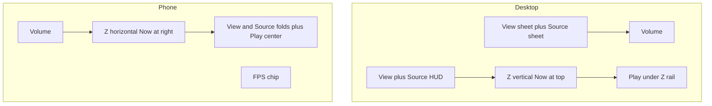

- **Display** — sparkline of recent frame times, FPS, rolling **AVG**,
  **1%** / **0.1%** lows (mean of the slowest 1% / 0.1% of a ~1000-frame
  window), FR, INST (`trunc` if capped), FOC, PLAY/PAUSE, BIRD. Frame
  times are raw; the 100 ms clamp is simulation catch-up only, so FPS is
  not stuck at 10 on a slow GPU. Long tab-hidden gaps are skipped.
  Cliff-finder: scale Depth / Grid until FPS and 1% low hold. A clear
  software rasterizer adds **SOFTWARE**. Path timers and GPU strings live
  in the control-sheet **Bench** block, not this card.
- **Source (Conway)** — GEN, LIVE, RATE (generations/s, not frame rate),
  EDIT. Swap this block when an event source lands.

The Z stack is a tick rail, not a HUD card: **Now**, the bar, the
generation beside the handle. Ends are **absolute** generations (oldest
kept … Now), not −N. Live, that span is the wake (Depth). Viewing the
tape, that span is the recording. Ticks stride so a long tape does not
grow the DOM.

## Modules

| File | Role |
|------|------|
| `src/conway.js` | B3/S23, seeds, wrap — port of BLITZ `blitz/data/conway.py` |
| `src/dynamics.js` | Worldline class still / oscillator / transit |
| `src/spacetime.js` | Generation ring → `EventSoA` (`x, y, t, v, k`) |
| `src/focus.js` | `tFocus` vs `tNow` (scrub clamp) |
| `src/axes.js` | Product X/Y/Z vs engine; tick labels |
| `src/coords.js` | Right-side numbered X/Y frame and hover hairlines |
| `src/observe.js` | Cell pick from world XZ (edit hover; isolation later) |
| `src/view.js` | Perspective ↔ bird-eye camera |
| `src/encoding.js` | Color LUT and fill for packed `k` / `s` (Conway today) |
| `src/bench.js` | Path timers, GPU/software probe, Conway load presets |
| `src/renderer.js` | Solid + ghost instanced cubes; focus frame; hover outlines |
| `src/main.js` | Scene, loop, dirty flags, edit/paint, camera, Z slab |
| `src/hud.js` | Display vs source HUD copy; frame-time sparkline; 1%/0.1% lows |
| `src/ui.js` | Two left sheets (View / Source), transport Play, Z-stack |

BLITZ **Ember** decay is a 2D grayscale trail and is **not** used here.
DONNER decay is visual weight along the time axis.

Random soup uses `mulberry32`. It is **not** bit-identical to NumPy's
generator in BLITZ. Patterns (glider, blinker, toad, beacon, R-pentomino,
Gosper gun) match BLITZ cell for cell.

## Renderer contract

The cube renderer is the first implementation, not the only one. A later
points / shader path should keep:

```text
setEvents(soa, { tFocus, decay, fadeSpan, timeScale, width, height, cellSize, isolate, sliceOnly, stabMode })
```

Color `k` and fill `s` are encoding fields. The renderer indexes
`src/encoding.js` (`CONWAY_KIND_HEX`, `encodingFill`) and does not
import Conway dynamics. An event source will swap the LUT.

`EventSoA` is packed typed arrays. Newest slices fill first so the present
is kept if instance capacity is exceeded (`truncated` flag in the HUD).

No WebSocket, no BLITZ sync, no EVT3 decode in the browser. Those attach
behind the same SoA later:

```text
Event camera → sidecar → standardized events
                          ├─ BLITZ (dense stack)
                          ├─ DONNER (space-time 3D)
                          └─ DONNER XR (same scene)
```

File format is not the runtime contract. Later sources may arrive as `.npy`
or `.npz` (WETTER’s NumPy interchange), a stream, or a sidecar. A **source
adapter** unpacks them into `EventSoA`. A monolithic NPZ is a transport
container, not random-access slicing — do not teach the renderer to read
NPZ. No NPY/NPZ loader in this tree.

## Delivery (product / renderer / shells)

**DONNER** is the product: EventSoA, focus plane, isolation, later XR.
**Three.js cubes** are the current engine, not the name. A later points /
shader path — or a native GPU backend if WebGL/WebGPU is *measured* to
fail — keeps `setEvents(...)`. Do not port DONNER into BLITZ/PyQtGraph.

Three shells around the same core, in order, not in parallel:

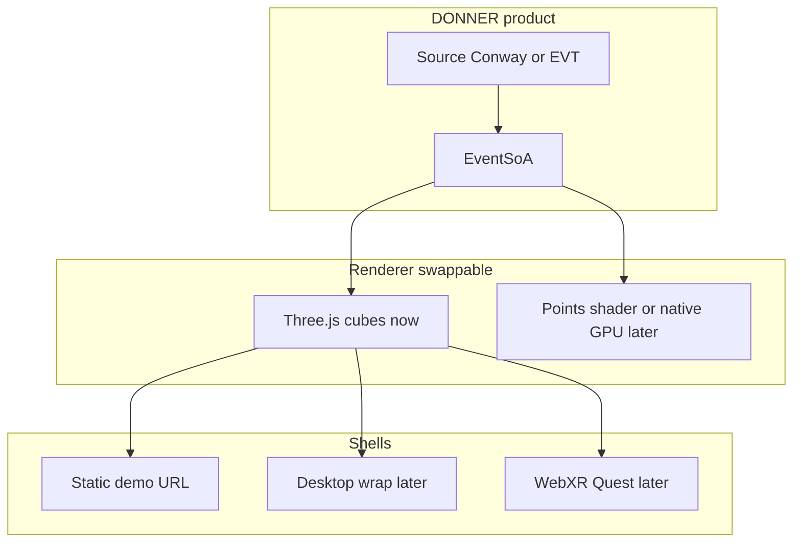

1. **Now — demo shell:** static HTML+JS. That is Stage 1, not a deficit.
2. **Later — desktop wrap:** only once local files / sidecar exist (WOLKE-style
   host, or a thin WebView). Empty `DONNER.exe` around `index.html` is not
   worth it today.
3. **XR shell:** same Three.js scene, WebXR. Native OpenXR/Unity only if
   WebXR fails the lab case.

## Wake vs RAM tape

**Play** is Live View: generator runs, playhead = Now, Z locked (`LIVE`).
The drawn volume is a **wake** of **Depth** cubes. **Pause** is Inspect:
the viewer opens its RAM tape (proto-file). Z is gen 0 … cached Now;
**the whole tape can be cubes** (Depth is hidden). A **Z slab** clips
which generations are instantiated (cyan playhead, gold cut rings in the
volume). Fog is off; zoom out to see the brick. Play jumps back to live
Now — it does not replay the tape. Source **Stop when stable** (default
on) pauses Live into Inspect after five unchanged Conway generations so
a still life does not record forever.

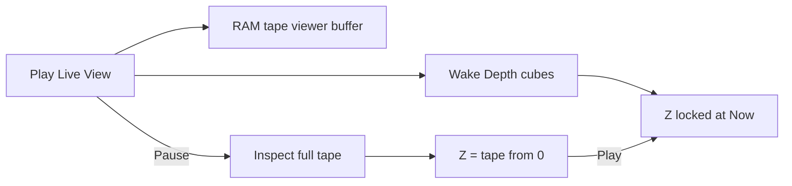

```text
Live (Play)
              |-- Depth --|
GEN 0 ........ [ oldest |||||||| Now ]   Z = LIVE

Inspect (Pause)
[ 0 |||||||||||||||||||||||||||| tape Now ]
 all cached slices are cubes; Z only moves the plane
```

**Decay** (View, on/off) fades to 0 at the **oldest drawn slice**. Live
that is the back of Depth; Inspect that is gen 0 (or the tape start).
Off = even brick.

Cache status lives in View. Conway Source does not own Depth, Decay, or
the tape. Caps: 4096 gens or 400 000 cells, then `full` (recording from
the start stops). Reset starts a new tape. Changing Depth resizes the
wake ring only. The 200 000-instance cap still newest-first (`trunc` in
the HUD) if Inspect is denser than the GPU envelope.

Neighborhood default is **none**. 3×3 / 5×5 is the motion gate (CPU cliff
at 5×5). Dynamics and Stability stay on for teaching.

## Dirty state

`requestAnimationFrame` no longer rebuilds the volume every frame.

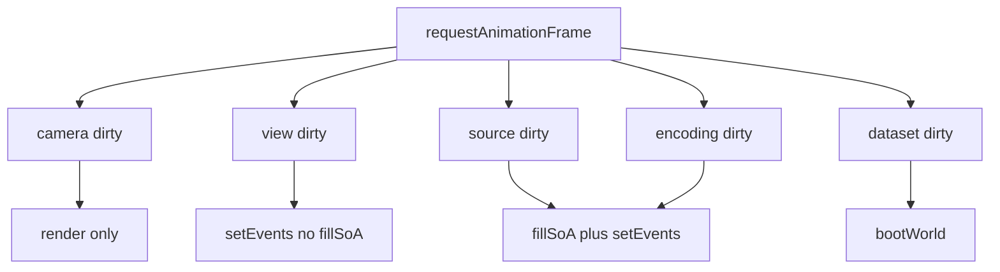

| Dirty | Typical cause | Work |
|-------|---------------|------|
| camera | Orbit, damping | `renderer.render` only |
| view | Decay, Bird slice, Inspect Z playhead | `setEvents` (decay/focus still CPU-baked) |
| source | Conway step, paint, live wake moved, enter Inspect, **Z slab** | `fillSoA` of **Depth** (live) or the **slab** (inspect), then `setEvents` |
| encoding | Stability, Bench flags | same as source |
| dataset | Grid, pattern, reset | `bootWorld` (new tape) |
| ring | Depth | wake `GenerationRing.resize` (keep newest slices) |

**Force full rebuild** in Bench restores the old every-frame `fillSoA` +
`setEvents` for A/B. P2 does **not** yet append a single generation into the
SoA or upload a GPU subrange — it refills the live wake or the inspect
tape. Incremental append is the next cut if CPU Stress + Dynamics stays
hitchy while playing.

Hover/`eventAt` runs only when the hovered cell, focus, or SoA changes.

Bench `now` is **this frame**. Skipped paths record 0 (`work rend` ⇒ `soa`
0). Rolling avg/max reset when a preset rebuilds the world — otherwise
Teaching inherits CPU-Stress hitches. `bound CPU soa` vs `bound GPU fill`
compares wall-clock frame time to the CPU paths. A paused 50k-cube volume
on a retina canvas (DPR 2, ~2500²) can sit at ~24 FPS with `rend` CPU
0.3 ms: that is fill-rate, not classification. Renderer Stress and CPU
Stress then look the same **until you look at `soa now`**. Applying a
preset starts Play.

## Performance envelope

Instanced cubes: one mesh, up to 200 000 instances. Conway is the synthetic
load generator. Use the **Bench** sheet: path timers (`sim` / `soa` /
`inst` / `hov` / `rend` CPU / `hud`), WebGL/software detection, feature
toggles, presets.

GPU timer queries: detect `EXT_disjoint_timer_query_webgl2` and show `n/a`
or `ext`. Do not treat CPU `rend` as GPU time.

If the unmasked renderer string matches llvmpipe, SwiftShader, Microsoft
Basic Render Driver, or GDI Generic, the View HUD and FPS chip warn
**SOFTWARE**. Missing unmasked strings are **unknown**, not a GPU claim.

### Presets

| Preset | Grid | Depth | Encoding |
|--------|------|-------|----------|
| **Teaching** | 32×32 Blinker | 48 | Full, Neighborhood none |
| **Desktop** | 64×64 Blinker | 100 | Full, Neighborhood none |
| **CPU Stress** | 64×64 Random | 100 | Dynamics on, Neighborhood none |
| **Renderer Stress** | 64×64 Random | 100 | Dynamics off, constant color/size |

Neighborhood **5×5** is the CPU cliff — turn it on in Bench to measure.
Presets leave it off.

Points renderer / million-event preset is later.

### Node CPU baseline (`fillSoA`, avg of 8, this tree)

Not FPS. Classification only, no Three.js. Measured 2026-08-31 on the
dev Node process:

| Case | `fillSoA` |
|------|-----------|
| Teaching 32 Blinker, dynamics on | ~1.3 ms (144 events) |
| Same, dynamics off | ~0.02 ms |
| Desktop 64 Blinker, dynamics on | ~1.5 ms (300 events) |
| CPU Stress 64 Random, Depth 100, dynamics on, neighborhood 5×5 | ~315 ms (≈30k events) |
| Same, dynamics off | ~0.14 ms |
| Renderer Stress 64 Random, dynamics off | ~0.2 ms (≈51k events) |
| Same soup if visible = resident = 1000, dynamics on | ~2.3 s and SoA truncates at 200k |

Takeaway: **Neighborhood 5×5 dominates** on dense soup; occupancy-only
Dynamics is cheap. Depth stops the 200k cap. Camera-only frames skip
`fillSoA` (Bench `work rend`). Playing at 8 gen/s with 5×5 on soup still
hitches until slice-append exists. Measure GPU FPS in the Bench HUD; do
not copy these Node numbers as frame rate.

## Stages

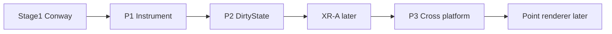

1. **Conway 3D** — this tree (P1 timers + P2 dirty/window are in)
2. **Event camera** — `x, y, t, polarity` behind the same SoA (not next)
3. **XR** — same scene, WebXR only. **P1/P2 baseline is met; XR-A is the
   next stage when opened.** Phone tabletop AR first, then a marker
   origin, then Quest 3 passthrough. Detail in [backlog.md](backlog.md).
   Do not start XR-A in the same slice as a new renderer.
4. **Integration** — optional sidecar / BLITZ via dataset + ROI, not shared
   widgets. Later: Open in DONNER / send space-time ROI back to BLITZ.

Product **Z** (time) already stands on the playfield plane, so a table
is a natural origin: past below the surface, ghost above. Phone orbit
today is not AR. Three.js WebXR lives in vendor; the app does not yet
enable it (`renderer.xr.enabled`, hit-test, AR overlay). One codebase:
feature-detect `immersive-ar`, pause orbit controls in session, keep
`setEvents(...)`. Phone HTTPS is `npm run start:https` (mkcert). An
ole.icu proxy LXC is backlog. iOS Safari AR is not the demo path unless
`navigator.xr` actually supports it. Chrome later (Source off the rail,
thin View) is in [backlog.md](backlog.md) and is not a gate for XR-A.

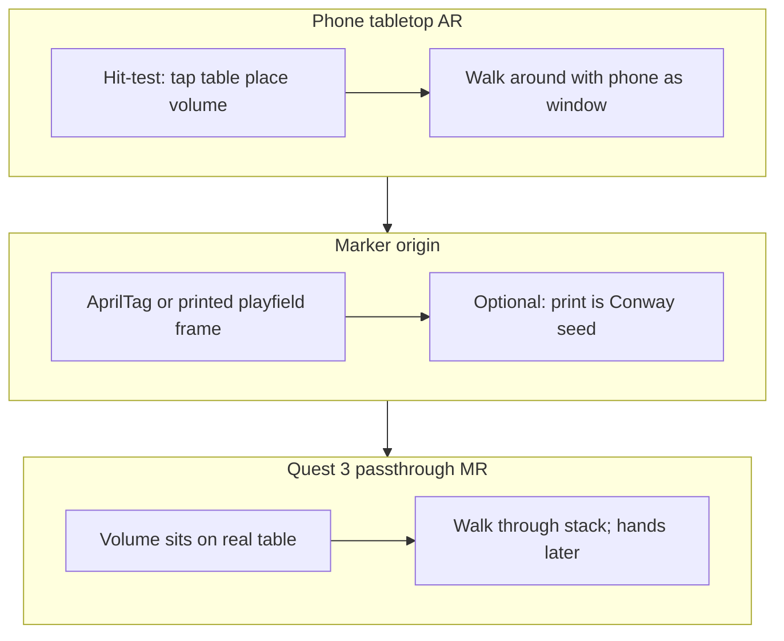

| Slice | Placement | Device |
|-------|-----------|--------|
| **XR-A** | Plane hit-test | Android Chrome; iPhone only if WebXR AR exists |
| **XR-B** | AprilTag or printed playfield (optional Conway seed) | Same phone AR; marker reused on Quest |
| **XR-C** | Hit-test and/or marker | Quest 3 passthrough; hands / Z scrub later |

## WETTER context

```text
                  LARGE DATA SPACE
                         |
                         v
                DAMPF / KEIM / WOLKE
                         |
                  structured data
                         |
              +----------+----------+
              |                     |
              v                     v
           DONNER                 BLITZ
        Explore 3D/XR          Analyze 2D
              |                     |
              +----------+----------+
                         |
                     Insight
                         |
                  new selection
```

```text
Image → matrix
Matrix → dynamic state
Time series → space-time volume
Event stream → sparse space-time point cloud
Browser / XR → explore that structure
```

## Related work

DONNER is an event viewer. Conway is only the v1 generator of sparse
events. Stacking Life along a time axis is not a new picture, and it is
not the product. See [`docs/related.md`](docs/related.md) — things found
while looking around, not influences. The internal Life reference while
the demonstrator is in the tree is Wolfram 2025 (same page); it is not a
spec for DONNER.
