# DONNER architecture

DONNER is a static browser app: **data source → events → space-time renderer**.
It is an **event viewer**. Conway is the v1 demonstrator — a cheap generator
of `(x, y, t, v)` — not the product. The later source is an event camera.
The renderer must not know which source produced a point.

**Explore in DONNER. Analyze in BLITZ.** DONNER is a parallel app, not a
pipeline stage and not a 3D mode of BLITZ. Both consume the same structured
dataset; they do not share a GUI.

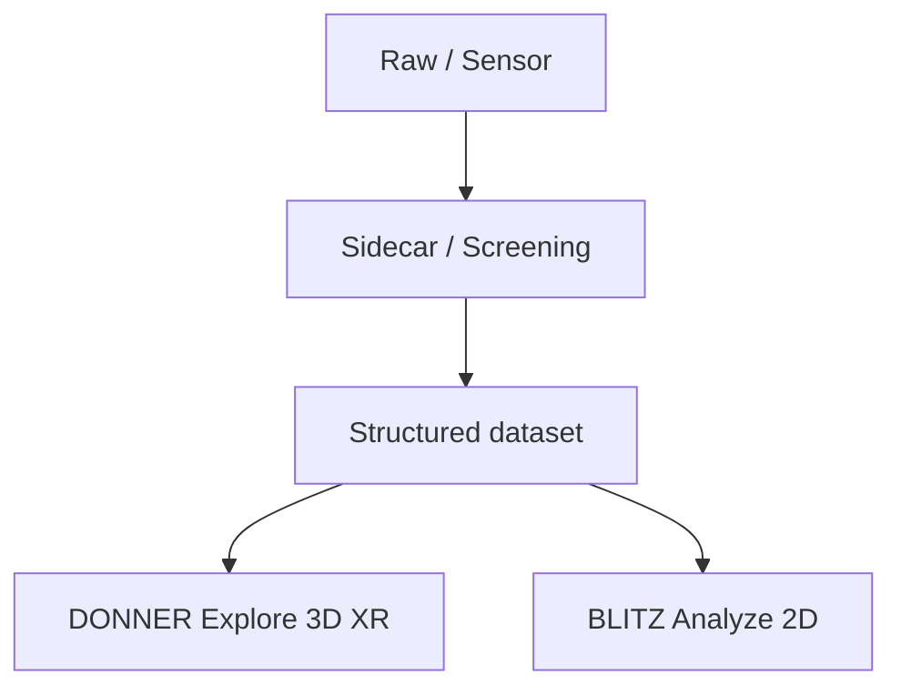

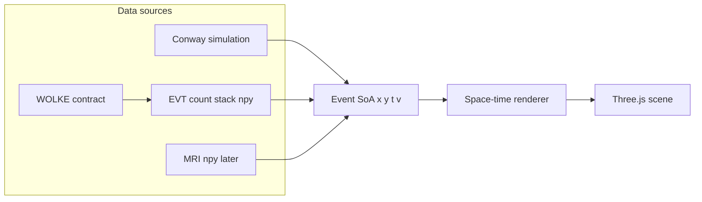

## Layers

DONNER is the **display engine**. Conway is a **source addon**. Color and
cube fill are an **encoding slot** the active addon fills — not Life
identity baked into the renderer.

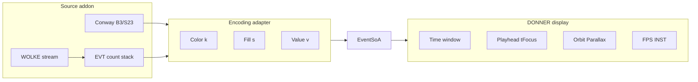

| Layer | Owns | UI now |
|-------|------|--------|
| **Display** | Orbit, Parallax, Align to Z, Light azimuth, CAD gizmo, slice stack (X/Y/Z), Play (Live/Inspect), Depth (live wake), Decay, cache tape, Grid light, FPS/INST | Sheet **View** + right display HUD; Play outside the sheets |
| **Source** | Kind switch. Conway: Pattern, Seed, Wrap, Grid, Step, Reset, Edit; HUD GEN / LIVE / RATE. Count: `.npy` file / ignition demo / WOLKE stream; HUD T / LIVE / SUM / MAX | Sheet **Source** (own left card) + right source HUD |
| **Encoding** | Color LUT (`k`) and fill (`s` + modes). Conway: still/osc/transit + None/Time/Focus. Count: integer rungs (cyan → gold → coral) + optional size-by-count. Polarity later. | Block inside the **View** sheet. LUT in `src/encoding.js` |
| **Bench** | Path timers, GPU/software probe, Neighborhood none/3×3/5×5, presets | Block inside the **View** sheet |

**Play** is one display button, always visible outside the sheets.
For Conway, **Play** is Live View: the generator runs, the playhead stays
at Now, the Z stack is locked (`LIVE`). **Pause** is Inspect: the viewer
opens its RAM tape, Z is gen 0 … cached Now, and **every cached slice is
drawn**. Play from Inspect jumps to live Now (no tape replay). A **count
stack** loads already-complete, so it opens in Inspect; **Play** scrubs
the active stack axis (sparse EVT: Z time; dense count: the slab window).
**Depth** is live-only GPU wake (hidden
in Inspect). **Decay** and the cache are viewer-owned. Decay is on/off:
fade toward the oldest drawn slice (live: back of Depth; inspect: tape start).

The cube renderer indexes `k` through `src/encoding.js` (`CONWAY_KIND_HEX` or
`countKindHex`, `encodingFill`). Do not move GEN into Encoding.

The left chrome is two sheets, not one mixed panel:

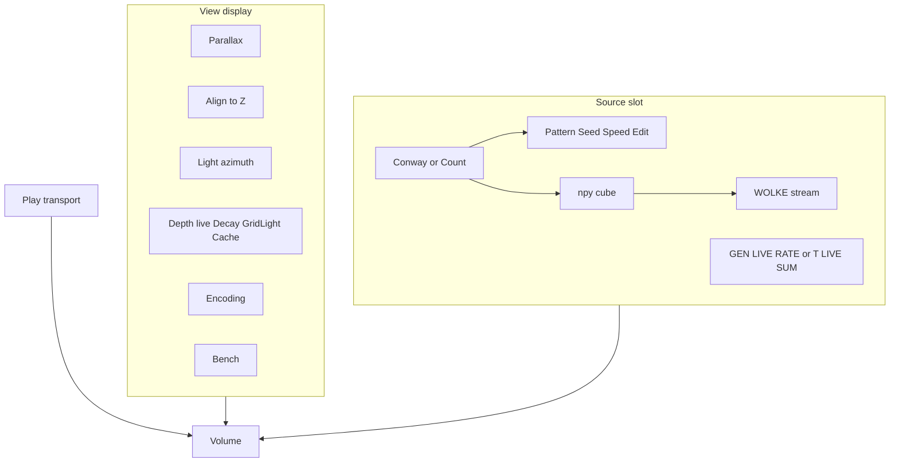

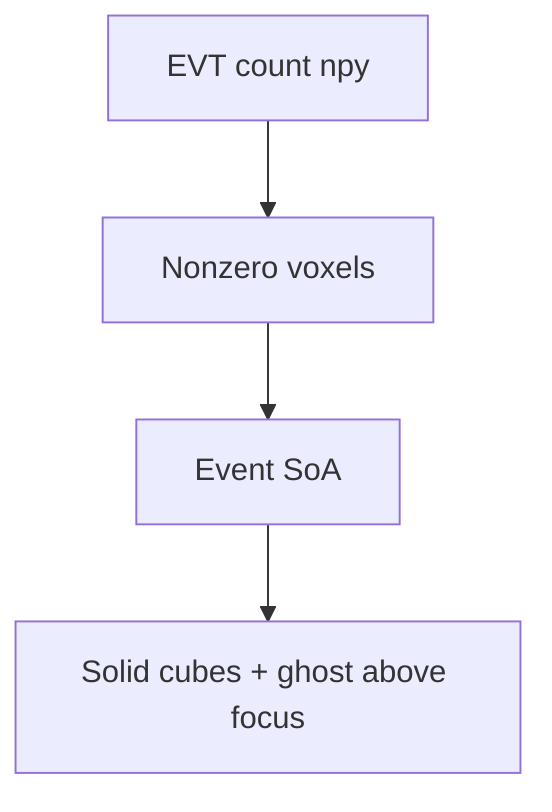

A **WOLKE-contract viewer** is another way to get that cube. Socket.IO
only announces `send_file_message`. The browser then GETs same-origin
`/stream-npy?u=…`; `scripts/serve-http.py` (and HTTPS) pulls the `.npy`
from the sidecar on the laptop so Chrome Local Network Access / CORS
cannot hide the body. The EVT sidecar already speaks this protocol
(`http://127.0.0.1:5055`, token `evt`). Packed selection and
`viewer_index` are not this slice.

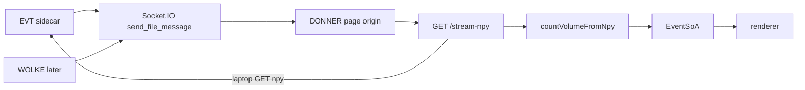

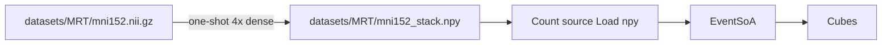

MRI is a **later** source addon, not a second product. A public low-res T1
is already converted to a count-shaped `.npy` (see
[MRI volume (later)](#mri-volume-later)). There is no NIfTI parser in the
browser and no MRI source kind yet. Load it today with Source → Count
stack → **Load .npy**.

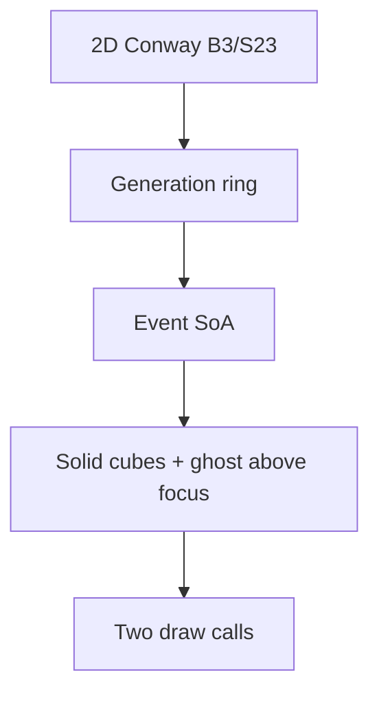

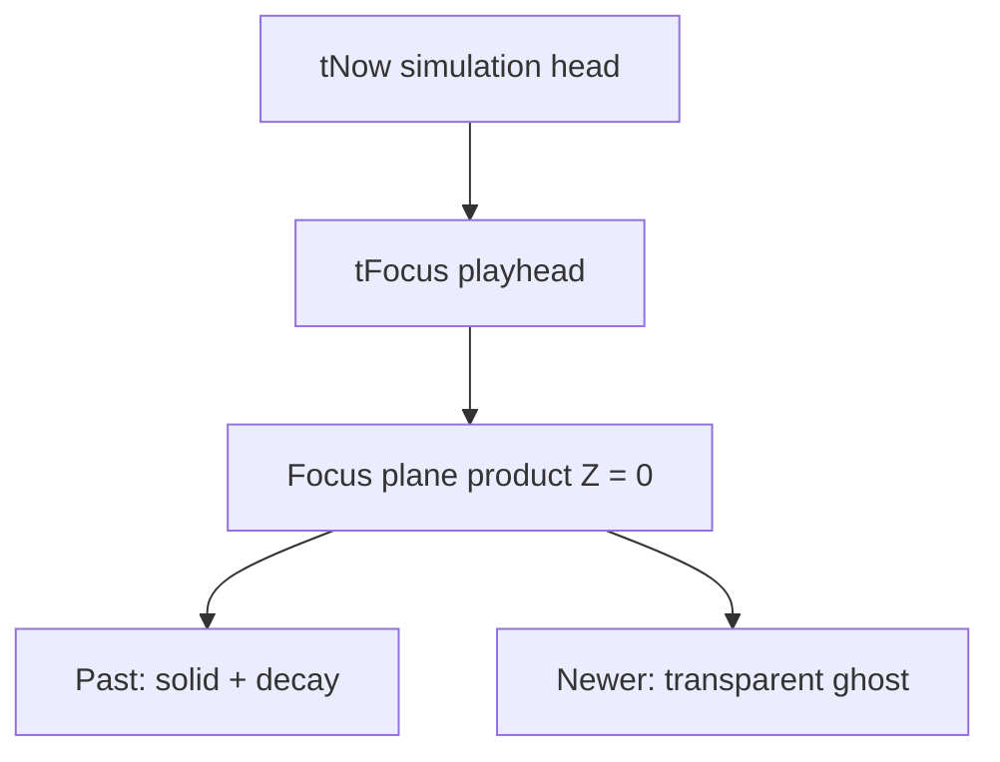

Paint/edit applies only when `tFocus === tNow`. Scrubbing is view-only.
Bird-eye is gone: **Parallax** off is orthographic at the current look.
A CAD viewcube snaps product-axis views. Worldline
isolation is deferred (later: rectangle select). Scrub the **stack**
(desktop: right, Now/max at the top; phone: bottom, Now/max at the right)
along Z (time, default) or X/Y, or Shift+wheel. Inspect adds two **slab**
handles: samples outside the band are not drawn. On X/Y, cells inside the
band fade from the cyan plane (ghost) and vanish at the gold grips. **Decay**
is only along Z (time); it does not drive that spatial fade.

## Mapping

Product axes are **X, Y = playfield**, **Z = time**. Three.js is Y-up, so
the engine stores product `(X, Y, Z)` as world `(X, Z, Y)`. UI copy always
uses product names. See README *Axes*.

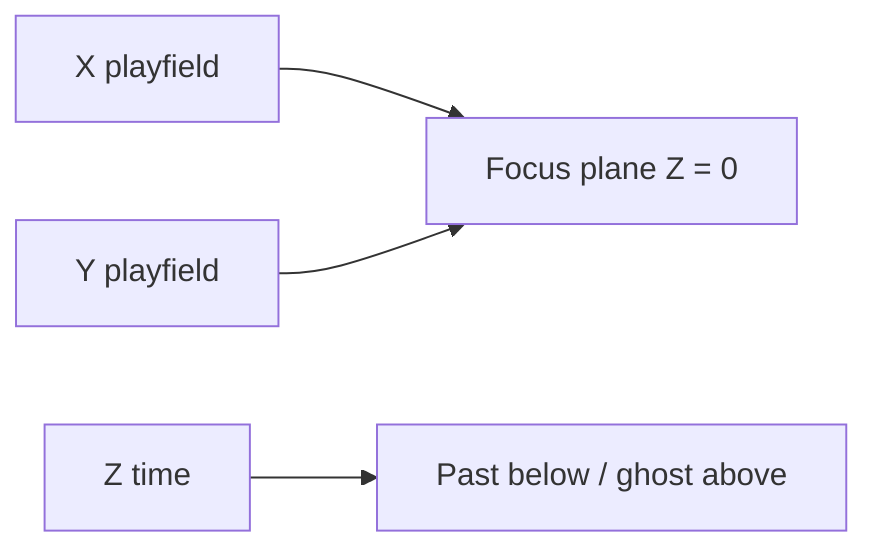

| Concept | Conway | Count stack | Product axis | Engine (Three.js) |
|---------|--------|-------------|--------------|-------------------|
| Spatial | cell `x, y` | sensor `x, y` | X, Y | world X, Z |
| Time | generation | bin index (Δt slice) | Z (plane at 0; past below, newer above) | world Y |
| Value | alive = 1 | integer count | — | `v` |
| Dynamics | still / osc / transit / warmup | count rung (not this classifier) | `k` (color); time stays on Z | `k` |

Conway **seeds** the volume and is a GPU/browser load generator. It is
not the destination. The first event-camera path is an EVT **count** cube
(`(T, H, W)` uint16, events per pixel per Δt) unpacked into the same SoA.
Polarity / occupancy / states encodings and live streams attach later.
Still / oscillator / transit and the 5×5 motion gate live in
`src/dynamics.js` as a **Conway adapter**. Do not treat that legend as the
event-camera product. The renderer only consumes packed events
(`x, y, t, v, k, s`).

Time is not a fake spatial dimension: it is the third axis of a space-time
volume. **Start with a blinker**, not a glider: the pattern sits still in
XY and oscillates along Z. A glider is the later case — a trajectory
through the volume (motion in XY plus time).

Present sits at generation `tNow`. The **focus plane** is `tFocus`
(`tNow` minus a scrub offset) and is always product **Z = 0** (engine Y = 0).
Older slices sit below; newer slices sit **above as a transparent ghost**
so the focused generation stays readable. Decay weights the past under the
plane; **Depth** is the live wake (how many slices are cubes while the
generator runs — the control formerly labeled History / Window). Older
gens fall off the live volume when the run passes Depth. They stay on
the RAM tape; **Pause** draws that whole tape.

This split matches the later event-camera design:

- **Depth** — live GPU budget (wake). Hidden while Inspect (count stacks
  load already-complete, so they open in Inspect).
- **Playhead (Z stack)** — Conway Live: locked at Now. Inspect / count:
  position on the tape. Count **Play** auto-scrubs that playhead.
- **Decay** — on: fade to 0 at the oldest drawn slice. Off: even brick.
- **Encoding** — color and fill from the source adapter (Conway: worldline
  class still / oscillator / transit / warmup; count: integer rungs)

Hue is not used for time. An oscillator **oscillates in occupancy** along
Z: cyan cubes appear and vanish; the off phase is empty, not a second
color. A still life is a gold pillar. A glider is a BLITZ-red **transit
tube** — the curve through XY+Z. Occupancy of one pixel is not enough:
a spaceship overlapping a cell for a few gens looks still/osc on that
worldline. Occupancy-only (Neighborhood **None**, the default) is enough
for Blinker/Toad. Still/osc vs glider tubes need a 3×3 or 5×5 centroid
that stays put (net shift over two generations). Translating activity is
then transit. Generations `t = 0, 1` are **warmup** (gray). Cube **scale**
follows Stability **None / Time / Focus**. Decay is brightness only.

Default seed is **R-pentomino**, started **paused**. Stability **Time**.
Oscillator lesson if you pick it: Blinker → Toad / Beacon → Glider.

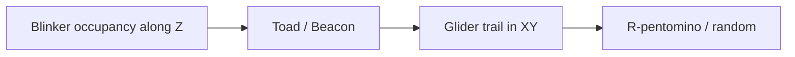

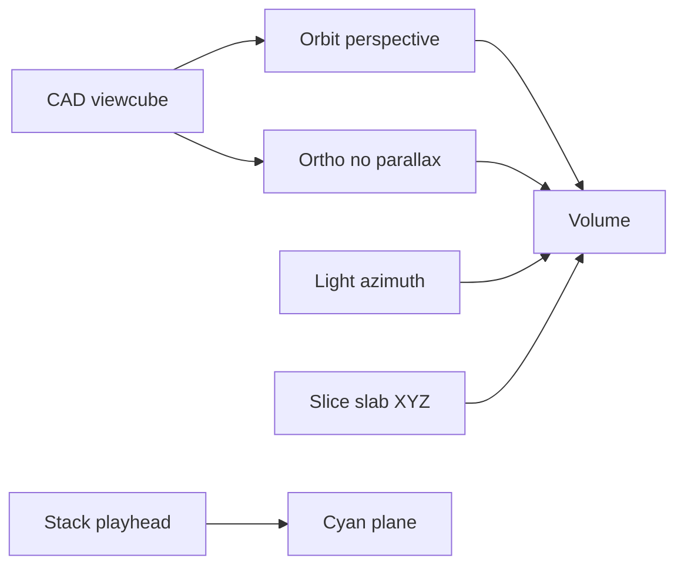

Orbit (browser) rotates around the **time axis** through the playfield
origin when **Align to Z** is on; the pivot sits at the mid-height of the
drawn brick. Turn Align to Z off for free pan. **Parallax** off keeps the
look and switches to an orthographic camera. **Fit**
frames the camera between the gold cuts. Scrubbing the cyan playhead
then slides the plane through that brick; the volume does not jump.

## Slice stack

The HUD slider is a **3D slicer** through the chosen product axis —
Z (time) by default, or X / Y. **Now** is `focusBack = 0` (high end of
the rail: live head on Z, max index on X/Y). The far end is the other
bound. The thumb is the cyan plane. Inspect (and X/Y always) has gold
slab grips. Wheel over the stack (or Shift+wheel on the canvas) still
scrubs. X/Y numbers stay on the playfield frame. A CAD viewcube (desktop,
left of the View card) is navigation only, not a time grabber.

When the slice axis is X or Y, the time brick is the live wake or the
whole inspect tape; Play still advances time and does not move the stack.
Inside the gold slab, cubes are solid on the cyan plane, ghost away from
it, and vanish at the grips. **Decay** still darkens older Z slices only.

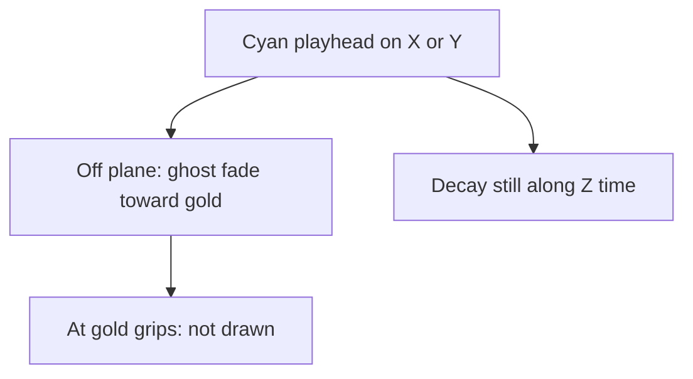

Desktop: vertical rail on the right, **Now at the top**, past at the
bottom. Phone: horizontal timeline at the bottom, **Now at the right**,
past at the left (the same stack, rotated).

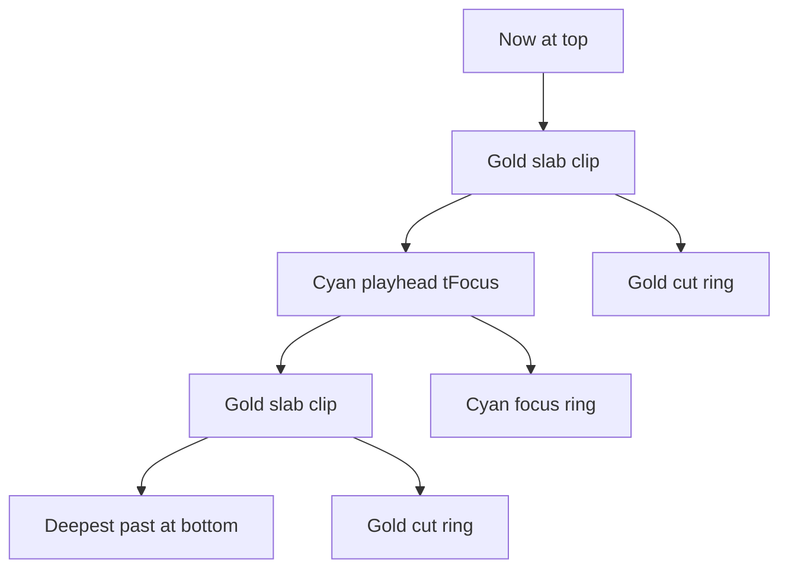

Inspect: generations outside the gold clips are **not drawn** (slicer
window). The focus plane is a **cyan** rectangle; the slab cuts are
**gold** rings (hidden when a cut sits on the playhead). **Fit** (View,
`F`) puts the camera between those cuts. Z scrub then moves only the
cyan plane; the brick stays put because the orbit target rides the
brick center. Live: only the cyan playhead exists (locked at Now). Fog
is **off** while Inspect so a zoomed-out brick stays lit; Live keeps
distance fog.

## Parallax, gizmo, Align to Z, yaw, light

**Parallax** (default on, keyboard `B`) is perspective. Off copies the
current pose onto an orthographic camera so you can look from the side
without a vanishing point. Escape turns parallax back on. When the look
sits within ~15° of the slice axis, ortho draws only the playhead plane
so cells do not stack.

A CAD **viewcube** is a 144 px **rail slot** immediately left of the View
HUD card (desktop orbit only). Six axis-colored **face frames**, a rim, and
X/Y/Z labels on the + faces. Hover lights the face; click snaps that
view. The cube is omitted on phone / coarse pointer (orbit + the slice
stack stay) and in AR. The desktop View card heading collapses the
telemetry (`View ▾` / `View ▸`).

**Align to Z** (default on) pins orbit to the time axis through the brick
center. Off allows screen-space pan. Ortho always pans.

**Yaw** is **AR-only**: after place, rotate the pillar on the table around
product Z (overlay slider or swipe). Gen 0 stays put. Then walk with the
phone. Desktop orbit does **not** yaw the volume — that looked like a
second camera orbit.

**Light** (desktop) walks the key and fill around product Z. The brick
stays put; Lambert faces change. Hemisphere stays sky-up. Shift-drag or
the View slider. In AR the light rig is identity so walking is the look.

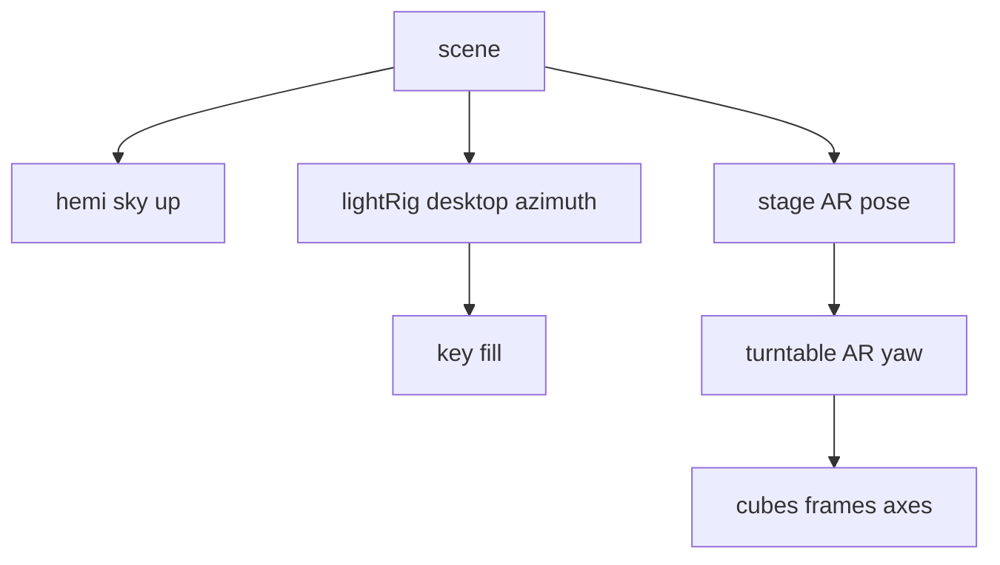

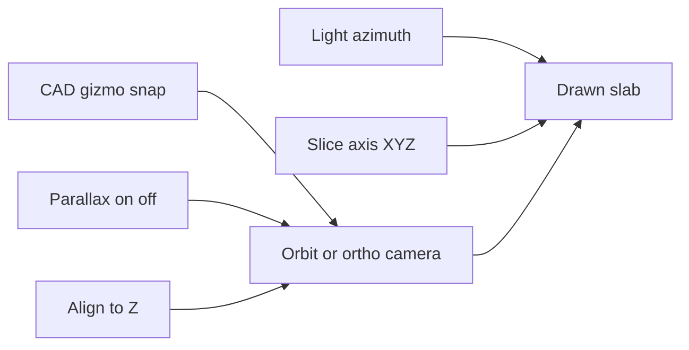

## Isolation / observation

Deferred. Double-click isolation is off. Later: rectangle select on the
playfield (see [backlog.md](backlog.md)). Hover hairlines and edit paint
are unchanged.

## Display HUD vs source HUD

Desktop: two telemetry cards plus a thin Z stack to their right, Play
under the stack. The View card heading collapses the display stats.
Phone: FPS chip (tap expands the View card); Z timeline
and Play at the bottom; source stats in the Source sheet. No viewcube.

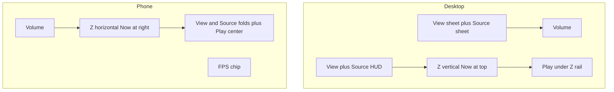

- **Display** — sparkline of recent frame times, FPS, rolling **AVG**,
  **1%** / **0.1%** lows (mean of the slowest 1% / 0.1% of a ~1000-frame
  window), FR, INST (`trunc` if capped), FOC, PLAY/PAUSE, ORTHO. Frame
  times are raw; the 100 ms clamp is simulation catch-up only, so FPS is
  not stuck at 10 on a slow GPU. Long tab-hidden gaps are skipped.
  Cliff-finder: scale Depth / Grid until FPS and 1% low hold. A clear
  software rasterizer adds **SOFTWARE**. Path timers and GPU strings live
  in the control-sheet **Bench** block, not this card.
- **Source** — Conway: GEN, LIVE, RATE (generations/s, not frame rate),
  EDIT. Count: T, LIVE, SUM, MAX, RATE (playhead/s while Play scrubs).

The Z stack is a tick rail, not a HUD card: **Now**, the bar, the
generation beside the handle. Ends are **absolute** generations (oldest
kept … Now), not −N. Live, that span is the wake (Depth). Viewing the
tape, that span is the recording. Ticks stride so a long tape does not
grow the DOM.

## Modules

| File | Role |
|------|------|
| `src/conway.js` | B3/S23, seeds, wrap — port of BLITZ `blitz/data/conway.py` |
| `src/dynamics.js` | Worldline class still / oscillator / transit |
| `src/spacetime.js` | Generation ring → `EventSoA` (`x, y, t, v, k`) |
| `src/focus.js` | `tFocus` vs `tNow` (scrub clamp) |
| `src/axes.js` | Product X/Y/Z vs engine; slice stack; tick labels |
| `src/coords.js` | Right-side numbered X/Y frame and hover hairlines |
| `src/observe.js` | Cell pick from world XZ (edit hover; isolation later) |
| `src/view.js` | Perspective ↔ orthographic (parallax) |
| `src/fade.js` | Decay along Z (time); X/Y slice proximity fade |
| `src/orbit.js` | Fit / pin orbit around the brick |
| `src/turntable.js` | AR object yaw around product Z; desktop light-rig azimuth |
| `src/gizmo.js` | CAD viewcube (desktop rail slot left of View; click-to-snap) |
| `src/gizmo-layout.js` | Viewcube CSS box and product-axis face mapping |
| `src/npy.js` | NumPy `.npy` v1/v2 reader (count cubes) |
| `src/count.js` | Sparse count volume → `EventSoA` |
| `src/wolke.js` | WOLKE viewer contract: Socket.IO notify + same-origin `/stream-npy` GET |
| `scripts/stream_proxy.py` | Allowlisted sidecar fetch mixed into the static HTTP/HTTPS servers |
| `src/encoding.js` | Color LUT and fill for packed `k` / `s` (Conway and count) |
| `src/bench.js` | Path timers, GPU/software probe, Conway load presets |
| `src/renderer.js` | Solid + ghost instanced cubes; focus frame; hover outlines |
| `src/main.js` | Scene, loop, dirty flags, edit/paint, camera, slice slab |
| `src/hud.js` | Display vs source HUD copy; frame-time sparkline; 1%/0.1% lows |
| `src/ui.js` | Two left sheets (View / Source), transport Play, slice stack |

BLITZ **Ember** decay is a 2D grayscale trail and is **not** used here.
DONNER decay is visual weight along the time axis.

Random soup uses `mulberry32`. It is **not** bit-identical to NumPy's
generator in BLITZ. Patterns (glider, blinker, toad, beacon, R-pentomino,
Gosper gun) match BLITZ cell for cell.

## Renderer contract

The cube renderer is the first implementation, not the only one. A later
points / shader path should keep:

```text
setEvents(soa, { tFocus, decay, fadeSpan, timeScale, width, height, cellSize, isolate, sliceAxis, sliceLo, sliceHi, sliceFocus, sliceOnly, stabMode })
```

Color `k` and fill `s` are encoding fields. The renderer indexes
`src/encoding.js` (`CONWAY_KIND_HEX` or `countKindHex`, `encodingFill`)
and does not import Conway dynamics.

`EventSoA` is packed typed arrays. Newest slices fill first so the present
is kept if instance capacity is exceeded (`truncated` flag in the HUD).

No DONNER backend, no EVT3 decode in the browser, no packed-selection /
`viewer_index` sync. A **WOLKE-contract viewer** (`src/wolke.js`) may
connect to the EVT sidecar or WOLKE: Socket.IO announces
`send_file_message`, the page GETs `/stream-npy` (allowlisted loopback /
RFC1918 only), then the count adapter unpacks EventSoA. Cubes do not
ride the socket. Restart `npm start` / `start:lan` after pulling this
so the proxy exists; `python3 -m http.server` will not.

```text
Event camera → sidecar → count cube .npy
                          ├─ BLITZ (dense stack)
                          ├─ DONNER (space-time 3D; file or stream)
                          └─ DONNER XR (same scene)
```

File format is not the runtime contract. A **source adapter** unpacks
`.npy` count cubes (`src/npy.js` + `src/count.js`) into `EventSoA`. A
monolithic NPZ is still a transport container — do not teach the renderer
to read NPZ. Polarity / occupancy / states views of the same ON/OFF
planes are later encodings, not extra parsers.

## Delivery (product / renderer / shells)

**DONNER** is the product: EventSoA, focus plane, isolation, later XR.
**Three.js cubes** are the current engine, not the name. A later points /
shader path — or a native GPU backend if WebGL/WebGPU is *measured* to
fail — keeps `setEvents(...)`. Do not port DONNER into BLITZ/PyQtGraph.

Three shells around the same core, in order, not in parallel:

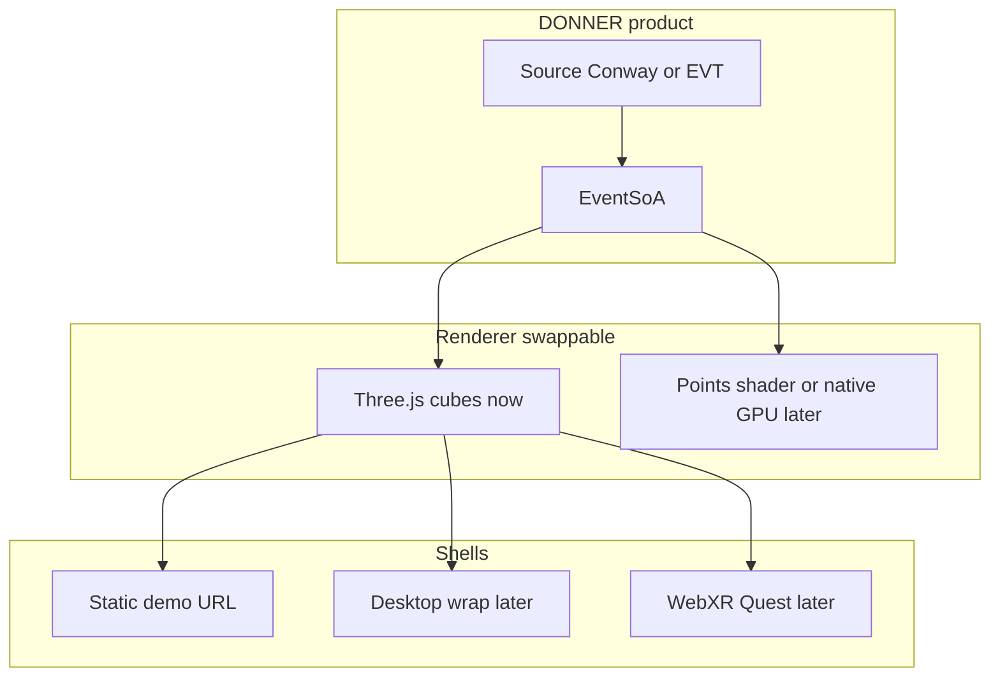

1. **Now — demo shell:** static HTML+JS. That is Stage 1, not a deficit.
2. **Later — desktop wrap:** only once local files / sidecar exist (WOLKE-style
   host, or a thin WebView). Empty `DONNER.exe` around `index.html` is not
   worth it today.
3. **XR shell:** same Three.js scene, WebXR. Native OpenXR/Unity only if
   WebXR fails the lab case.

## Wake vs RAM tape

**Play** is Live View: generator runs, playhead = Now, Z locked (`LIVE`).
The drawn volume is a **wake** of **Depth** cubes. **Pause** is Inspect:
the viewer opens its RAM tape (proto-file). Z is gen 0 … cached Now;
**the whole tape can be cubes** (Depth is hidden). A **Z slab** clips
which generations are instantiated (cyan playhead, gold cut rings in the
volume). Fog is off; zoom out to see the brick. Play jumps back to live
Now — it does not replay the tape. Source **Stop when stable** (default
on) pauses Live into Inspect after five unchanged Conway generations so
a still life does not record forever.

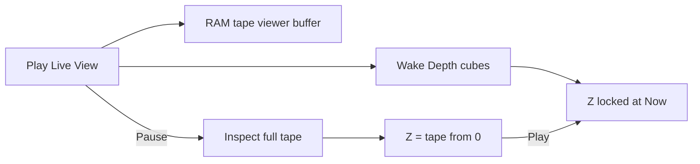

```text
Live (Play)
              |-- Depth --|
GEN 0 ........ [ oldest |||||||| Now ]   Z = LIVE

Inspect (Pause)
[ 0 |||||||||||||||||||||||||||| tape Now ]
 all cached slices are cubes; Z only moves the plane
```

**Decay** (View, on/off) fades to 0 at the **oldest drawn slice**. Live
that is the back of Depth; Inspect that is gen 0 (or the tape start).
Off = even brick.

Cache status lives in View. Conway Source does not own Depth, Decay, or
the tape. Caps: 4096 gens or 400 000 cells, then `full` (recording from
the start stops). Reset starts a new tape. Changing Depth resizes the
wake ring only. The instance cap (Bench **Cube cap**, default 200 000)
still newest-first (`trunc` in the HUD) if Inspect is denser than the GPU
envelope.

Neighborhood default is **none**. 3×3 / 5×5 is the motion gate (CPU cliff
at 5×5). Dynamics and Stability stay on for teaching.

## Dirty state

The animation loop (`setAnimationLoop`) no longer rebuilds the volume every
frame. XR frames come from the same callback.

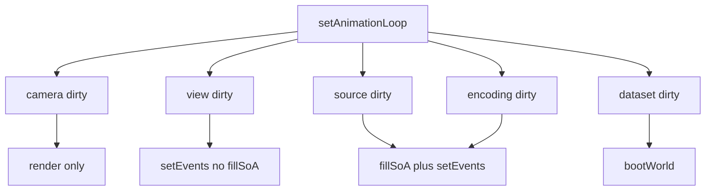

| Dirty | Typical cause | Work |
|-------|---------------|------|
| camera | Orbit, damping | `renderer.render` only |
| view | Decay, slice axis, Inspect playhead | `setEvents` (decay/focus still CPU-baked) |
| source | Conway step, paint, live wake moved, enter Inspect, **Z slab** | `fillSoA` of **Depth** (live) or the **slab** (inspect), then `setEvents` |
| encoding | Stability, Bench flags | same as source |
| dataset | Grid, pattern, reset | `bootWorld` (new tape) |
| ring | Depth | wake `GenerationRing.resize` (keep newest slices) |

**Force full rebuild** in Bench restores the old every-frame `fillSoA` +
`setEvents` for A/B. P2 does **not** yet append a single generation into the
SoA or upload a GPU subrange — it refills the live wake or the inspect
tape. Incremental append is the next cut if CPU Stress + Dynamics stays
hitchy while playing.

Hover/`eventAt` runs only when the hovered cell, focus, or SoA changes.

Bench `now` is **this frame**. Skipped paths record 0 (`work rend` ⇒ `soa`
0). Rolling avg/max reset when a preset rebuilds the world — otherwise
Teaching inherits CPU-Stress hitches. `bound CPU soa` vs `bound GPU fill`
compares wall-clock frame time to the CPU paths. A paused 50k-cube volume
on a retina canvas (DPR 2, ~2500²) can sit at ~24 FPS with `rend` CPU
0.3 ms: that is fill-rate, not classification. Renderer Stress and CPU
Stress then look the same **until you look at `soa now`**. Applying a
preset starts Play.

## Performance envelope

Instanced cubes: one mesh, default 200 000 instances (Bench **Cube cap**
up to 4 000 000). Conway is the synthetic
load generator. Use the **Bench** sheet: path timers (`sim` / `soa` /
`inst` / `hov` / `rend` CPU / `hud`), WebGL/software detection, feature
toggles, presets.

GPU timer queries: detect `EXT_disjoint_timer_query_webgl2` and show `n/a`
or `ext`. Do not treat CPU `rend` as GPU time.

If the unmasked renderer string matches llvmpipe, SwiftShader, Microsoft
Basic Render Driver, or GDI Generic, the View HUD and FPS chip warn
**SOFTWARE**. Missing unmasked strings are **unknown**, not a GPU claim.

### Presets

| Preset | Grid | Depth | Encoding |
|--------|------|-------|----------|
| **Teaching** | 32×32 Blinker | 48 | Full, Neighborhood none |
| **Desktop** | 64×64 Blinker | 100 | Full, Neighborhood none |
| **CPU Stress** | 64×64 Random | 100 | Dynamics on, Neighborhood none |
| **Renderer Stress** | 64×64 Random | 100 | Dynamics off, constant color/size |

Neighborhood **5×5** is the CPU cliff — turn it on in Bench to measure.
Presets leave it off.

Points renderer / million-event preset is later.

### Node CPU baseline (`fillSoA`, avg of 8, this tree)

Not FPS. Classification only, no Three.js. Measured 2026-08-31 on the
dev Node process:

| Case | `fillSoA` |
|------|-----------|
| Teaching 32 Blinker, dynamics on | ~1.3 ms (144 events) |
| Same, dynamics off | ~0.02 ms |
| Desktop 64 Blinker, dynamics on | ~1.5 ms (300 events) |
| CPU Stress 64 Random, Depth 100, dynamics on, neighborhood 5×5 | ~315 ms (≈30k events) |
| Same, dynamics off | ~0.14 ms |
| Renderer Stress 64 Random, dynamics off | ~0.2 ms (≈51k events) |
| Same soup if visible = resident = 1000, dynamics on | ~2.3 s and SoA truncates at 200k |

Takeaway: **Neighborhood 5×5 dominates** on dense soup; occupancy-only
Dynamics is cheap. Depth stops the 200k cap. Camera-only frames skip
`fillSoA` (Bench `work rend`). Playing at 8 gen/s with 5×5 on soup still
hitches until slice-append exists. Measure GPU FPS in the Bench HUD; do
not copy these Node numbers as frame rate.

## MRI volume (later)

Anatomical MRI is a dense `(x, y, z)` cube. DONNER still consumes
`EventSoA` cubes — **not** a NIfTI viewer. Do **not** embed NiiVue (different
camera, chrome, and contract). A 3D-texture / raymarch “glass brain” is a
later renderer behind the same stage, only if a measured slab of cubes is
not enough.

There is **no** MRI source kind and **no** NIfTI parser in the browser.
The public demo is a one-shot convert to the count interchange
`(T, H, W)` uint16. Load it with Source → Count stack → **Load .npy**.
Until a dedicated kind exists, Count **Play** walks the 8-slice window
on the **active** stack axis (Z, X, or Y). Decay is off on dense stacks
(a time-fade on anatomy is wrong).

```mermaid
flowchart TB
  dense[Dense mni152_stack npy]
  slab[Stack-axis slab window]
  cull[Emit if 6-neighbor air or slab boundary]
  soa[EventSoA]
  cubes[Instanced cubes]
  dense --> slab --> cull --> soa --> cubes
```

**Public demo** (local, not git): `datasets/MRT/mni152.nii.gz` from
[niivue/niivue-demo-images](https://github.com/niivue/niivue-demo-images)
(BSD-2-Clause wrapper; derived from [ICBM 152 NLin 2009](https://www.bic.mni.mcgill.ca/ServicesAtlases/ICBM152NLin2009)).
Converted file: `datasets/MRT/mni152_stack.npy` — **dense** 4× stack
`(54, 64, 52)`, intensity 1…32. Do not vendor either file in this repo.
Check ICBM terms before shipping a derived `.npy`.

**SHIP working data** under `datasets/MRT/raw image/` and
`Segmentierungen/` stays on disk only. Do not copy subject NIfTIs or
masks into DONNER git.

**Cube budget** is occupancy, not INST. Ignition is ~70k cubes at **3 %**
fill — a sparse cloud. A 4× MNI brick is ~84k at **47 %**: ~75k interiors
overdraw if every voxel is a Lambert cube (`bound GPU fill`, ~200 ms).
`CountVolume.fillSoA` skips a voxel whose six neighbors are occupied
**and** inside the current slab on the **active stack axis** (Z time, or
X / Y). A full-tape slab is an outer hull; an **8-slice** mid-volume
window (auto when occupancy > 15 %) shows tissue on the cut. Play
translates that window on X, Y, or Z. Affine / RAS is ignored — the
gizmo is array X/Y/Z.

Re-run the convert (numpy + gzip, no nibabel). From the WETTER-Suite
root:

```python
import gzip, struct
from pathlib import Path
import numpy as np

src = Path("datasets/MRT/mni152.nii.gz")
dst = Path("datasets/MRT/mni152_stack.npy")
raw = gzip.open(src, "rb").read()
dim = struct.unpack_from("<8h", raw[:348], 40)
off = max(352, int(struct.unpack_from("<f", raw[:348], 108)[0] or 352))
nx, ny, nz = int(dim[1]), int(dim[2]), int(dim[3])
vol = np.frombuffer(raw[off:off + nx * ny * nz], dtype=np.uint8).reshape(
    (nx, ny, nz), order="F"
)
stack = np.ascontiguousarray(np.transpose(vol[::4, ::4, ::4], (2, 1, 0)))
mx = int(stack.max())
out = np.zeros(stack.shape, dtype=np.uint16)
if mx > 0:
    q = np.clip(np.round(stack.astype(np.float64) * 32.0 / mx), 0, 32).astype(
        np.uint16
    )
    q[(stack > 0) & (q == 0)] = 1
    out = np.ascontiguousarray(q)
np.save(dst, out)
```

Next (not this tree): a dedicated MRI encoding / source kind, or a volume
texture pass. Not a NIfTI-in-browser parser first. See
[backlog.md](backlog.md).

## Stages

```mermaid
flowchart LR
  s1[Stage1 Conway]
  p1[P1 Instrument]
  p2[P2 DirtyState]
  xra[XR-A session]
  p3[P3 Cross platform]
  pts[Point renderer later]
  s1 --> p1 --> p2 --> xra --> p3 --> pts
```

1. **Conway 3D** — this tree (P1 timers + P2 dirty/window are in)
2. **Event camera** — count-stack `.npy` is in (same SoA), including a
   WOLKE-contract stream from the EVT sidecar (Socket.IO notify + HTTP
   GET). Polarity / occupancy / states encodings, packed selection,
   `viewer_index`, and EVT3-in-browser are later. An anatomical MRI cube
   is also later: same `.npy` interchange, not a NIfTI parser — see
   [MRI volume (later)](#mri-volume-later).
3. **XR** — same scene, WebXR only. **XR-A is opened:** passthrough,
   plane hit-test (tap a table to place, then lock the session origin),
   viewer-front fallback. After lock, **Yaw** turns the pillar on the
   table (product Z; gen 0 stays put). Then walk with the phone.
   The volume is a pillar: gen 0 on the table,
   **Play** grows the tape up, Z clips a segment in place. The DOM overlay is `#xr-overlay`
   (Play / Z / Size / Yaw / Exit), not `document.body`. Next
   is XR-B marker origin, then XR-C Quest 3 passthrough. Detail in
   [backlog.md](backlog.md). Do not start a new renderer in the same
   slice as XR.
4. **Integration** — WOLKE-contract stream is in (sidecar / WOLKE →
   DONNER count cube). Later: Open in DONNER / send space-time ROI back
   to BLITZ. No shared widgets.

Product **Z** (time) already stands on the playfield plane, so a table
is a natural origin. In AR the **oldest slice** (gen 0 / tape start)
sits on the table and **Play** grows the tape up as a pillar; Z clips a
segment in place (it does not slide that chunk onto the table). Phone
orbit is still the non-AR fallback. One codebase: feature-detect
`immersive-ar`, `renderer.xr.enabled`, pause orbit in session, keep
`setEvents(...)`. Phone HTTPS is **`https://lab.ole.icu/`** (Caddy →
laptop `start:lan`). The LAN/HTTPS servers send
`Permissions-Policy: xr-spatial-tracking=(self)` so Chrome Android still
allows WebXR after a browser update. mkcert (`npm run start:https`) is
fallback if the LXC is down. Do not use `pve.ole.icu:8006`. iOS Safari AR is not the
demo path unless `navigator.xr` actually supports it. Chrome later
(Source off the rail, thin View) is in [backlog.md](backlog.md) and is
not a gate for XR-A.

```mermaid
flowchart LR
  phone[Phone Chrome]
  lab[lab.ole.icu Caddy LXC]
  laptop["Laptop :8765 start:lan"]
  phone -->|HTTPS LE| lab
  lab -->|reverse_proxy| laptop
  laptop --> xr[WebXR immersive-ar]
  xr --> vol[Hit-test place on table]
```

```mermaid
flowchart TB
  subgraph phone [Phone tabletop AR]
    sess[Session: passthrough]
    hit[Hit-test: tap table, lock pillar at 0]
    yaw[Yaw around table Z]
    walk[Walk around with phone as window]
    sess --> hit --> yaw --> walk
  end
  subgraph marker [Marker origin]
    tag[AprilTag or printed playfield frame]
    seed[Optional: print is Conway seed]
    tag --> seed
  end
  subgraph quest [Quest 3 passthrough MR]
    table[Volume sits on real table]
    explore[Walk through stack; hands later]
    table --> explore
  end
  phone --> marker
  marker --> quest
```

| Slice | Placement | Device |
|-------|-----------|--------|
| **XR-A** | Plane hit-test (gold reticle, tap to place then lock); yaw on the table; pillar at gen 0; Z clips in place; viewer-front if hit-test is missing | Android Chrome; iPhone only if WebXR AR exists |
| **XR-B** | AprilTag or printed playfield (optional Conway seed) | Same phone AR; marker reused on Quest |
| **XR-C** | Hit-test and/or marker | Quest 3 passthrough; hands / Z scrub later |

## WETTER context

```text
                  LARGE DATA SPACE
                         |
                         v
                DAMPF / KEIM / WOLKE
                         |
                  structured data
                         |
              +----------+----------+
              |                     |
              v                     v
           DONNER                 BLITZ
        Explore 3D/XR          Analyze 2D
              |                     |
              +----------+----------+
                         |
                     Insight
                         |
                  new selection
```

```text
Image → matrix
Matrix → dynamic state
Time series → space-time volume
Event stream → sparse space-time point cloud
Browser / XR → explore that structure
```

## Related work

DONNER is an event viewer. Conway is only the v1 generator of sparse
events. Stacking Life along a time axis is not a new picture, and it is
not the product. See [`docs/related.md`](docs/related.md) — things found
while looking around, not influences. The internal Life reference while
the demonstrator is in the tree is Wolfram 2025 (same page); it is not a
spec for DONNER.
