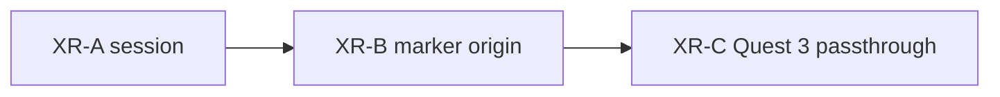

# Later / declined

Shipped work is in [`CHANGELOG.md`](CHANGELOG.md). Remaining product
stages live under **Later** in [`architecture.md`](architecture.md) and
[`docs/gui.md`](docs/gui.md).

**Later:** polarity / occupancy / states encodings on the same `EventSoA`,
sidecar ingest, then the XR ladder below. Count-stack `.npy` is in.
P1 instrumentation and P2 dirty-state / visible window are in this tree.
NPZ loaders, a points renderer, and slice-append SoA updates are also later.

## Public connection

https://github.com/uzh-rpg/event-based_vision_resources#software-utilities

Hier mal PR oder so.
würde eigentlich sehr gut passen
(eher zu event viewer?)

## coord system wie in CAD; damit man von der seite schauen kann und immer orientiert ist

## Chrome (desktop / phone orbit — not XR-A)

Keep the generator out of the viewer chrome. The left split (View card vs
Source card) is a first cut, not the end state.

- **Source off the rail.** Conway does not belong on the right HUD rail
  (GEN / LIVE / RATE) or as a permanent left sheet beside View. Source
  becomes its own surface: open when picking pattern / seed / grid, then
  get out of the way. The volume and Z/Play stay viewer-only.
- **Thin View.** The View sheet is too dense for teaching (Bench timers,
  GPU strings, Neighborhood, presets, Encoding legend, cache line, …).
  Strip View to display controls the human actually uses on the volume
  (Bird, Decay, Depth, maybe a one-line cache). Bench and debug telemetry
  leave the teaching View (fold, flag, or a separate debug sheet).

These are orbit-shell polish. XR-A already specifies a **thin overlay**
(Play, Z, Exit) and must not wait on this cleanup — but the same instinct
applies: AR chrome is not the desktop sheets.

## HTTPS / ops

**Phone / XR URL:** `https://lab.ole.icu/` (Caddy LXC, Let’s Encrypt,
LAN DNS). Upstream is the laptop: `npm run start:lan` on
`192.168.178.30:8765`. A 502 means DONNER is not listening. Do not serve
DONNER from `pve.ole.icu:8006`. The Caddyfile stays on the CT, not in
this git.

**Fallback:** local mkcert — `npm run cert` then `npm run start:https`
(see README) when the LXC is down. Trust the mkcert CA on the phone
once. Re-issue if the LAN IP changes.

## XR ladder

Tech demo, same Three.js scene — not a Unity fork, not a projector, not a
native iOS wrapper. P1/P2 baseline is in; **XR-A session is opened**.
Do not start a new renderer (points / million-event) in the same slice
as XR-B/C.

1. **XR-A — phone tabletop.** WebXR `immersive-ar` on **Android Chrome**.
   **Opened:** passthrough, plane **hit-test** (gold square reticle, tap
   to place, then lock for the session), tabletop scale (32 cells ≈ 40 cm).
   The volume is a pillar: gen 0 on the table, **Play** grows the tape
   up, Z clips a segment in place.
   If hit-test is missing, the volume sits ~0.8 m in front of the viewer.
   Feature detect; no AR button if `immersive-ar` is missing. Orbit is
   the fallback. **HTTPS** is `https://lab.ole.icu/` (`start:lan`
   upstream); mkcert is fallback. AR chrome is Play, Z, Size, Exit. Pause
   `OrbitControls` in session. `setEvents(...)` stays. Teaching 32 is
   enough; no extra Depth/Grid cap this stage. iPhone only if
   `navigator.xr` actually supports AR. No 8th Wall, no ARKit shell.
   **Next:** XR-B marker origin.

2. **XR-B — marker origin.** AprilTag or a printed gold playfield frame
   for a repeatable origin and metric scale. Optional gag: the print *is*
   the Conway seed (Blinker on paper → the stack grows along product Z).
   Same phone AR session; the marker also serves Quest later.

3. **XR-C — Quest 3 passthrough.** Same scene as mixed reality on the
   table (`immersive-ar` / alpha-blend). Walk the stack; hand input and
   in-world Z scrub come after placement works. This is the exploratory
   capture feel; XR-A is only the window demo.

Out of this ladder: projection mapping, Unreal, Vision Pro as a first
target. Count-stack `.npy` is in; polarity encodings and EVT3-in-browser
stay later.

## Isolation (later)

Worldline isolation is **deferred**. Double-click on a cube is off.
Later: **rectangle selection** on the playfield, not a cube double-click.
`src/observe.js` pick math can stay; the shell does not call it.

**Declined for now:** filmstrip and hover recheck-ROI.
