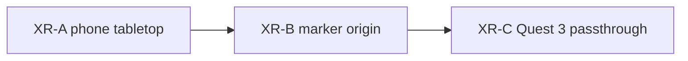

# Later / declined

Shipped work is in [`CHANGELOG.md`](CHANGELOG.md). Remaining product
stages live under **Later** in [`architecture.md`](architecture.md) and
[`docs/gui.md`](docs/gui.md).

**Later:** event-camera source on the same `EventSoA`, a polarity (or
other) encoding LUT, then the XR ladder below. P1 instrumentation and
P2 dirty-state / visible window are in this tree — the P1/P2 gate for
XR-A is met. NPY/NPZ loaders, a points renderer, and slice-append SoA
updates are also later.

## Chrome (desktop / phone orbit — not XR-A)

Keep the generator out of the viewer chrome. The left split (View card vs
Source card) is a first cut, not the end state.

- **Source off the rail.** Conway does not belong on the right HUD rail
  (GEN / LIVE / RATE) or as a permanent left sheet beside View. Source
  becomes its own surface: open when picking pattern / seed / grid, then
  get out of the way. The volume and Z/Play stay viewer-only.
- **Thin View.** The View sheet is too dense for teaching (Bench timers,
  GPU strings, Neighborhood, presets, Encoding legend, cache line, …).
  Strip View to display controls the human actually uses on the volume
  (Bird, Decay, Depth, maybe a one-line cache). Bench and debug telemetry
  leave the teaching View (fold, flag, or a separate debug sheet).

These are orbit-shell polish. XR-A already specifies a **thin overlay**
(Play, Z, Exit) and must not wait on this cleanup — but the same instinct
applies: AR chrome is not the desktop sheets.

## HTTPS / ops

**Phone / XR tests:** local mkcert — `npm run cert` then
`npm run start:https` (see README). Trust the mkcert CA on the phone
once. Re-issue if the LAN IP changes.

**Later (ops):** an ole.icu reverse-proxy LXC (Let's Encrypt DNS-01, same
split-horizon pattern as `pve.ole.icu`, no WAN). No lab LXC yet. Do not
serve DONNER from `pve.ole.icu:8006`.

## XR ladder

Tech demo, same Three.js scene — not a Unity fork, not a projector, not a
native iOS wrapper. P1/P2 baseline is in; **XR-A is the next product
stage when opened**. Do not start XR-A in the same slice as a new
renderer (points / million-event).

1. **XR-A — phone tabletop.** WebXR `immersive-ar`, plane **hit-test**:
   tap a table, place the volume, walk around with the phone as a window.
   Demo path is **Android Chrome**. iPhone only if `navigator.xr` actually
   supports AR; otherwise treat it as blocked. No 8th Wall, no ARKit
   shell. Feature-detect; fallback is today's orbit viewer. **HTTPS**
   for that test is local mkcert (`npm run start:https`), not an ole.icu
   LXC. Keep Depth/Grid smaller than the desktop 200 000-cube envelope.
   AR UI is a thin overlay (Play, Z scrub, Exit); Bird-eye is usually
   redundant (you look down yourself). Pause `OrbitControls` while a
   session is active. Renderer contract `setEvents(...)` stays.

2. **XR-B — marker origin.** AprilTag or a printed gold playfield frame
   for a repeatable origin and metric scale. Optional gag: the print *is*
   the Conway seed (Blinker on paper → the stack grows along product Z).
   Same phone AR session; the marker also serves Quest later.

3. **XR-C — Quest 3 passthrough.** Same scene as mixed reality on the
   table (`immersive-ar` / alpha-blend). Walk the stack; hand input and
   in-world Z scrub come after placement works. This is the exploratory
   capture feel; XR-A is only the window demo.

Out of this ladder: projection mapping, Unreal, Vision Pro as a first
target, event-camera import (stage 2).

## Isolation (later)

Worldline isolation is **deferred**. Double-click on a cube is off.
Later: **rectangle selection** on the playfield, not a cube double-click.
`src/observe.js` pick math can stay; the shell does not call it.

**Declined for now:** filmstrip and hover recheck-ROI.
