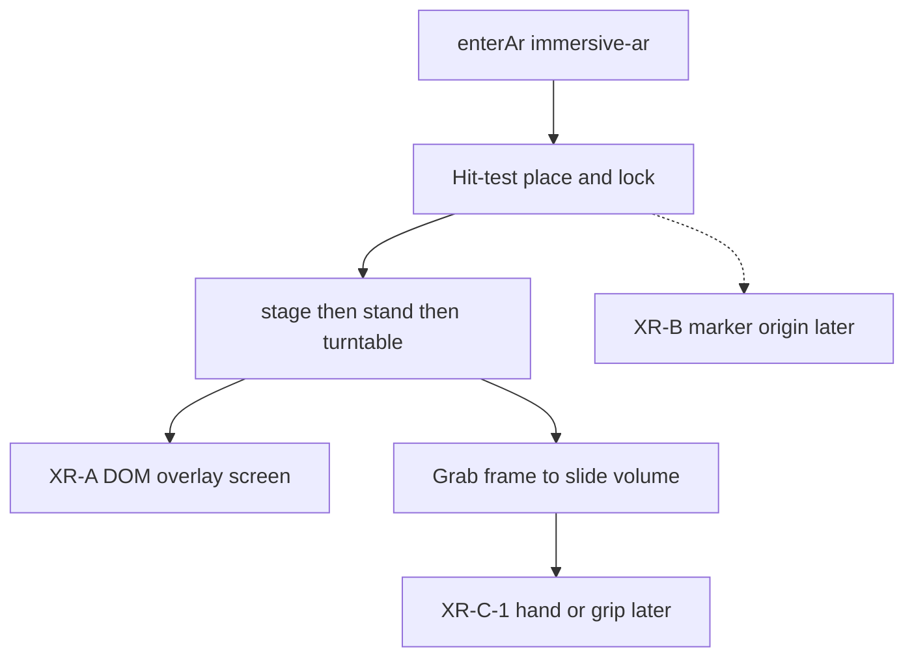

# Later / declined

Shipped work is in [`CHANGELOG.md`](CHANGELOG.md). Remaining product
stages live under **Later** in [`architecture.md`](architecture.md) and
[`docs/gui.md`](docs/gui.md).

## Product roadmap

Do not rewrite DONNER. Do not merge it into BLITZ. Do not start a
Dataset Contract or PointRenderer before a public preview.

**Phase 1 — finish current milestone.** Quest session works again (no
DOM overlay, `local` tracking, `XRWebGLLayer`). The in-world Play/stand/Exit
plate is retired — confirm the four device follow-ups below on hardware
(WWM). C-1 hands later. Freeze the Unreleased XR/MNI slice.

**Phase 2 — public preview.** Thin View; Bench off the primary workflow
(see Chrome notes below). Curated Conway + EVT + volume demos. Deploy
`https://donner.mess.engineering` (GitHub Pages + custom domain). Add
DONNER to the WETTER landing page (sibling repo `WETTER/`). Retire the
old M.E.S.S. Java/browser point-cloud showcase from the active site
(archive OK). Connected / sidecar mode stays off that static host.

**Phase 3 — feedback.** Usability, slicing, mobile, AR, Quest,
performance, own-data loading. Do not decide every later feature first.

**Phase 4 — Dataset Contract.** Source adapter → Dataset Contract → core
→ renderer. Axis role / unit / spacing / affine. Keep `CountVolume` for
counts; add `ScalarVolume` for generic volumes. Formalize WETTER Viewer
Contract (packed `__selection__.npy`, `viewer_index`). NPZ + optional
`dataset.json`. Demo shell vs product core. See
[`architecture.md`](architecture.md#later-dataset-contract).

**Phase 5 — renderers.** PointRenderer vs CubeRenderer (benchmarks
first). VolumeTextureRenderer only if dense volumes justify it.

**Phase 6 — integration.** XR-B AprilTag (dataset id + spatial origin;
no secrets in the marker). Quest interaction. WOLKE. Domain adapters
(CT/MRI) only when needed.

**Later detail:** polarity / occupancy / states encodings on the same
`EventSoA`, packed WOLKE selection / `viewer_index`, then the XR ladder
below. Count-stack `.npy` and the WOLKE-contract stream (EVT sidecar)
are in. P1 instrumentation and P2 dirty-state / visible window are in
this tree. Dense count cubes (occupancy > 15 %) already open at full
AABB with enclosed voxels culled. Source → **MNI 152** is the public T1
(`datasets/MRT/mni152_stack.npy`, native grid, local symlink). Do not
embed NiiVue.

## MRI volume (later)

Anatomical MRI is not a NIfTI viewer. Same cube engine, later source
addon. Until a dedicated kind exists, the public MNI stack is a count
cube.

- **Now:** Source → **MNI 152** loads `data/mni152_stack.npy` (symlink to
  `datasets/MRT/`, native `(215, 256, 207)` uint16, intensity 1…32).
  Occupancy > 15 % → Inspect, Decay off, `fillSoA` skips 6-enclosed
  voxels (~140k hull). Play/Loop walks the active playhead. Local
  symlink, not a git blob. Check ICBM before redistributing the `.npy`.
  Recipe in [`architecture.md`](architecture.md#mri-volume-later).
- **Next:** Dataset Contract + `ScalarVolume` (intensity, spacing,
  affine) — not NiiVue, not a NIfTI-in-browser parser, not a DICOM
  workstation. Volume-texture pass only if the cube slab is not enough.
  See [`architecture.md`](architecture.md#later-dataset-contract).
- **Not git:** SHIP MPR and nose masks under `datasets/MRT/`. Do not
  commit subject NIfTIs. ICBM terms before shipping a derived `.npy`.

## Public connection

https://github.com/uzh-rpg/event-based_vision_resources#software-utilities

Hier mal PR oder so.
würde eigentlich sehr gut passen
(eher zu event viewer?)

## 3d Viewer

- Rail und View aufräumen (sinnvoll separieren)

## DATA

wir könnten beim einladen der daten einen schwellwert oder filter einstelllen; unterhabl wird kein cube dargestellt

empirisch zeigt, das ab ca 500k Voxel die performance schlechter wird (auf meinem sehr performanten Laptop)

## Conway encoding cost

**Stability scaling** (`stabScale` / Time / Focus) is a real `fillSoA`
hit: every live cell in the AABB runs `stabilityAge`, including Inspect
Triple/Ghost rebuilds on playhead moves. For Conway that is teaching
fill only — **nice-to-have, not required**. Later: default off, or skip
it on those rebuilds. Do not treat it as a display essential.

## Chrome (desktop / phone orbit — not XR-A)

Keep the generator out of the viewer chrome. The left split (View card vs
Source card) is a first cut, not the end state.

- **Source off the rail.** Conway does not belong on the right HUD rail
  (GEN / LIVE / RATE) or as a permanent left sheet beside View. Source
  becomes its own surface: open when picking pattern / seed / grid, then
  get out of the way. The volume and Z/Play stay viewer-only.
- **Thin View.** The View sheet is too dense for teaching (Bench timers,
  GPU strings, Neighborhood, presets, Encoding legend, cache line, …).
  Strip View to display controls the human actually uses on the volume
  (Parallax, Align to Z, Decay, Depth, maybe a one-line cache). Bench and debug telemetry
  leave the teaching View (fold, flag, or a separate debug sheet).

These are orbit-shell polish. XR-A already specifies a **thin overlay**
(Play, Z, Exit) and must not wait on this cleanup — but the same instinct
applies: AR chrome is not the desktop sheets.

## Visible sun (later)

Headlamp is the default (key/fill follow the view). A **visible sun**
with a position in the scene is extra: a gold marker on a ring around the
brick that you drag, so Lambert relief is a studio lamp you can see.
Desktop first. Do not put a CGI sun in AR until that extra is wanted —
AR keeps headlamp plus **Yaw** (slider / swipe after place, then walk).
Not this slice.

## HTTPS / ops

**Phone / XR URL:** `https://lab.ole.icu/` (Caddy LXC, Let’s Encrypt,
LAN DNS). Upstream is the laptop: `npm run start:lan` on
`192.168.178.30:8765`. A 502 means DONNER is not listening. Do not serve
DONNER from `pve.ole.icu:8006`. The Caddyfile stays on the CT, not in
this git.

**Fallback:** local mkcert — `npm run cert` then `npm run start:https`
(see README) when the LXC is down. Trust the mkcert CA on the phone
once. Re-issue if the LAN IP changes.

## XR ladder

Tech demo, same Three.js scene — not a Unity fork, not a projector, not a
native iOS wrapper. P1/P2 baseline is in; **XR-A session is opened**.
XR-B is **not** a gate for Quest chrome. Do not start a new renderer
(points / million-event) in the same slice as further XR work.

1. **XR-A — phone tabletop (shipped ceiling).** WebXR `immersive-ar` on
   **Android Chrome**. Passthrough, plane **hit-test** (gold square
   reticle, tap to place, then lock), tabletop scale (32 cells ≈ 40 cm).
   The volume **stands** on the chosen product plane (default Z: gen 0 on
   the table, time up). **Play** grows the tape along time. Bounding
   frames stay visible after lock. If hit-test is missing, the volume
   sits ~0.8 m in front of the viewer. Feature detect; no AR button if
   `immersive-ar` is missing. Orbit is the fallback. After place, **Yaw**
   orients the volume (overlay slider or swipe). Then walk with the phone
   as an IMU window — that is the phone product, not a stepping stone to
   more phone chrome. **HTTPS** is `https://lab.ole.icu/` (`start:lan`
   upstream); mkcert is fallback. AR chrome is Play, Stand X/Y/Z, Size, Yaw, Exit
   on `#xr-overlay` (`dom-overlay` type `screen`). Pause `OrbitControls`
   in session. `setEvents(...)` stays. iPhone only if `navigator.xr`
   actually supports AR. No 8th Wall, no ARKit shell.

2. **XR-B — marker origin (later).** AprilTag or a printed gold playfield
   frame for a repeatable origin and metric scale. Optional gag: the print
   *is* the Conway seed (Blinker on paper → the stack grows along product
   Z). Same phone AR session; the marker also serves Quest later. Not a
   blocker for XR-C.

3. **XR-C — Quest passthrough (parallel chrome fork).** Same
   `immersive-ar` session and placement as XR-A. Quest Browser must not
   request `dom-overlay` (a fullscreen root covers passthrough). The
   parked Play/stand/Exit **plate is retired** — it was unreadable and
   out of reach. **Yaw** is the thumbstick. **Size** is both grips, then
   hands apart/together. **Grab a bounding frame** and drag: the whole
   volume follows the hand (this is not a clip/playhead scrub). Poke a
   cube to isolate the standing plane (Ghost). Phone `screen` overlay
   (Play / Stand / Size / Yaw / Exit) is unchanged. Exit on Quest is the
   headset / browser system gesture. **XR-C-1 later:** hand tracking,
   grip or wrist attach. XR-A is the window demo.

Out of this ladder: projection mapping, Unreal, Vision Pro as a first
target. Count-stack `.npy` is in; polarity encodings and EVT3-in-browser
stay later.

## Device follow-ups (Quest / phone)

Confirm on hardware after the session-fix (WWM). In this tree:

1. **Headset sharpness.** The first Quest-AR recovery used
   `framebufferScaleFactor` 0.5 and 2D pixel ratio 1, which made the
   panel and passthrough look blocky. Use the native XR layer scale.
   2D Quest still skips the viewcube scissor; cap DPR at 1.5 (not 1).
   Keep `XRWebGLLayer` (no projection layer) and skip DOM overlay.

2. **Phone orbit vs sliders.** On touch, one finger rotates and pinch
   zooms. Playhead and clip planes move only on the stack sliders. In-scene
   frame grab stays mouse / desktop. (Phone AR overlay sliders are
   unchanged.)

3. **No world HUD plate.** The XR-C-0 Play / stand X·Y·Z / Exit panel
   stays off. Do not bring it back without a readable, reachable layout
   (XR-C-1 wrist / hand). Stick yaw and grip-pinch size stay.

4. **XR frame grab moves the room.** Select a bounding-frame edge; the
   stage translates with the controller (1:1 with the hand). Ray pick
   rim is ~8 cm, not a 3 cm thread. Clip/playhead in XR is not this
   grab — phone sliders still crop; Quest crop-by-frame is later if
   needed.

## QR door (later)

Print or HUD-share a QR that opens the lab door **`https://lab.ole.icu/`**
(after `npm run start:lan`). Scan loads the viewer; **AR** stays the
existing button when `immersive-ar` is supported.

Optional spawn suffix (query or hash) picks a **known** source, e.g.
`?src=conway&pattern=Blinker` or `?src=count&demo=ignition`. Arbitrary
local `.npy` paths and WOLKE URLs come after that (they are not public
behind the lab door). A Share control that draws the current door+query
as a QR waits on the URL parser. Not this slice: auto-enter AR, marker
prints (XR-B), a QR library.

## Isolation (later)

Worldline isolation is **deferred**. Double-click on a cube is off; the
viewer no longer hover-picks cubes or draws an isolate beacon.
AR **poke** is a different gimmick: it Ghost-isolates the **standing**
plane (time if Z is up), not a worldline.
Later: **rectangle selection** on the playfield, not a cube double-click.
`src/observe.js` pick math can stay; the shell does not call it.

**Numbered axes / units (later).** The right-side coordinate frame,
tick numbers, and hover hairlines are unwired (`src/coords.js` stays
in the tree). They come back with real units, not as an edit-era overlay.

**Declined for now:** filmstrip and hover recheck-ROI.
