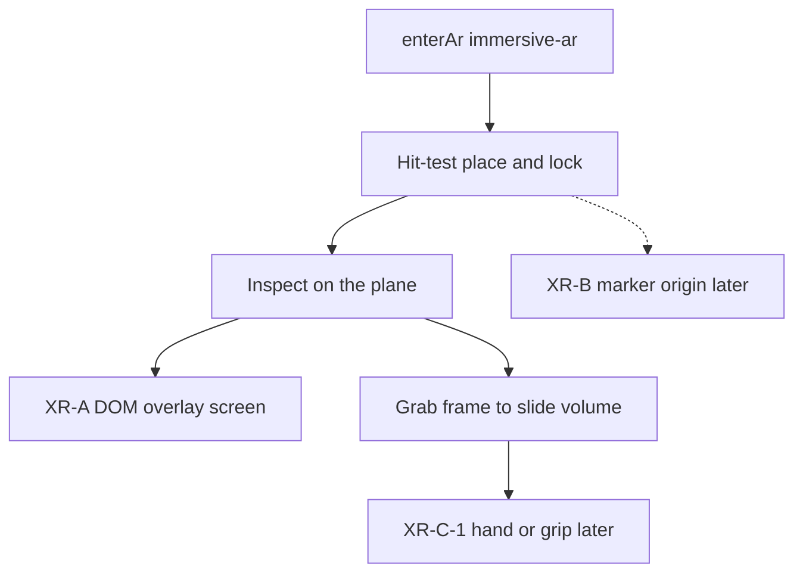

# Later / declined

Shipped work is in [`CHANGELOG.md`](CHANGELOG.md). Remaining product
stages live under **Later** in [`architecture.md`](architecture.md) and
[`docs/gui.md`](docs/gui.md).

## Now vs later

**Already in this tree** (do not list as next work):

- Source | View accordion (desktop rail + phone folds)
- Gap
- Reset Planes
- Hide center / Hide outer on the viewcube
- Source Play vs View Loop
- Hull / Ghost universal (same peek for MRI and Ignition)
- Mid-volume playhead catch
- Loading spinner
- Streamer hidden from Source (no sidecar on Pages). Drop `.npy` on the volume is in.
- Neighborhood gone
- Decay UI gone
- Opt-in **DEV Bench** on the right View HUD (path timers off until checked)
- Ghost / peek: hull InstancedMesh stays; only the solid plane refills (LRU)
- View **Quality** Low / Medium / High (manual; default Medium)
- Visitor Source labels (**Game of Life**, **Lighter Ignition**, **Brain MRI**), About, committed example cubes
- Opt-in **Guide** button to the right of the brand chip (Orbit, Source, Play vs Loop, Rails, Viewcube, Inspect, Look; arrows on the controls)
- Public host live at [https://donner.mess.engineering/](https://donner.mess.engineering/) (GitHub Pages)
- Phone AR inspect (three rails + Loop, named Hull/Ghost/Cuts, Hide center/outer)
- Phone AR search on enter (no Search Anchor), no Z-height slider, footprint-fit scale
- Face AR PoC and Face lab (`face-lab.html`): phone/webcam getUserMedia + MediaPipe, Ghost brain on a tracked head (not WebXR, not Quest). Face button is always visible when the camera exists; `?face=1` enters.

**Later / next candidates** (keep; do not implement in this slice):

1. QR print / path `/ignition` / AR-from-QR — query `?src=` / `?quality=` is in
2. AR floor-plane picker; viewcube face snaps in AR (Hide + Shade are in)
3. Streamer UI (WOLKE-contract Connect). File drop + volume preloader is in; Streamer stays hidden — static Pages has no sidecar.
4. Decay opt-in
5. Dataset Contract / ScalarVolume
6. 500k voxel note / volume-texture pass under DATA
7. Visible sun, isolation, numbered axes, XR-B (incl. physical-head overlay) / XR-C-1
8. Auto View Quality from Bench metrics (`bound GPU fill`, `frm`, software /
   iGPU strings). Manual Low / Medium / High is in. Do not recreate WebGL
   for antialias.
9. Face AR occlusion mesh, auto skull scale

Tried after Face lock: Pose Landmarker lite + inflated landmark hull + CAMShift to keep the brain on a turning or occluded head. Cut — tried; not performant and erroneous (hull overlay too large / misplaced; Pose is a full-body model and often fails on a close-up face). Overlay canvas 640 px cap from that WIP stayed. After lock, Face keeps the last Face pose until the face returns (no second WASM, no getImageData).

## Product roadmap

Do not rewrite DONNER. Do not merge it into BLITZ. Do not start a
Dataset Contract or PointRenderer in the same slice as XR follow-ups
or own-data ingest. The public host is already live.

**Phase 1 — finish current milestone.** Quest session works again (no
DOM overlay, `local` tracking, `XRWebGLLayer`). The in-world Play/stand/Exit
plate is retired — confirm the four device follow-ups below on hardware
(WWM). C-1 hands later. Freeze the Unreleased XR/MNI slice.

**Phase 2 — public host (shipped).** Thin View (Neighborhood is gone; **DEV Bench** is an
opt-in on the right View HUD, not a tab). Curated Conway + EVT + volume demos.
**Live** at [`https://donner.mess.engineering`](https://donner.mess.engineering/)
(GitHub Pages + custom domain). Still open: add DONNER to the WETTER
landing page (sibling repo `WETTER/`). Retire the
old M.E.S.S. Java/browser point-cloud showcase from the active site
(archive OK). Connected / sidecar mode stays off that static host.

**Phase 3 — feedback.** Usability, slicing, mobile, AR, Quest,
performance, own-data loading (file drop + preloader is in; Streamer
stays later). Do not decide every later feature first.

**Phase 4 — Dataset Contract.** Source adapter → Dataset Contract → core
→ renderer. Axis role / unit / spacing / affine. Keep `CountVolume` for
counts; add `ScalarVolume` for generic volumes. Formalize WETTER Viewer
Contract (packed `__selection__.npy`, `viewer_index`). NPZ + optional
`dataset.json`. Demo shell vs product core. See
[`architecture.md`](architecture.md#later-dataset-contract).

**Phase 5 — renderers.** PointRenderer vs CubeRenderer (benchmarks
first). VolumeTextureRenderer only if dense volumes justify it.

**Phase 6 — integration.** XR-B AprilTag (dataset id + spatial origin;
no secrets in the marker). Teaching overlay: one or two tags on a
physical head so Brain MRI locks onto the model. Quest interaction.
WOLKE. Domain adapters (CT/MRI) only when needed.

**Later detail:** polarity / occupancy / states encodings on the same
`EventSoA`, packed WOLKE selection / `viewer_index`, then the XR ladder
below. Count-stack `.npy` and the WOLKE-contract stream (EVT sidecar)
are in. P1 instrumentation and P2 dirty-state / visible window are in
this tree. Dense count cubes (occupancy > 15 %) already open at full
AABB with enclosed voxels culled. Source → **Brain MRI Low** is the
visitor T1; **High** is the native-grid cube. Do not embed NiiVue.

## MRI volume (later)

Anatomical MRI is not a NIfTI viewer. Same cube engine, later source
addon. Until a dedicated kind exists, the public MNI stack is a count
cube.

- **Now:** Source → **Brain MRI Low** loads `data/mni152_low_stack.npy`
  (2× mean bin, `(107, 128, 103)`). **Brain MRI High** loads
  `data/mni152_stack.npy` (committed example, native `(215, 256, 207)`
  uint16, intensity 1…32). Occupancy > 15 % → Inspect, Decay off,
  `fillSoA` skips 6-enclosed voxels (~140k hull on High). Play/Loop
  walks the active playhead. Notices in
  [`data/NOTICE.md`](data/NOTICE.md).
  Recipe in [`architecture.md`](architecture.md#mri-volume-later).
- **Next:** Dataset Contract + `ScalarVolume` (intensity, spacing,
  affine) — not NiiVue, not a NIfTI-in-browser parser, not a DICOM
  workstation. Volume-texture pass only if the cube slab is not enough.
  See [`architecture.md`](architecture.md#later-dataset-contract).
- **Not git:** SHIP MPR and nose masks under `datasets/MRT/`. Do not
  commit subject NIfTIs. ICBM terms before shipping a derived `.npy`.

## Public connection

https://github.com/uzh-rpg/event-based_vision_resources#software-utilities

Hier mal PR oder so.
würde eigentlich sehr gut passen
(eher zu event viewer?)

## 3d Viewer

- Rail und View aufräumen (sinnvoll separieren)

## DATA

Display **Hide** (View → Color coding) drops cubes below a value.
Dense bricks rebuild the hull. That is not the ingest comfort cap.

A load-time threshold (throw voxels away before RAM) is still later
if own-cube drops stay above ~500k occupied.

empirisch zeigt, das ab ca 500k Voxel die performance schlechter wird (auf meinem sehr performanten Laptop)

## Conway encoding cost

Conway `s` is stamped per generation (along Z). **Size by age**, Start,
and Tail are display. Occupancy classification only. Count / MNI color the windowed Scale; they do not size-by-count.

Ghost/Triple still refill the occupancy list on playhead — next cut after
stored `s`.

## Chrome (desktop / phone orbit — not XR-A)

Keep the generator out of the viewer chrome. The left rail (Source fold
on top, View fold below) is the current shell, not the end state.

- **Source off the rail.** Conway does not belong on the right HUD rail.
  After setup the Source fold is a static block the user collapses.
  Later: Source becomes its own surface and leaves the viewer chrome;
  the volume and Z/Play stay viewer-only.
- **Thin View.** The View sheet can still slim for teaching
  (Encoding legend, cache line, Cube cap). Strip View to display controls
  the human actually uses on the volume
  (Parallax, Align to Z, Depth, maybe a one-line cache). Do not shorten
  all View labels in a toolbox pass yet.

These are orbit-shell polish. XR-A already specifies a **thin overlay**
(inspect rails, Loop, Size, Yaw, Exit) and must not wait on this cleanup
— but the same instinct applies: AR chrome is not the desktop sheets.

## Decay (later / opt-in)

Z/time fade toward the oldest drawn slice is still in the renderer
(`src/fade.js`, `DEFAULTS.decay` off). There is no Decay checkbox.
Bring it back only as an explicit opt-in (sparse stacks). Dense MNI
must keep it off. Do not put a dead toggle in View.

## Bench (opt-in debug)

The right View HUD has an opt-in **DEV Bench** checkbox (costs
performance). Path timers (`src/bench.js`) stay off the hot path until it
is checked (`PathTimer.enabled` default false; `measure` calls the work
with no `performance.now()` when off). Always-on bench on the frame / rAF
HUD stuttered; FPS recovered after it left the always-on stats. Do not
add a Bench tab, starters, `slot-bench` / `sheet-bench`, or put timers
on the left View sheet. After using Bench, performance follow-up is
later (see DATA ~500k voxels).

## Legacy — Neighborhood

Neighborhood (none / 3×3 / 5×5) was a filter plaything on the Conway
demonstrator, from a time when coloring and filters were going to be a
bigger deal. Occupancy classification is the only path now. Not a
product feature.

## Visible sun (later)

Headlamp is the default (key/fill follow the view). A **visible sun**
with a position in the scene is extra: a gold marker on a ring around the
brick that you drag, so Lambert relief is a studio lamp you can see.
Desktop first. Do not put a CGI sun in AR until that extra is wanted —
AR keeps headlamp plus **Yaw** (slider / swipe after place, then walk).
Not this slice.

## HTTPS / ops

**Phone / XR URL:** `https://lab.ole.icu/` (Caddy LXC, Let’s Encrypt,
LAN DNS). Upstream is the laptop: `npm run start:lan` on
`192.168.178.30:8765`. A 502 means DONNER is not listening. Do not serve
DONNER from `pve.ole.icu:8006`. The Caddyfile stays on the CT, not in
this git.

**Fallback:** local mkcert — `npm run cert` then `npm run start:https`
(see architecture.md *Serve*) when the LXC is down. Trust the mkcert CA on the phone
once. Re-issue if the LAN IP changes.

## XR ladder

Tech demo, same Three.js scene — not a Unity fork, not a projector, not a
native iOS wrapper. P1/P2 baseline is in; **XR-A session is opened**.
XR-B is **not** a gate for Quest chrome. Do not start a new renderer
(points / million-event) in the same slice as further XR work.

1. **XR-A — phone tabletop (shipped ceiling).** WebXR `immersive-ar` on
   **Android Chrome**. Passthrough, plane **hit-test** starts on enter
   (gold square reticle, tap to place, then lock). Scale fits the longest
   volume edge to 40 cm (32-cell Conway board stays 40 cm). The volume
   **stands** on the chosen product plane (default Z: gen 0 on the table,
   time up). After lock, phone AR is the desktop **inspect** model (three
   rails, Loop, named shade). Bounding frames follow Hide center / Hide
   outer. If hit-test is missing, the volume sits ~0.8 m in front of the
   viewer. Feature detect; no AR button if `immersive-ar` is missing.
   Orbit is the fallback. After place, **Yaw** orients the volume
   (overlay slider or swipe). Then walk with the phone as an IMU window.
   **HTTPS** is `https://lab.ole.icu/` (`start:lan` upstream); mkcert is
   fallback. AR chrome after spawn is rails / Loop / Size / Yaw / Reset
   Anchor / Exit plus Hide and Hull/Ghost/Cuts top-right on `#xr-overlay`
   (`dom-overlay` type `screen`). Pause `OrbitControls`
   in session. `setEvents(...)` stays. iPhone only if `navigator.xr`
   actually supports AR. No 8th Wall, no ARKit shell.

2. **XR-B — marker origin (later).** AprilTag or a printed gold playfield
   frame for a repeatable origin and metric scale. Optional gag: the print
   *is* the Conway seed (Blinker on paper → the stack grows along product
   Z). Same phone AR session; the marker also serves Quest later. Not a
   blocker for XR-C.

   **Teaching overlay — physical head.** Stick one or two AprilTags (QR
   only if it can serve as a pose marker) onto a physical head already
   on the table (Styrofoam, plastic skull, whatever). Start DONNER on a
   tablet, lock onto the tags, and register Brain MRI to that pose so
   the current inspect / playhead is visible both in the volume and on
   the model — true overlay, “we are here.” Two tags beat one for yaw
   and tilt; metric scale comes from the marker geometry, not from a
   floor hit-test. Same XR-B contract (dataset id + origin; no secrets
   in the tag). Not a custom head mesh in git, not projection mapping,
   not a second renderer.

3. **XR-C — Quest passthrough (parallel chrome fork).** Same
   `immersive-ar` session and placement as XR-A. Quest Browser must not
   request `dom-overlay` (a fullscreen root covers passthrough). The
   parked Play/stand/Exit **plate is retired** — it was unreadable and
   out of reach. **Yaw** is the thumbstick. **Size** is both grips, then
   hands apart/together. **Grab a bounding frame** and drag: the whole
   volume follows the hand (this is not a clip/playhead scrub). Poke a
   cube to isolate the standing plane (Ghost). Phone `screen` overlay
   (Play / Stand / Size / Yaw / Exit) is unchanged. Exit on Quest is the
   headset / browser system gesture. **XR-C-1 later:** hand tracking,
   grip or wrist attach. XR-A is the window demo.

Out of this ladder: projection mapping, Unreal, Vision Pro as a first
target. Count-stack `.npy` is in; polarity encodings and EVT3-in-browser
stay later.

## Device follow-ups (Quest / phone)

Confirm on hardware after the session-fix (WWM). In this tree:

1. **Headset sharpness.** The first Quest-AR recovery used
   `framebufferScaleFactor` 0.5 and 2D pixel ratio 1, which made the
   panel and passthrough look blocky. Use the native XR layer scale.
   2D Quest still skips the viewcube scissor; cap DPR at 1.5 (not 1).
   Keep `XRWebGLLayer` (no projection layer) and skip DOM overlay.

2. **Phone orbit vs sliders.** On touch, one finger rotates and pinch
   zooms. Playhead and clip planes move only on the stack sliders. In-scene
   frame grab stays mouse / desktop. (Phone AR overlay sliders are
   unchanged.)

3. **No world HUD plate.** The XR-C-0 Play / stand X·Y·Z / Exit panel
   stays off. Do not bring it back without a readable, reachable layout
   (XR-C-1 wrist / hand). Stick yaw and grip-pinch size stay.

4. **XR frame grab moves the room.** Select a bounding-frame edge; the
   stage translates with the controller (1:1 with the hand). Ray pick
   rim is ~8 cm, not a 3 cm thread. Clip/playhead in XR is not this
   grab — phone sliders still crop; Quest crop-by-frame is later if
   needed.

## AR (later)

Phone AR inspect is in: search on enter, sit-on-plane (no Z height),
footprint-fit scale (floor axes → 40 cm; Play grows up), three rails + Loop, named
Hull / Ghost / Cuts, Hide center / Hide outer. Viewcube face snaps stay
desktop. Remaining:

- **Optional: pick the floor plane.** Let the user choose which detected
  plane is the ground or table the voxels sit on, not only “any
  horizontal surface.” Walls stay ignored; among horizontal hits, pick
  which plane is the sit surface.
- **Viewcube / face snaps in AR.** Desktop 2D ortho cuts fight
  passthrough. Hide + Shade are already top-right. A cube that yaws the
  brick (no camera cut) is later if wanted.

## Live ingest

- **Drop `.npy` + volume preloader is in.** Control lives on Source (Load
  NumPy; drop on the volume still works). Header peek, ~500k comfort warn,
  256³ hard cap, optional 2/4/8 mean/max-bin that skips short axes, first-plane
  preview.
- **Streamer + Connect** stays hidden. WOLKE-contract stream needs a
  sidecar; GitHub Pages has none. Loaders stay in the tree. The Source
  **Loading…** spinner is the seed for “something is arriving.”

## QR door (later)

Print or HUD-share a QR that opens the lab door **`https://lab.ole.icu/`**
(after `npm run start:lan`). Scan loads the viewer; **AR** stays the
existing button when `immersive-ar` is supported.

**URL spawn query is in.** `?src=` picks Game of Life / Lighter Ignition /
Brain MRI Low / High (allow-list + aliases; no arbitrary `.npy` URLs).
`brain` / `mri` open Low. `?quality=` is renderer low / medium / high
(default medium), not the MRI grid. The address bar follows those
controls. Path `/ignition`, printed QR, and AR-from-QR stay later.
Optional `pattern=` allow-list is still later.

**AR from the same QR.** Scanning in an AR-capable browser can place
the volume using the QR / marker as the sit origin (the brick grows
out of the code), instead of a separate floor search. Desktop scan
still just opens the matching Source. Marker prints (XR-B) and
auto-enter AR stay related but distinct.

A Share control that draws the current door+query as a QR waits on the
URL parser. Not this slice: auto-enter AR, a QR library.

## Isolation (later)

Worldline isolation is **deferred**. Double-click on a cube is off; the
viewer no longer hover-picks cubes or draws an isolate beacon.
AR **poke** is a different gimmick: it Ghost-isolates the **standing**
plane (time if Z is up), not a worldline.
Later: **rectangle selection** on the playfield, not a cube double-click.
`src/observe.js` pick math can stay; the shell does not call it.

**Numbered axes / units (later).** The right-side coordinate frame,
tick numbers, and hover hairlines are unwired (`src/coords.js` stays
in the tree). They come back with real units, not as an edit-era overlay.

**Declined for now:** filmstrip and hover recheck-ROI.
