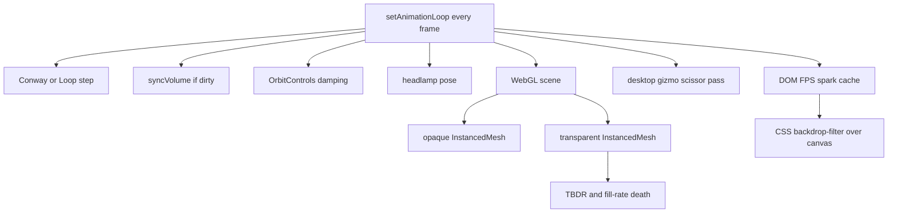

# FPS optimization notes

Catalog of remaining frame-time work. Shipped envelope (Quality, hull cache,
dirty flags, Cube cap) stays in [`architecture.md`](../architecture.md)
**Performance envelope**. This file is ideas and the next CPU/DOM slice, not
a second renderer spec.

Personas: **phone** and **desktop High** matter. **Desktop Low** is a
fallback (Quality Low + SOFTWARE chip). Do not auto-switch Quality from GPU
strings. Do not recreate the WebGL context for antialias (XR-unsafe). Do not
CSS-transform the canvas (blank layer).

Idle orbit of a paused volume is usually **GPU fill-rate** and compositor
work, not `fillSoA`. Documented cliff (when High was DPR 2): ~50k cubes, ~2500², ~24 FPS,
CPU `rend` 0.3 ms → `bound GPU fill`.

---

## Already in the tree

- View Quality Low / Medium / High. Default is **High**. Occupied cells
  above 500k drop to **Medium** (`autoViewQuality`); Low is manual only.
  High: Lambert + ACES + fill, DPR 1.25. Medium: Lambert key, no ACES,
  no fill, DPR 1. Low: unlit, DPR 1.
- Phone: `antialias: !coarse`, no viewcube second pass.
- Dirty loop: camera-only frames skip `fillSoA`.
- MRI hull cache, enclosed-voxel skip (~140k vs ~5.4M), plane LRU + prefetch.
- Ghost matrices sticky; playhead fade is a shader uniform.
- Cube cap 200 000 live; Pause / dense MRI raise to drawn instances, not
  occupied voxels.
- Face AR overlay cap 640 px. Face no longer forces Low (uses current
  Quality; MRI Low/High auto-Medium after load). Overlay pose smoothing
  stays; extra One-Euro on the brain stage was removed.
- Hide debounce 150 ms before a dense hull rebuild.
- DEV Bench path timers off until checked. SOFTWARE warning on the FPS chip.
- No FPS cap (vsync / `setAnimationLoop` only).
- Session RAM cache of decoded demo cubes (switch Source without refetch).

## Unreleased working tree — brakes vs wins

Measured occupied: Brain MRI Low **677 346** (48 %), High **5 395 599**
(47 %). Both trip auto-Medium after `bootCount`. Ignition (~70k) and
Game of Life stay High.

**Brakes (keep in mind, not Kleinvieh):**

- Public door starts High, then MRI load drops to Medium (`resize` twice).
  Ignition Ghost stays High (DPR 1.25 + transparent cubes).
- Visitor Brain shade is **Ghost**. Auto-Medium still draws a glass hull.
- Face no longer forces Low. Phone Face = Ghost + Medium + MediaPipe +
  1280×720 camera + overlay. FPS chip stays visible on Face / phone AR
  (Quest has no DOM overlay).
- `backdrop-filter: blur(12px)` still on brand / Look / folds over the
  canvas (`--panel` is already 0.72 alpha). AR FPS chip is opaque
  (`background: var(--bg)`, no blur) — dock chips `#151c24` too.
- Camera still `ideal: 1280×720`. Overlay iris discs are extra 2D fill
  after lock (cheap vs WebGL Ghost).

**Wins in the same tree:** extra One-Euro on the Face stage gone; demo
RAM cache; Face hides plane frames; dock/AR FPS chip opaque.

---

## Next slice — Kleinvieh (CPU / DOM every frame)

Cheap work that runs **every** rAF tick while paused. Does not change cube
look, Quality, or Ghost blending. Does **not** skip `renderer.render` (XR,
Face AR, and damping still need a draw). Fill-rate slices stay later.

### 1. Cache viewcube CSS layout

[`src/gizmo.js`](../src/gizmo.js) `cssBox()` / `render()` / `layoutHit()` call
`getBoundingClientRect` and `getComputedStyle` on the canvas, `#gizmo-slot`,
and overlay selectors (`.stack`, `.look-strip`, `.look-more`, `.gizmo-fps`,
`.hud-cards`) **every frame**. Desktop uses the slot; overlays are unused
once a slot exists, but they are still measured.

Cache `{ canvasRect, slot, overlays, box }`. Invalidate on window /
`visualViewport` resize, `showGizmo()` flip, Look More, FPS card open/close,
and fold layout. `gizmoCssBox` math in [`src/gizmo-layout.js`](../src/gizmo-layout.js)
stays pure.

`syncGizmoChrome()` in [`src/main.js`](../src/main.js) must not set `hidden`
when the flag did not change.

### 2. Throttle HUD DOM

[`src/main.js`](../src/main.js) `frame()` HUD block writes every tick:

- `hudViewEl.textContent = formatViewHud(...)` even when `#hud-engine` is
  closed (`body.hud-bench-open` is off).
- `ui.setFps(fps)` with `displayFps || 1000 / emaMs` — EMA changes every
  frame, so the chip text changes every frame.
- `drawSparkline` on `#hud-spark` every frame.
- `ui.setCache(...)` every frame.

Keep `FrameClock` sampling every frame (honest FPS). Write the chip from
`displayFps` (already ~0.4 s). Write spark + `#hud-view` + Bench text only
while `hud-bench-open`. Write cache status only when the status key changes.
Conway live overlay already runs only while playing.

### 3. Skip headlamp when the camera is still

[`src/main.js`](../src/main.js) `syncHeadlamp()` decomposes the camera and
moves two lights every frame. In XR, always update (headset moves). In orbit,
skip when position / quaternion match the last pose within a small epsilon
(after damping has settled).

### 4. Hide unused lights on Quality Low

`syncFog()` already sets hemi / key / fill **intensity** to 0 on Low. Also
set `visible = false` so Three does not keep them in the light list. Restore
key on Medium / High; fill only on High.

### Out of this slice

Idle skip of `renderer.render`, Ghost hashed-alpha, phone `backdrop-filter`,
canvas `alpha`, adaptive DPR, exposed faces, greedy hull, Conway SoA append.

### Test / docs when implementing

- Gizmo: layout cache invalidates; `gizmoCssBox` tests stay.
- HUD: chip text stable between `displayFps` ticks; spark not required when
  the card is closed (unit-test the guard if extracted).
- Headlamp: no pose write when camera frozen (unit-test the skip predicate).
- CHANGELOG `[Unreleased]`: paused orbit does less DOM / layout work; FPS
  chip still honest.
- One pointer from `architecture.md` Performance envelope and
  [`docs/llm-brief.md`](llm-brief.md) Related list to this file (if not
  already linked).

---

## Later — phone compositor

Tile GPUs plus Safari compositing the WebGL canvas through CSS filters.

1. Turn off `backdrop-filter: blur(...)` on `pointer: coarse` (already off
   in `body.is-ar`). Opaque `--panel` is enough.
2. `WebGLRenderer({ alpha: false })` except while an AR session needs a
   transparent buffer. Orbit clear is already opaque `COLOR.bg`.
3. Medium is already DPR **1.0** on every surface. High is **1.25**. Not an
   auto Quality switch.
4. Idle skip of `renderer.render` after damping when `!playing && !looping`
   && volume not dirty. FPS chip holds last `displayFps`. Never skip in XR
   or Face AR.
5. Do not CSS-`transform` or `filter` the canvas.

---

## Later — Ghost overdraw (phone + desktop High)

Ghost is a second `InstancedMesh`, `transparent`, `depthWrite: false`,
opacity 0.22. That is the expensive Inspect mode, not Hull.

- Hashed alpha / dither `discard` (no blending) or MSAA alpha-to-coverage
  when antialias is on. Goal: leave the transparent pass.
- `ghost.visible = false` when `count === 0` (Hull idle).
- Share one `BoxGeometry` between solid and ghost; drop unused UVs.
- Flat / Gouraud lighting for cubes (faces are flat; per-fragment Lambert
  + two directionals + hemisphere is extra ALU on overdrawn pixels).

---

## Later — desktop High fill-rate

High wants DPR 1.25 and Lambert. Cliff is **pixels × MSAA × overdraw**, not the
140k JS stamp (that runs only when dirty).

- Adaptive `setPixelRatio` *inside* High (start 1.25, drop toward 1 if
  `frm > 18 ms`, recover slowly). Not Auto Quality from GPU strings.
  Antialias stays frozen at context create; pixel ratio is already runtime.
- Exposed faces only: hull voxels are full cubes (12 tris). Typical surface
  voxel has 1–3 free faces. Six instanced quad batches or a face id on the
  instance. MRI Size-by-age is off → uniform scale.
- Greedy mesh of the hull surface at load / clip (once). Largest triangle
  cut that can still look like voxels. Do this before a volume texture.
- Camera-relative backface instance skip on the hull potato.
- InstancedMesh frustum: today `frustumCulled = false`. Helpful when zoomed
  into a corner; Cuts / plane already draw few instances.
- `setEvents` write `instanceMatrix.array` directly (no
  `Object3D.updateMatrix`). Helps Conway Play / clip rebuild (`bound CPU
  inst`), not fill-rate orbit.

Volume texture / PointRenderer stay Phase 5 — only after measured numbers
on the live host.

---

## Later — Conway Play CPU

P2 refills the live wake every step. Incremental append of one generation
plus a GPU subrange is the documented next cut if dense Random + Color
coding stays hitchy. Not an orbit FPS fix.

---

## Desktop Low (fallback only)

Quality Low is the fallback. SOFTWARE chip already warns. Do not build a
fourth renderer. Optional: on `gpuInfo.software`, prefer Hull over Ghost,
keep Cube cap modest, skip the viewcube pass. Hint “Quality → Low”, never
auto-switch the preset.

---

## Do not

- Raise Cube cap to “get FPS” (2 M envelope hitch).
- Default phone to Quality High.
- Recreate WebGL for antialias.
- Auto Quality from unmasked GPU strings in the same slice as Kleinvieh.
- Treat Fog as the main lever (already off in Inspect / AR).

---

## Measure

DEV Bench on; read `bound` and `frm`.

1. Desktop: Brain MRI High, Inspect **Ghost**, Quality **High**, orbit only —
   fill-rate / Ghost slices. Kleinvieh should not be judged here (CPU `rend`
   is already ~0.3 ms).
2. Desktop: same in **Hull**, paused, FPS card **closed** — Kleinvieh
   baseline. Pass: chip still ticks ~0.4 s; no spark canvas traffic; layout
   not queried every frame (DevTools Performance).
3. Phone: Brain MRI Low, Medium, Hull — compositor slices after Kleinvieh.
4. Conway Play, 32 grid — if `bound CPU soa/inst`, then append, not DPR.

Pass for Kleinvieh: paused orbit still draws; 1% low not worse; XR / Face AR
unchanged; FPS card still honest when opened.
