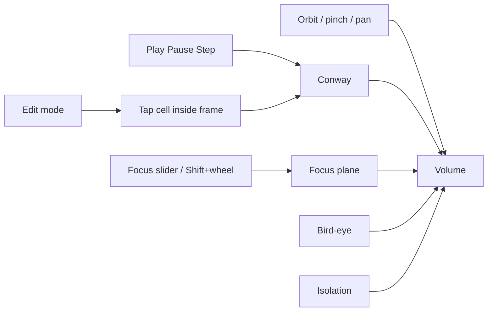

# DONNER UI

The 3D volume is the product. Chrome is a thin M.E.S.S. HUD: Orbitron for
brand and control labels, Inter for running text, dark `#0b0f14` field,
gold `#ffc53d` accent, cyan `#00fff2` for live telemetry. No dashboard
layout.

## Camera

| Input | Action |
|-------|--------|
| Drag / one-finger | Orbit |
| Wheel / pinch | Zoom |
| Right-drag / two-finger | Pan |
| Shift+wheel | Scrub focus into the past / back to now |
| Drag cyan posts / Y-gizmo (paused) | Scrub focus (orbit locked for that gesture) |
| Space | Play / pause |
| `E` | Edit mode (pauses, snaps focus to Now) |
| `B` | Bird-eye (orthographic top view) |
| `I` | Isolation (tap a cell or cube) |
| Escape | Leave isolation, or leave bird-eye |
| `.` or `N` | Simulation step |
| `[` / `↓` | Focus one generation into the past |
| `]` / `↑` | Focus toward Now |
| Home | Focus Now |
| `R` | Reset |

## Simulation

| Control | Meaning |
|---------|---------|
| Play / Pause | Advance generations |
| Step | One generation (also pauses) |
| Edit | Paint cells on the focus plane (only at Now) |
| Bird | Orthographic top-down onto the **focus slice** only; pan / pinch |
| Iso | Dim the volume; keep one `(x, y)` worldline. Tap a cell or cube. |
| Reset | Same pattern and seed |
| Seed | New RNG seed, then reset |
| Pattern | BLITZ seeds; Gosper gun needs grid ≥ 48 |
| Speed | Target generations per second (1–60) |
| Decay | Fade of slices **below** the focus plane |
| Grid light | Brightness of the cell grid and focus-plane fill |
| History | Visible generations from the simulation head (8–96) |
| Focus | Move the working plane through stored history; **Now** snaps to `tNow` |
| Grid | 16…64; rebuilds the world |
| Wrap | Torus vs hard edges |
| Stability | **None** — equal cube size (occupancy). **Time** (default) — fill = stability already reached at that generation. **Focus** — fill = stability on the focus plane, whole column. Hover the control for details. |

The gold **frame** is the playfield edge (rectangle + tall cyan corner posts).
While paused, drag those posts or the cyan **Y** of the corner XYZ gizmo to
scrub focus. Slices newer than the focus sit **above** it, translucent.

**Bird** looks straight down with an orthographic camera (no parallax).
**Iso** dims every cell except one worldline; tap a cell on the plane or a
cube. Edit is unchanged: pause, plane at Now, tap inside the frame.

On narrow viewports the control sheet is behind **Controls ▸** so the
volume stays dominant.

## HUD (right)

| Line | Source |
|------|--------|
| GEN | Simulation head |
| FOC | Focus generation (the plane) |
| LIVE | Live cells on the **focus** slice |
| INST | Instanced cubes (`trunc` if SoA capped) |
| FPS / FR | Frame rate and frame time |
| RATE | Measured generation rate while playing |
| BIRD | Present in bird-eye |
| ISO | Isolated cell, or `…` while picking |

This HUD is also a cheap GPU / browser benchmark. If INST hits the cap,
lower History or Grid before judging FPS.

## Visual mapping

**Geometry** is time (Y). **Color** is dynamics along each `(x, y)` worldline,
not a second clock. An oscillator does **not** cycle hue along Y; it
cycles **occupancy** (cubes present / absent). Mixing extra hues would
fight the class colors.

| Kind | Color | Typical Conway |
|------|-------|----------------|
| Still | gold | block, beehive, blinker core (always on) — activity stays put |
| Oscillator | cyan | blinker tips, toad, beacon — **only when live**, in place |
| Transit | BLITZ coral | glider tube, births/deaths, soup — the space-time **curve** |
| Warmup | gray | generations 0 and 1 — too little history to class |

Default pattern is **Blinker**. Teaching order: Blinker → Toad/Beacon →
Glider. A glider must read as a coral trail, not mixed cyan/gold: those
classes mean the pattern sat still. Cyan on a glider was a false friend
(the ship crawling over the same cell).

Decay only darkens older slices; it does not change hue or cube size.
**Size / fill** depends on **Stability**:

- **None** — every live cell the same size (truth view for occupancy)
- **Time** (default) — duration already reached at that generation (taper)
- **Focus** — duration on the focus plane, whole `(x, y)` column

Cap is 16 generations. Transit stays smaller in Time/Focus. Warmup cubes
stay full size so the first slices are not a false “shrink”.

These classes are the **Conway demonstrator**. The later live path is
event-camera data; polarity (and other encodings) will not reuse this
still/osc/transit legend by default.

The gold **frame** is the playfield edge. **Grid light** sets how bright the
cell lattice is.

## Later

Nerd FPS HUD (sparkline + averages, like the M.E.S.S. homepage overlay) to
find the performance cliff — not built yet.
