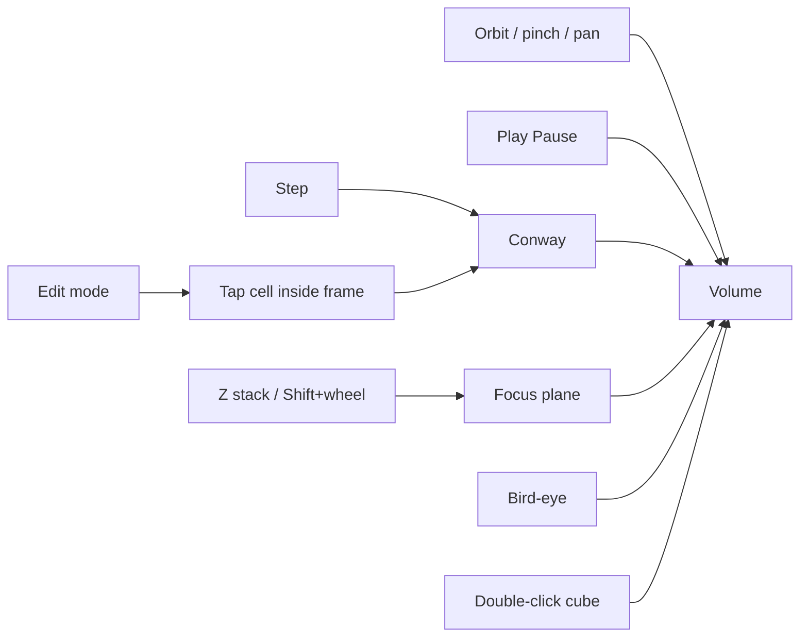
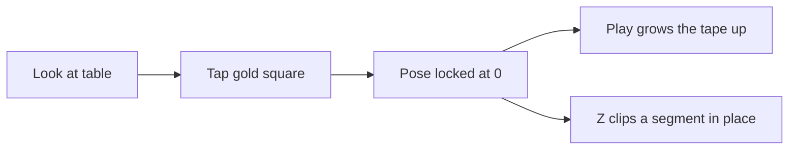
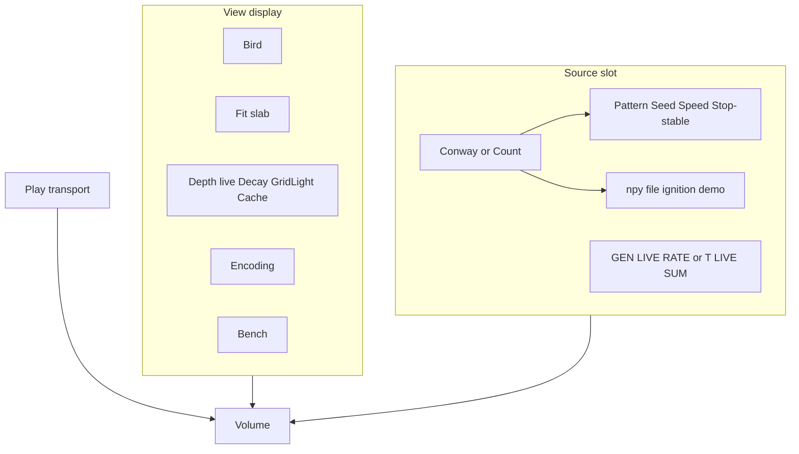
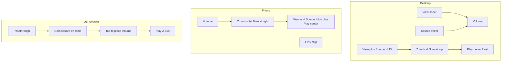
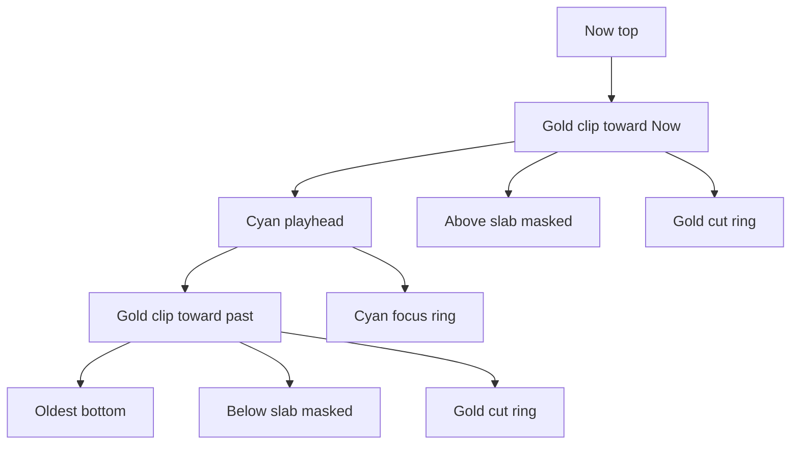

# DONNER UI

The 3D volume is the product. Chrome is a thin M.E.S.S. HUD: Orbitron for
brand and control labels, Inter for running text, dark `#0b0f14` field,
gold `#ffc53d` accent, cyan `#00fff2` for live telemetry. No dashboard
layout.

Play is a **display** transport outside the sheets. Conway loads **paused**
(R-pentomino). **Play** = Live View (generator runs, Z locked at Now);
for a count stack it scrubs Z through the recording. **Pause** = Inspect
the RAM tape (Z from 0). **Pause** lights the brick (fog off, camera far
fits the tape). Two extra Z handles clip a **slab** (outside not drawn).
Conway Play from Inspect jumps to live Now.

In an **AR session** the same Play and Z stack stay; brand, View/Source
sheets, and the FPS chip hide. Bird is not offered. Point at a table
until a gold square appears, then **tap** to place. The pose **locks**
for the session (Z and Size do not move the origin). The volume is a
**pillar**: gen 0 stays on the table; **Play** grows the tape upward;
Z clips a segment in place; **Size** scales the whole stack. **Exit**
(or Escape) returns to orbit. The WebXR DOM
overlay is `#xr-overlay` (HUD only), not `document.body`, so the camera
passthrough and the volume stay visible.

The left chrome is two sheets — **View** (Bird, Decay, Depth live-only,
cache, Encoding, Bench) and **Source** (kind: Conway or count stack;
GEN/LIVE/RATE or T/LIVE/SUM stay on the right HUD). Generator controls do
not share a panel with View.

Isolation is not a sheet mode. Worldline isolation is deferred (later:
rectangle select on the playfield).

## Camera

| Input | Action |
|-------|--------|
| Drag / one-finger | Orbit |
| Wheel / pinch | Zoom |
| Right-drag / two-finger | Pan in **Bird** only. Orbit mode rotates around the time axis at the brick center (no pan). |
| Shift+wheel | Scrub focus into the past / back to now |
| **Z** stack | Scrub the playhead. Inspect also has two **slab** handles (3D-slicer clip). After **Fit**, the brick stays put and the cyan plane moves. Desktop: right rail, Now at top. Phone: bottom timeline, Now at the right; handles have a large touch target. Wheel over it steps the playhead. |
| Space | Play / pause |
| `E` | Edit mode (pauses, snaps focus to Now) |
| `B` | Bird-eye (orthographic top view) |
| `F` | **Fit** — frame the camera to the drawn slab |
| Escape | Leave bird-eye; in AR, end the session |
| **AR** | Start `immersive-ar` when the device supports it (Android Chrome). Look at a table; tap the gold square to place. Pose locks. **Play** grows the pillar from gen 0; Z clips a segment; **Size** scales it. Not shown on desktop orbit. |
| **Exit** | End the AR session; orbit returns. Visible in AR only. |
| `.` or `N` | Simulation step |
| `[` / `↓` | Focus one generation into the past |
| `]` / `↑` | Focus toward Now |
| Home | Focus Now |
| `R` | Reset |

## Display (DONNER)

| Control | Meaning |
|---------|---------|
| Play / Pause | **Play** = Live View (generator + Now). **Pause** = Inspect: whole cache as cubes; after **Fit**, Z moves the cyan plane through a still brick. Play jumps to live Now. |
| Bird | Orthographic top-down onto the **focus slice** only; pan / pinch |
| Fit | Frame the camera to the drawn brick (Inspect: between the gold cuts). Key `F`. |
| Decay | On/off. On: fade to 0 at the oldest **drawn** slice (live: back of Depth; inspect: back of the Z slab). Off: even brick. |
| Grid light | Brightness of the cell grid and focus-plane fill |
| Depth | Live wake only (8–128). Hidden while Inspect. |
| Cache | Viewer RAM tape status (View sheet). Pause inspects it. Caps 4096 gens / 400 000 cells. |
| **Z stack** | Live: locked, label **LIVE**. Inspect: cyan **playhead** (larger) plus two gold **slab** handles. Dragging a gold handle past the playhead pushes it. After **Fit**, scrubbing the playhead does not move the brick. Volume: cyan ring = plane, gold rings = cuts. **Now** snaps the playhead (and opens the top of the slab). |

## Source

| Control | Meaning |
|---------|---------|
| Source | **Conway** or **Count stack** |
| Speed | Conway: generations/s. Count: playhead steps/s while Play scrubs Z |

### Conway addon

| Control | Meaning |
|---------|---------|
| Step | One generation (also pauses) |
| Edit | Paint cells on the focus plane (only at Now) |
| Reset | Same pattern and seed |
| Seed | New RNG seed, then reset |
| Pattern | BLITZ seeds; Gosper gun needs grid ≥ 48 |
| Grid | 16…64; rebuilds the world |
| Wrap | Torus vs hard edges |
| Stop when stable | Pause into Inspect after 5 identical grids (still / empty). Oscillators and wrapping gliders keep running. A glider on a hard edge dies, then the empty board pauses — leave Wrap on. Default on. |

### Count stack (EVT)

| Control | Meaning |
|---------|---------|
| Ignition demo | Load `data/ignition_stack.npy` (local symlink into `datasets/EVT/`) |
| Load .npy | Any EVT count cube `(T, H, W)` or `(T, H, W, 1)`; ON/OFF `(T, H, W, 2)` is summed to activity |
| Size by count | Encoding: cube scale follows the integer count. Off: occupancy (color only) |

Count stacks open in Inspect (the recording is already complete). **Play**
scrubs the cyan plane from oldest to Now and loops. Color is 1 = cyan …
max = coral. Empty pixels (count 0) are not cubes.

## Encoding (slot)

Color and cube fill are display slots. Conway supplies still / osc /
transit / warmup and Stability **None / Time / Focus**. A count stack
supplies integer rungs (cyan → gold → coral) and optional size-by-count.
Polarity is later. The sheet **Encoding** block is that slot; source
stats stay in **Source**.

| Control | Meaning |
|---------|---------|
| Stability | **None** — equal cube size (occupancy). **Time** (default) — fill = stability already reached at that generation. **Focus** — fill = stability on the focus plane, whole column. Hover the control for details. |

The **cyan frame** is the current Z plane. Numbered **X/Y** sit on the
**right** (gold). Inspect also draws **gold rings** at the slab cuts.
Time is the **Z stack slider** beside the HUD (Now at the top),
not a 3D gizmo. Hovering the plane draws two thin lines to X and Y,
a gold square on the cell, and a pale cage around the cube on that
slice when the cell is live. Slices newer than the focus sit **above**
the plane, translucent.

**Bird** looks straight down with an orthographic camera (no parallax).
Worldline **isolation** is deferred (later: rectangle select). Edit is
unchanged: pause, plane at Now, tap inside the frame.

Inspect **Z slab** (3D-slicer):

On narrow viewports **View ▸** and **Source ▸** are separate folds (Play
stays bottom-center). The Z stack is a bottom timeline, and telemetry
collapses to an **FPS chip** (tap to open the View card). Source GEN /
LIVE / RATE stay in the Source sheet.

## HUD (right rail)

Desktop: two cards, then a thin Z stack to their right, Play under the
stack. Display is cyan; source is muted. Phone: FPS chip top-right; tap
to expand the View card. Source stats live in the Source sheet.

| Line | Block |
|------|-------|
| sparkline | Display — recent frame times (60 fps reference line) |
| FPS / AVG / 1% / 0.1% / FR | Display — instant, rolling average, slowest-percent FPS, frame time |
| INST | Display — instanced cubes (`trunc` if SoA capped) |
| FOC | Display — playhead generation (also beside the Z-stack handle) |
| PLAY / PAUSE | Display |
| BIRD | Display — view state |
| GEN | Source Conway — simulation head |
| T | Source count — bin index |
| LIVE | Source — live cells / voxels on the focus slice |
| SUM | Source count — event sum on the focus slice |
| MAX | Source count — count ceiling (color ramp top) |
| RATE | Source — measured generation or playhead rate while playing |
| COUNT | Source — count stack is active |
| EDIT | Source Conway — present in edit mode |

**Z stack:** thin rail — **Now**, a tick per stored step, generation
beside the handle. Desktop: Now at the top, deepest past at the bottom.
Phone: Now at the right, past at the left. Wheel over the stack (or
Shift+wheel on the canvas) still scrubs.

If INST hits the cap (`trunc`), live: lower Depth or Grid; inspect: the
tape is denser than the 200 000-cube envelope (newest slices kept). RATE is
not frame rate. FPS, 1%/0.1% lows, and the sparkline are wall-clock
frame times; they are not clamped to 10. **1%** / **0.1%** are the mean
FPS of the slowest 1% / 0.1% of the last ~1000 frames — hitch, not AVG.

## Visual mapping

**Geometry** is time (**Z**). **Color** is dynamics along each `(x, y)` worldline,
not a second clock. An oscillator does **not** cycle hue along Z; it
cycles **occupancy** (cubes present / absent). Mixing extra hues would
fight the class colors.

| Kind | Color | Typical Conway |
|------|-------|----------------|
| Still | gold | block, beehive, blinker core (always on) — activity stays put |
| Oscillator | cyan | blinker tips, toad, beacon — **only when live**, in place |
| Transit | BLITZ coral | glider tube, births/deaths, soup — the space-time **curve** |
| Warmup | gray | generations 0 and 1 — too little history to class |

Default pattern is **R-pentomino**, started **paused** (Play to run).
Teaching order if you switch seeds: Blinker → Toad/Beacon → Glider.
A glider must read as a coral trail, not mixed cyan/gold: those
classes mean the pattern sat still. Cyan on a glider was a false friend
(the ship crawling over the same cell).

Decay only darkens older slices; it does not change hue or cube size.
**Size / fill** depends on **Stability**:

- **None** — every live cell the same size (truth view for occupancy)
- **Time** (default) — duration already reached at that generation (taper)
- **Focus** — duration on the focus plane, whole `(x, y)` column

Cap is 16 generations. Transit stays smaller in Time/Focus. Warmup cubes
stay full size so the first slices are not a false “shrink”.

These classes fill the **encoding slot** for the Conway demonstrator. A
count stack uses a different LUT: integer rungs cyan → gold → coral.
Polarity (and occupancy / states) will not reuse still/osc/transit.

The gold **frame** is the playfield edge. **Grid light** sets how bright the
cell lattice is.

## Bench

Open the **View** sheet and scroll to **Bench**. Each preset has a one-line purpose.
**Teaching** / **Desktop** are the demo loads. **CPU Stress** is dense soup
(expect INST to fill Depth). **Renderer Stress** is cubes/GPU (should stay
smooth). **Neighborhood 5×5** is the CPU cliff; default is **None**.
Dynamics and Stability stay on for teaching. **Depth** (View) is cube
height. Live Z is locked; **Pause** inspects the cache (fog off, Z slab).
Depth is hidden until Play.
Preset select rebuilds the world and **starts Play**. **Force full
rebuild** is the old every-frame SoA path for A/B. Path table `now` is
this frame (0 if skipped); avg/max reset on preset. `bound GPU fill`
means the canvas/cubes are the limit. `rend` is CPU time inside
`renderer.render`, not GPU. GPU block shows WebGL2 and **SOFTWARE
RENDERING** for llvmpipe / SwiftShader / Basic Render Driver. Phone:
Bench stays in the sheet, not on the FPS chip.

## Later

- **Source off the rail:** Conway HUD (GEN / LIVE / RATE) and the left
  Source sheet leave the viewer chrome; generator is its own surface.
- **Thin View:** teaching View keeps Bird / Decay / Depth (and maybe
  cache). Bench, GPU strings, Neighborhood, presets, and dense Encoding
  leave the everyday sheet.
- **Isolation later:** rectangle select on the playfield (not cube double-click).
- Polarity / occupancy / states encodings (count rungs are in)
- NPZ, sidecar ingest, BLITZ sync, in-browser EVT3
- **XR-A is in:** WebXR `immersive-ar` passthrough and plane hit-test
  (gold reticle, tap a table to place; pose locks; Z clips a segment in
  the pillar). **AR** only if `navigator.xr` supports it. Chrome is
  Play, Z, Size, Exit. Phone HTTPS is
  `https://lab.ole.icu/` (`start:lan` upstream); mkcert is fallback.
  **Next:** XR-B marker, then XR-C Quest 3. Do not start a points
  renderer in the same slice as further XR work.
