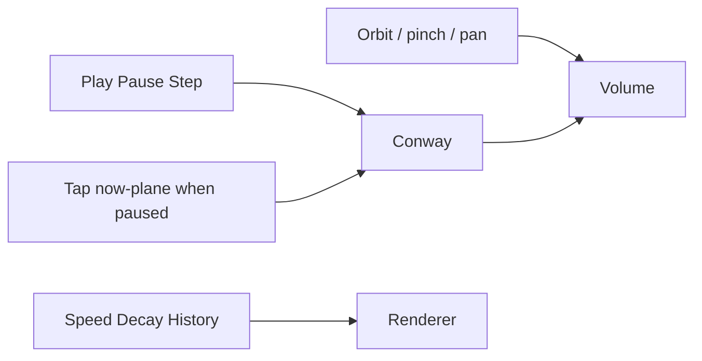

# DONNER UI

The 3D volume is the product. Chrome is a thin M.E.S.S. HUD: Orbitron for
brand and control labels, Inter for running text, dark `#0b0f14` field,
gold `#ffc53d` accent, cyan `#00fff2` for live telemetry. No dashboard
layout.

## Camera

| Input | Action |
|-------|--------|
| Drag / one-finger | Orbit |
| Wheel / pinch | Zoom |
| Right-drag / two-finger | Pan |
| Space | Play / pause |
| `.` or `N` | Single step |
| `R` | Reset |

## Simulation

| Control | Meaning |
|---------|---------|
| Play / Pause | Advance generations |
| Step | One generation (also pauses) |
| Reset | Same pattern and seed |
| Seed | New RNG seed, then reset |
| Pattern | BLITZ seeds; Gosper gun needs grid ≥ 48 |
| Speed | Target generations per second (1–60) |
| Decay | Exponential fade of older slices (0 = crystal, high = present only) |
| History | Visible generations (8–96) |
| Grid | 16…64; rebuilds the world |
| Wrap | Torus vs hard edges |

While **paused**, a short tap (not a drag) on the now-plane toggles a cell.
The now-plane is the XZ grid at `Y = 0` (current generation).

On narrow viewports the control sheet is behind **Controls ▸** so the
volume stays dominant.

## HUD (right)

| Line | Source |
|------|--------|
| GEN | Conway generation |
| LIVE | Live cells in the current grid |
| INST | Instanced cubes (`trunc` if SoA capped) |
| FPS / FR | Frame rate and frame time |
| RATE | Measured generation rate while playing |

This HUD is also a cheap GPU / browser benchmark. If INST hits the cap,
lower History or Grid before judging FPS.

## Visual mapping

Current generation: gold cubes on the now-plane. Older generations: lerp
toward cyan, darker and slightly smaller with decay. Trajectories (glider,
Gosper streams) read as space-time tubes going **down** into the past.
