# DONNER UI

The 3D volume is the product. Chrome is a thin M.E.S.S. HUD: Orbitron for
brand and control labels, Inter for running text, dark `#0b0f14` field,
gold `#ffc53d` accent, cyan `#00fff2` for live telemetry. No dashboard
layout.

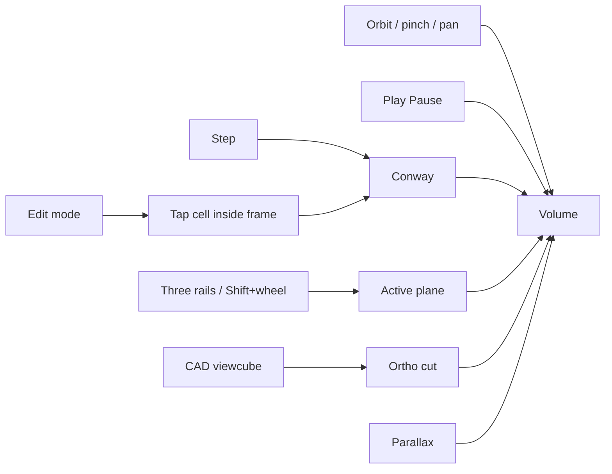

Play is a **display** transport outside the sheets. Conway loads **paused**
(R-pentomino). **Play** = Live View (generator runs, Z locked at Now);
for a count stack it scrubs the **active playhead**. **Pause** = Inspect
the RAM tape (Z from 0). **Pause** lights the brick (fog off, camera far
fits the tape). Three rails clip an **AABB** crop (outside not drawn).
Conway Play from Inspect jumps to live Now.

In an **AR session** the same Play and Z stack stay; brand, View/Source
sheets, and the FPS chip hide. The viewcube and Parallax are not offered. Point at a table
until a gold square appears, then **tap** to place (the volume is already
in front of you so the WebGL layer is never empty). If no plane appears,
that pose locks after a short wait. Once locked, Z and Size do not move
the origin. **Yaw** then turns
the volume on the table (swipe on passthrough or the overlay
slider). **Stand X / Y / Z** chooses which product plane is the table
(default Z, time up). Walk with the phone after that. Bounding
**frames** stay visible so you can navigate the box. On a **phone** in
orbit, fingers rotate and pinch-zoom; the stack **sliders** move planes.
On a **headset**, grab a frame edge to slide the whole volume in the
room. Point at a **cube** to isolate the standing plane
(Ghost); **Play** returns to the live volume. **Size** scales the whole
stack. **Exit** (or Escape) returns to orbit. On a **phone** the WebXR
DOM overlay is `#xr-overlay` (HUD only), not `document.body`, so the
camera passthrough and the volume stay visible. On a **headset** (Quest)
do **not** request that overlay — a fullscreen root covers passthrough.
There is **no** in-world Play/stand/Exit plate. Thumbstick yaws; squeeze
both grips and move the hands apart or together to **Size**. Exit with the
headset / browser system gesture. Headset 2D Browser skips the viewcube
scissor; XR uses the native layer scale.

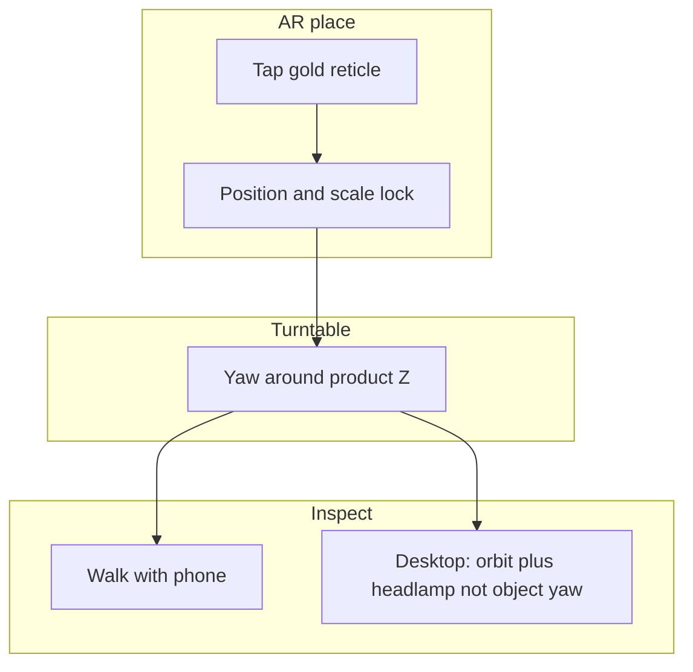

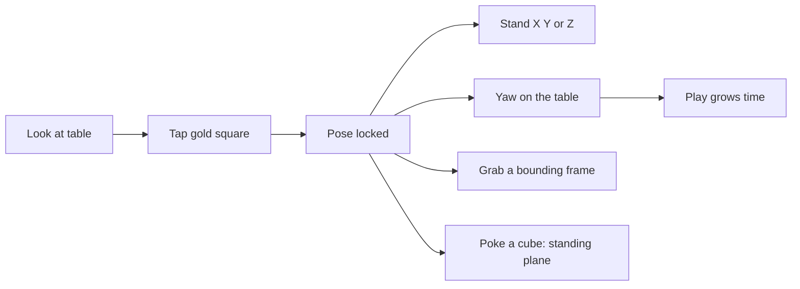

The left chrome is two sheets — **View** (Parallax, Align to Z, Light, Decay, Depth live-only,
cache, Encoding, Bench) and **Source** (kind: Conway or count stack;
GEN/LIVE/RATE or T/LIVE/SUM stay on the right HUD). Generator controls do
not share a panel with View.

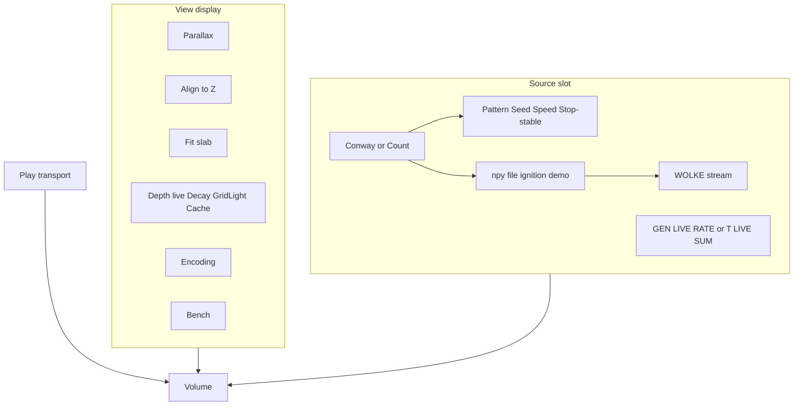

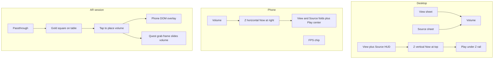

Isolation is not a sheet mode. Worldline isolation is deferred (later:
rectangle select on the playfield).

## Camera

| Input | Action |
|-------|--------|
| Drag / one-finger | Orbit. On a phone this does **not** grab playhead/clip frames — those move on the stack sliders. |
| Shift+left-drag | Walk the **key light** around product Z. The volume stays put. Polar still orbits. |
| Wheel / pinch | Zoom. **Shift+wheel** pages the **active** axis (3D and viewcube cut). |
| Right-drag / two-finger | Pan. **Align to Z** keeps XY on the time axis and still slides along Z. Off = free XY pan. In a viewcube cut, pan stays in that plane. |
| **Slice stack** | Three rails (X / Y / Z). Playhead plus two clips per rail in Inspect. Crop is the AABB intersection. A viewcube face uses that axis for the 2D cut. Dense count: full-extent clips, hull cull against the AABB. After **Fit**, the brick stays put; X/Y **and Z** playheads move through it. Desktop: three vertical rails, Now on Z at top. Phone: three horizontal tracks. Wheel over a rail steps that playhead. Live: Z only. AR: Z only. |
| Space | Play / pause |
| `E` | Edit mode (pauses, snaps focus to Now; Z slice only) |
| `B` | Toggle **Parallax** (perspective ↔ orthographic, same look) |
| `F` | **Fit** — frame the camera to the drawn slab |
| Escape | Restore parallax; in AR, end the session |
| Viewcube | Desktop: click a product-axis **face**. Enters a fitted 2D ortho cut; wheel zooms, right-drag pans, Shift+wheel pages. Clicking the **same face** pages the stack (no refit, no jump to 3D). **Left-drag** orbits out to 3D. **B** also leaves. **Planes** under the cube (default on) shows or hides 3D frames; a cut still shows the current plane. Collapse View via the heading. Hidden on phone and in AR. |
| **AR** | Start `immersive-ar` when the device supports it (Android Chrome / Quest). Look at a table; tap the gold square to place. Pose locks. **Stand** X/Y/Z chooses the table plane (phone overlay). Bounding frames stay on; poke a cube to isolate the standing plane. Phone: overlay Stand / **Yaw** / **Size** / Play. Quest: grab a frame to slide the volume; stick yaws; both grips pinch size; no in-world menu. Not shown on desktop orbit. |
| **Exit** | End the AR session; orbit returns. Visible in AR only. |
| `.` or `N` | Simulation step |
| `[` / `↓` | Focus one generation into the past |
| `]` / `↑` | Focus toward Now |
| Home | Focus Now |
| `R` | Reset |

## Display (DONNER)

| Control | Meaning |
|---------|---------|
| Play / Pause | **Play** = Live View (generator + Now). **Pause** = Inspect: whole cache as cubes; after **Fit**, the plane moves through a still brick. Play jumps to live Now. |
| Parallax | Default on = perspective. Off = orthographic at the current look (keeps the slab). Key `B`. Viewcube face is a separate 2D cut. |
| Align to Z | Default on = orbit around the time axis (XY pinned). Right-drag still slides along Z. Off = free pan. Off while a viewcube cut is locked. Z scrub does not move the orbit height. |
| Headlamp | Automatic: key/fill follow the view (orbit and AR walk). No slider. A visible sun is later. |
| Yaw | AR overlay only: turn the pillar on the table after place, then walk. |
| Fit | Frame the camera to the drawn brick (Inspect: between the clip cuts). Key `F`. The only automatic reframe. |
| Full | Reset the three clip planes to the full volume. Playhead stays. |
| Decay | Default **off**. On: fade to 0 at the oldest **drawn** Z slice (live: back of Depth; inspect: back of the time window). Off: even along time. Ghost hull uses proximity along the active plane, not Decay. |
| Shade | Inspect: **Hull** (default, outer AABB solid; grab a playhead to peek; clip edges stay hull), **Ghost** (sparse: volume ghost + active plane; dense: the cut only), **Triple** (three cuts only, no hull). |
| Depth | Live wake only (8–128). Hidden while Inspect. |
| Cache | Viewer RAM tape status (View sheet). Pause inspects it. Caps 4096 gens / 400 000 cells. |
| Cube cap | Bench instance envelope (default 200 000). Newest slices kept on overflow (`trunc`). |
| **Slice stack** | Live Z: locked, label **LIVE**. Inspect: three rails, playheads, AABB clips. Dragging a clip handle past the playhead pushes it. **Now** snaps Z to the high end of the rail. Z matches X/Y: the volume stays put. |

## Source

| Control | Meaning |
|---------|---------|
| Source | **Conway**, **Ignition**, **MNI 152**, or Count file / stream |
| Speed | Conway: generations/s. Count: playhead steps/s while Play scrubs the **active** axis |

### Conway addon

| Control | Meaning |
|---------|---------|
| Step | One generation (also pauses) |
| Edit | Paint cells on the focus plane (only at Now) |
| Reset | Same pattern and seed |
| Seed | New RNG seed, then reset |
| Pattern | BLITZ seeds; Gosper gun needs grid ≥ 48 |
| Grid | 16…64; rebuilds the world |
| Wrap | Torus vs hard edges |
| Stop when stable | Pause into Inspect after 5 generations in a short cycle (period 1–15): stills and oscillators. Wrapping gliders keep running. A glider on a hard edge dies, then the empty board pauses — leave Wrap on. Default on. |

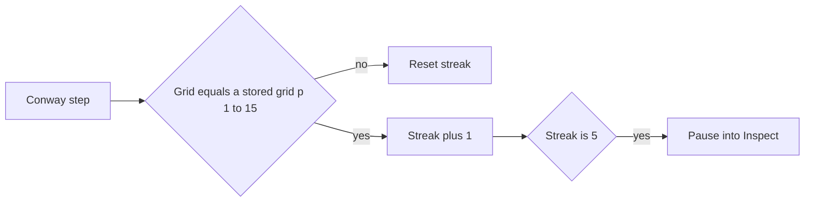

### Count stack (EVT)

| Control | Meaning |
|---------|---------|
| Source | Conway, **Ignition**, **MNI 152**, or Count file / stream |
| Load .npy | Any EVT count cube `(T, H, W)` or `(T, H, W, 1)`; ON/OFF `(T, H, W, 2)` is summed to activity. Shown under Count file / stream. |
| Stream | WOLKE contract. Default `http://127.0.0.1:5055` / token `evt` (EVT sidecar). Connect listens for `send_file_message`; the cube GET is same-origin `/stream-npy` (DONNER’s static server pulls the sidecar). Send as **counts**. Restart `npm start` / `start:lan` so the proxy exists. `https://lab.ole.icu` works when Caddy reverse-proxies that laptop server. |
| Token | Sidecar / WOLKE token (sidecar default `evt`) |
| Connect | Toggle the Socket.IO viewer. A new send replaces the cube. 2D/RGB is rejected with a hint; the previous volume stays. |
| Size by count | Encoding: cube scale follows the integer count. Off: occupancy (color only) |

Count stacks open in Inspect (the recording is already complete). **Play**
scrubs the cyan plane from oldest to Now and loops. Color is 1 = cyan …
max = coral. Empty pixels (count 0) are not cubes.

## Encoding (slot)

Color and cube fill are display slots. Conway supplies still / osc /
moving / unsettled / base and Stability **None / Time / Focus**. A count stack
supplies integer rungs (cyan → gold → coral) and optional size-by-count.
Polarity is later. The sheet **Encoding** block is that slot; source
stats stay in **Source**.

| Control | Meaning |
|---------|---------|
| Stability | Display of stamped Conway `s` (not a rebuild). **None** — equal size. **Time** (default) — fill already reached at that generation. **Focus** — fill on the focus plane, whole column. |

The **axis-colored frames** are the three slice planes (X `#5b8cff`, Y
`#e8c547`, Z `#3ecf8e`). Inspect also draws **clip rings** on all three
axes at the AABB cuts. Playhead rings sit slightly inside the box; clips
sit further in so they do not share a side with a playhead. Playhead bars are thicker
and brighter than clips. A clip on the playhead index is hidden. Hover a
**frame edge** (about 28 px rim, **move** cursor) to light that whole ring
and drag it along the axis in screen space; the fill is not a hit target. Three
HUD rails stay as a dimmer second path (Now/max at the top of Z). **Planes**
under the viewcube hides the 3D frames (default on). Crop is
the intersection of the three clip windows. **Hull** (default) draws the
outer hull solid; grab a **playhead** edge to peek the cut (sparse volumes
keep a ghost hull). Grab a **clip**
edge and the volume stays hull so you can stake the crop. **Ghost** is
the active plane (dense cubes: that cut only). **Triple** is three slices
only, no hull. Both persist in the View sheet. **Decay** stays a Z/time fade on
sparse stacks. The CAD viewcube (desktop, left of the View card) enters a
fitted 2D cut with **that plane's frame and grid**; wheel zooms, right-drag
pans, Shift+wheel pages; the **same face** pages the stack; a click on
the cut does nothing; **B** restores the volume. Zoom and pan stay in the cut.

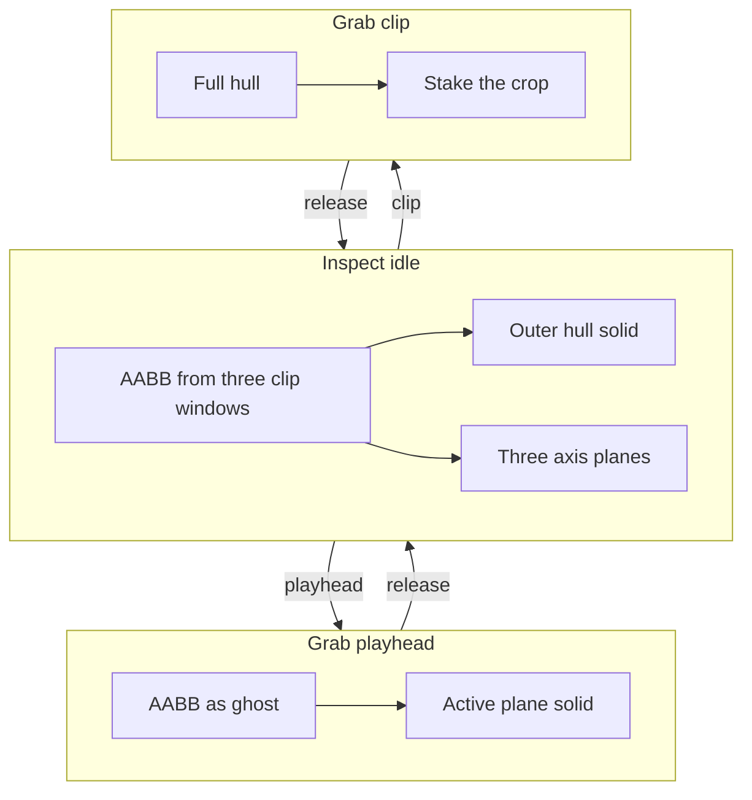

Live: slices newer than the focus sit **above**
the plane, translucent.

**Parallax** off is orthographic at the current look (no vanishing point)
and still shows the slab. Click a **face** of the viewcube (desktop; hover
lights the frame) to enter a 2D **cut** on that axis: ortho, one plane,
that plane's frame and cell grid, wheel zooms, Shift+wheel pages the stack. A click on the cut does
nothing. **B** restores the volume; zoom and pan stay in the cut.

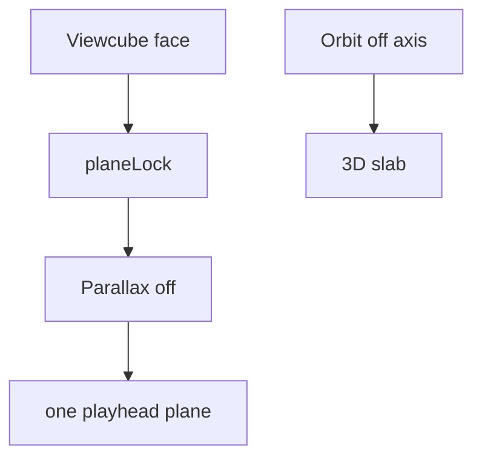

Worldline **isolation** is
deferred (later: rectangle select). Edit stays on the Z playfield at Now.

Inspect **Z slab** (3D-slicer):

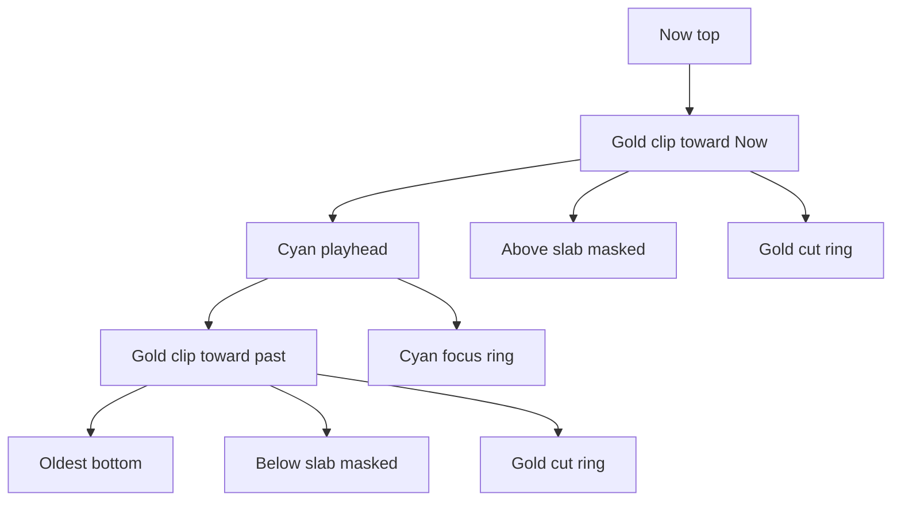

Inspect **X/Y slab** (same gold grips):

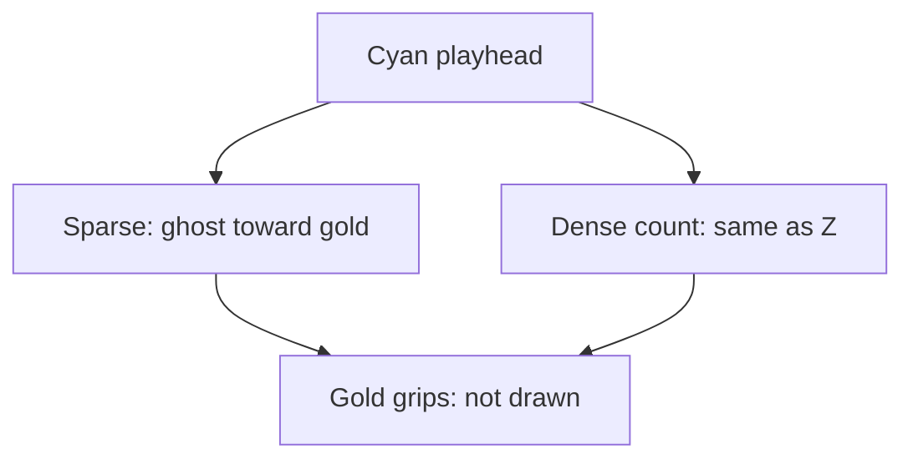

On narrow viewports **View ▸** and **Source ▸** are separate folds (Play
stays bottom-center). The Z stack is a bottom timeline, and telemetry
collapses to an **FPS chip** (tap to open the View card). Source GEN /
LIVE / RATE stay in the Source sheet.

## HUD (right rail)

Desktop: two cards, then a thin Z stack to their right, Play under the
stack. Click **View ▾** on the display card to collapse the stats.
Display is cyan; source is muted. Phone: FPS chip top-right; tap
to expand the View card. Source stats live in the Source sheet. No viewcube.

| Line | Block |
|------|-------|
| sparkline | Display — recent frame times (60 fps reference line) |
| FPS / AVG / 1% / 0.1% / FR | Display — instant, rolling average, slowest-percent FPS, frame time |
| INST | Display — instanced cubes (`trunc` if SoA capped) |
| FOC | Display — playhead generation (also beside the Z-stack handle) |
| PLAY / PAUSE | Display |
| ORTHO | Display — parallax off |
| GEN | Source Conway — simulation head |
| T | Source count — bin index |
| LIVE | Source — live cells / voxels on the focus slice |
| SUM | Source count — event sum on the focus slice |
| MAX | Source count — count ceiling (color ramp top) |
| RATE | Source — measured generation or playhead rate while playing |
| COUNT | Source — count stack is active |
| EDIT | Source Conway — present in edit mode |

**Slice stack:** three rails — **Now** on Z, a tick per stored step, label
beside the handle. Desktop: Now/max at the top. Phone: three tracks,
Now/max at the right. Wheel over a rail (or Shift+wheel on the canvas)
scrubs the **active** axis.

If INST hits the cap (`trunc`), live: lower Depth or Grid; inspect: the
tape is denser than the 200 000-cube envelope (newest slices kept). RATE is
not frame rate. FPS, 1%/0.1% lows, and the sparkline are wall-clock
frame times; they are not clamped to 10. **1%** / **0.1%** are the mean
FPS of the slowest 1% / 0.1% of the last ~1000 frames — hitch, not AVG.

## Visual mapping

**Geometry** is time (**Z**). **Color** is dynamics along each `(x, y)` worldline,
not a second clock. An oscillator does **not** cycle hue along Z; it
cycles **occupancy** (cubes present / absent). Mixing extra hues would
fight the class colors.

| Kind | Color | Typical Conway |
|------|-------|----------------|
| Still | gold | block, beehive, blinker core (always on) — activity stays put |
| Oscillator | cyan | blinker tips, toad, beacon, longer-period occupancy — **only when live**, in place |
| Moving | BLITZ coral | glider tube — Neighborhood 3×3/5×5; translating activity |
| Unsettled | violet | soup, births/deaths that are not yet still or periodic |
| Base | gray | gens 0–1, and the first cube of each `(x, y)` worldline |

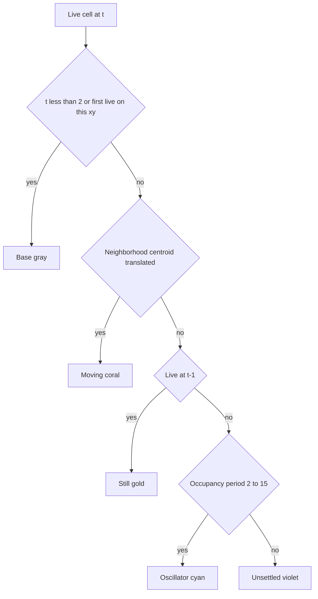

Default pattern is **R-pentomino**, started **paused** (Play to run).
Teaching order if you switch seeds: Blinker → Toad/Beacon → Glider.
A glider must read as a coral trail, not mixed cyan/gold: those
classes mean the pattern sat still. Cyan on a glider was a false friend
(the ship crawling over the same cell).

Decay only darkens older **Z** slices; it does not change hue or cube size.
**Size / fill** (Conway) reads stamped stability along Z. **None / Time /
Focus** only change how that stored `s` is shown (Focus = value on the
playhead, whole column). Count **Size by count** is the same idea for
integer magnitude. Neither toggle rebuilds the tape.

Cap is 16 generations. Moving and Unsettled stay smaller in Time/Focus. Base cubes
stay full size so the first slices are not a false “shrink”.

These classes fill the **encoding slot** for the Conway demonstrator. A
count stack uses a different LUT: integer rungs cyan → gold → coral.
Polarity (and occupancy / states) will not reuse still/osc/moving/unsettled.

The gold **frame** is the playfield edge. The cell lattice sits on the
**active** cyan plane.

## Bench

Open the **View** sheet and scroll to **Bench**. Each preset has a one-line purpose.
**Teaching** / **Desktop** are the demo loads. **CPU Stress** is dense soup
(expect INST to fill Depth). **Renderer Stress** is cubes/GPU (should stay
smooth). **Neighborhood 5×5** is the CPU cliff; default is **None**.
Dynamics and Stability stay on for teaching. **Depth** (View) is cube
height. Live Z is locked; **Pause** inspects the cache (fog off, Z slab).
Depth is hidden until Play.
Preset select rebuilds the world and **starts Play**. **Force full
rebuild** is the old every-frame SoA path for A/B. Path table `now` is
this frame (0 if skipped); avg/max reset on preset. `bound GPU fill`
means the canvas/cubes are the limit. `rend` is CPU time inside
`renderer.render`, not GPU. GPU block shows WebGL2 and **SOFTWARE
RENDERING** for llvmpipe / SwiftShader / Basic Render Driver. Phone:
Bench stays in the sheet, not on the FPS chip.

## Later

- **Public preview (Phase 2):** Thin View and Bench off the everyday
  sheet before `donner.mess.engineering`. Do not start Dataset Contract
  or a PointRenderer in that slice.
- **Source off the rail:** Conway HUD (GEN / LIVE / RATE) and the left
  Source sheet leave the viewer chrome; generator is its own surface.
- **Thin View:** teaching View keeps Parallax / Align to Z / Light / Decay / Depth (and maybe
  cache). Bench, GPU strings, Neighborhood, presets, and dense Encoding
  leave the everyday sheet.
- **Isolation later:** rectangle select on the playfield (not cube double-click). AR poke already isolates the standing plane. Numbered axes with units come back later; the overlay is off.
- Polarity / occupancy / states encodings (count rungs are in)
- NPZ, packed WOLKE selection / `viewer_index`, BLITZ widget sync, in-browser EVT3
- **MRI / scalar volume later.** Dense count `.npy` (occupancy > 15 %)
  already opens a mid-volume slab with enclosed voxels hidden. Dedicated
  kind + `ScalarVolume` wait on the Dataset Contract. Do not embed
  NiiVue. Volume texture / raymarch later if that slab is not enough.
  See [`architecture.md`](../architecture.md#mri-volume-later).
- **XR-A is in** (phone ceiling): WebXR `immersive-ar` passthrough and
  plane hit-test (gold reticle, tap a table to place; pose locks; Z clips
  a segment in the pillar). **AR** only if `navigator.xr` supports it.
  Phone chrome is Play, Z, Size, Yaw, Exit on `#xr-overlay`. Phone HTTPS
  is `https://lab.ole.icu/` (`start:lan` upstream); mkcert is fallback.
  After a Chrome update, check site **Augmented reality** (not blocked)
  and that the response has `Permissions-Policy: xr-spatial-tracking=(self)`.
- **XR-C-0 is in:** Quest uses the same session but **without** `dom-overlay`
  and **without** the in-world Play/stand/Exit plate. Stick yaws; both grips
  pinch size. Grab a bounding frame to slide the volume in the room.
  Bounding frames stay on; poke a cube to isolate the
  standing plane. XR-B marker, XR-C-1 hands / wrist attach, and a QR door
  (`https://lab.ole.icu/` plus optional `?src=conway&pattern=Blinker` /
  `?src=count&demo=ignition`) are later. Do not start a points renderer
  in the same slice as further XR work.
