# DONNER UI

The 3D volume is the product. Chrome is a thin M.E.S.S. HUD: Orbitron for
brand and control labels, Inter for running text, dark `#0b0f14` field,
gold `#ffc53d` accent, cyan `#00fff2` for live telemetry. No dashboard
layout. **Guide** is a button to the right of the brand chip (desktop): an opt-in
Look walkthrough (Orbit, Source, Play vs Loop, Rails, Viewcube, Inspect,
Look) with arrows on the controls. Source and View unfold while it runs. It does not open on
its own. Hidden on a phone (`pointer: coarse`). **About Data** (Source fold, next to the heading) and footer
**About** are identity (examples, share URL, credit). Footer **M.E.S.S.** and
**WETTER** links are cyan. Visitor copy:
[`docs/welcome.md`](welcome.md).

**Look** shortcuts sit top-right on every surface (Hull / Ghost / Cuts, plus **Fit**
on desktop and phone orbit). **View** is display setup (Quality, Gap, Align to Z,
Parallax, Reset Planes, Color). FPS is a small overlay on the viewcube
(bottom-right); tap it for the spark / DEV Bench card. That card is independent
of the left rail so you can keep View open. AR and phone share the Look strip;
desktop also has the viewcube.

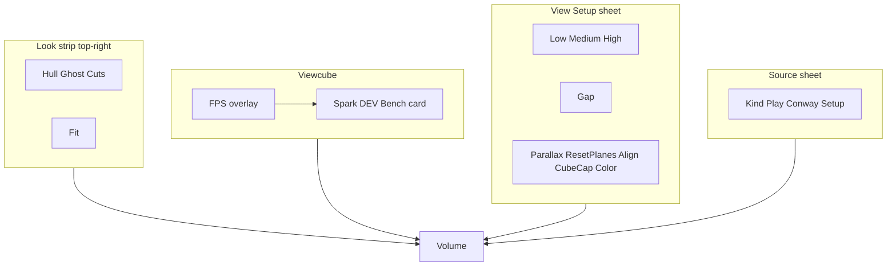

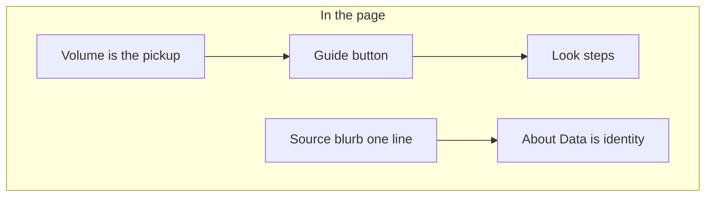

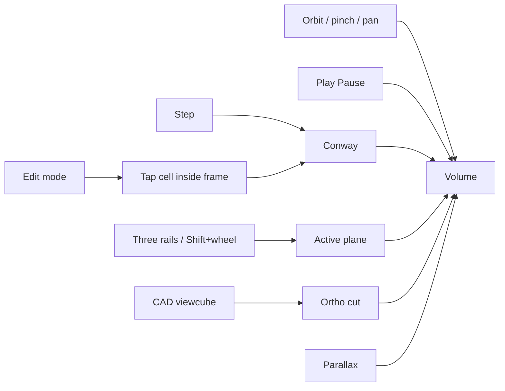

Play is **Source** transport for Conway and time-evolving stacks (Ignition /
count). Conway loads **paused** after **12** silent generations (R-pentomino),
so the brick has Z depth on first look. Inspect first paint, Conway
pattern change, and source change use the **Reset Planes** pose: clips
open to the full volume, playheads at mid-volume (floor of half-span).
**Reset Planes** is then a no-op until a handle moves. Conway **Play**
still locks Z to Now (live generator). A 1-voxel-thick axis (Conway Z at
generation 0) can still sit on the outer clip. **Play** = Live View
(generator runs, Z locked at Now); for a count stack or **MNI 152** it
scrubs the **loop-axis playhead** (X / Y / Z under the rails, default Z —
not the viewcube / camera axis). **Pause** = Inspect the RAM tape
(Z from 0). **Pause** lights the brick (fog off, camera far fits the
tape). Three rails clip an **AABB** crop (outside not drawn). Conway Play
from Inspect jumps to live Now. MRI / MNI uses the same Play as a
slice-scan.

In an **AR session** the phone overlay is inspect chrome after the
volume is placed; brand, View/Source sheets, and Guide hide. The
viewcube, Fit, and Parallax are not offered. **Enter AR** is passthrough plus
overlay only — no brick, no viewer-front preview. Floor hit-test starts
immediately: look at the **floor** until a gold square sits on that
plane, then **tap** to spawn. Walls are ignored. The first detected
plane is not taken automatically, and a timeout does not lock. **Reset
Anchor** (phone overlay, next to Exit) despawns the brick and returns to
search. Scene tap is not used for reset. Once locked the brick **sits**
on the plane; **Size** scales it; **Yaw** turns it around the standing
axis. Scale fits the table footprint to 40 cm; **Play** grows the
standing axis up from the plane (gen 0 stays put). **Floor** X / Y / Z
picks which product axis grows out of the plane (default Z). Walk with
the phone after that. Three inspect rails, Conway **Play /
Pause** next to AR, and **Hull / Ghost / Cuts** (top-right Look strip).
**Loop**, **Hide center / Hide outer**, **Reset Planes**, and **Quality**
sit behind **More**. On a **phone** in orbit,
fingers rotate and pinch-zoom; Conway **Play** sits next to **AR** in the
fold-bar gap between Source and View. The Look strip is top-right (shade plus Fit). The stack **sliders** move planes and stop
short of the right edge (system back-swipe). On a
**headset**, grab a frame edge to slide the whole volume in the room.
Point at a **cube** to isolate the standing plane (Ghost). **Exit** (or
Escape) returns to orbit. On a **phone** the WebXR DOM overlay is
`#xr-overlay` (HUD chrome only, not a painted full-screen sheet), not
`document.body`, so the camera passthrough and the volume stay visible.
Outside AR the overlay is 0×0 so it does not cover the orbit canvas; it
expands for the session. Overlay tap-guard applies to buttons and
sliders, not passthrough taps. On a **headset** (Quest) do **not**
request that overlay — a fullscreen root covers passthrough. There is
**no** in-world Play/stand/Exit plate, so Quest has no Reset Anchor
button: Exit AR and enter again to place on another plane. Thumbstick
yaws; squeeze both grips and move the hands apart or together to
**Size**. Exit with the headset / browser system gesture. Headset 2D
Browser skips the viewcube scissor; XR uses the native layer scale.

**Face** is a second placement mode, not WebXR. The **Face** button is
visible whenever the camera exists (laptop webcam or phone). `?face=1`
enters immediately. Prove the camera first on **`face-lab.html`** if
needed (live video plus landmark mesh, no Three.js). The phone starts on
the **rear** camera; desktop starts **Selfie**. MediaPipe tracks a face;
a Ghost Brain MRI Low overlay locks to the head after a short hold.
After lock: oval + lips + pupils while the face is in view; if the mesh
drops, the last pose stays and tracking resumes when the face returns.
**Selfie** toggles the user camera. Face does not show Size, Flip, millimetre
sliders, or XYZ rails. Quest does not show Face. Camera frames stay on
the device.

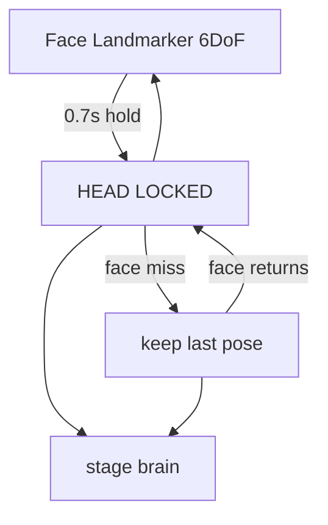

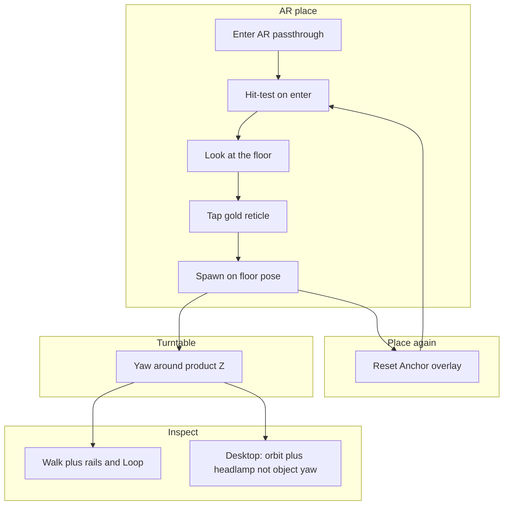

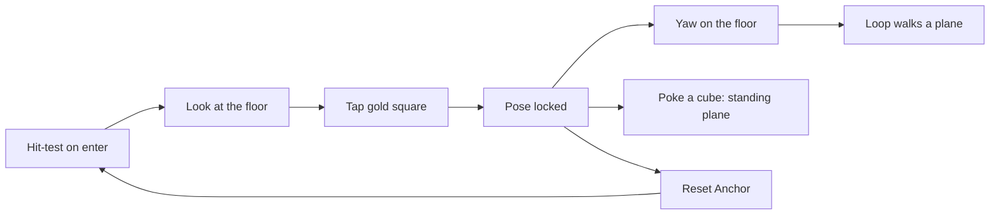

The left chrome is one rail — **Source** on top (kind, one-line blurb,
Game of Life **Play**; Conway pattern / grid / seed live under **Setup**)
and **View** below (Parallax, Align to Z, Quality,
Gap, Depth live-only, cache, Color coding, Size by age, Cube
cap). Shade (**Hull / Ghost / Cuts**) and **Fit**
live on the top-right Look strip, not in this sheet. FPS is a cube overlay;
spark and **DEV Bench** open as a card next to it, not inside View. **Loop**, loop **Speed**, and loop axis **X / Y / Z**
sit under the slice rails. Conway **Play** stays in Source on desktop;
on phone it also sits next to **AR**. Conway **GEN / LIVE / RATE**
only while Conway Play is on. Generator setup does not share a panel
with View. Desktop stacks both folds; collapse Source after setup and
live in View. Phone uses the same two folds (bottom bar, one sheet at a
time). A short **Loading…** spinner (Source fold + canvas overlay) runs
while a source, pattern, grid, or cube is switching.

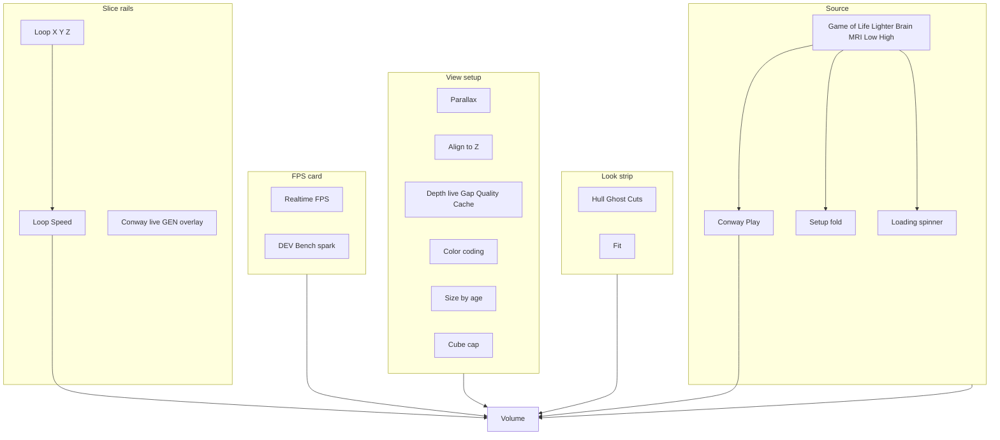

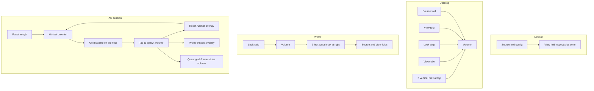

Isolation is not a sheet mode. Worldline isolation is deferred (later:
rectangle select on the playfield).

## Camera

| Input | Action |
|-------|--------|
| Drag / one-finger | Orbit. On a phone this does **not** grab playhead/clip frames — those move on the stack sliders. |
| Shift+left-drag | Walk the **key light** around product Z. The volume stays put. Polar still orbits. |
| Wheel / pinch | Zoom. **Shift+wheel** pages the **active** axis (3D and viewcube cut). |
| Right-drag / two-finger | Pan. **Align to Z** keeps XY on the time axis and still slides along Z. Off = free XY pan. In a viewcube cut, pan stays in that plane. |
| **Slice stack** | Three rails (X / Y / Z). Playhead plus two clips per rail in Inspect. Crop is the AABB intersection. A viewcube face uses that axis for the 2D cut. Dense count: full-extent clips, hull cull against the AABB. After **Fit**, the brick stays put; X/Y **and Z** playheads move through it. Desktop: three vertical rails, max at the top of Z. Phone: three horizontal tracks. Wheel over a rail steps that playhead. Live: Z only. Phone AR after place: all three rails (same inspect crop). **Loop** walks the highlighted plane (rail **X / Y / Z** or grab a frame). Ghost solids that plane. Hull+Loop grows a potato from the axis origin through the playhead (opaque in 3D; glass potato plus the slice in a viewcube cut). Cuts is three slices in 3D and the lock-axis plane in a cut. Camera tracks the playhead in a cut. |
| Space | Play / pause |
| `E` | Edit mode (pauses, snaps focus to Now; Z slice only) |
| `B` | Toggle **Parallax** (perspective ↔ orthographic, same look) |
| `F` | **Fit** — frame the camera to the drawn slab |
| Escape | Restore parallax; in AR, end the session |
| Viewcube | Desktop: click a product-axis **face**. Enters a fitted 2D ortho cut. Hull = glass potato + solid slice; Ghost = full silhouette + slice; Cuts = that plane only. Wheel zooms, right-drag pans, Shift+wheel pages and the camera tracks the playhead. Clicking the **same face** pages the stack (no refit, no jump to 3D). **Left-drag** orbits out to 3D. **B** also leaves (that is not Parallax off in 3D). **Hide center** / **Hide outer** under the cube hide playhead+grid vs clip frames; a cut still shows the current plane. Hidden on phone orbit. Phone AR: Hide lives in **More** (no cube). |
| **AR** | Start `immersive-ar` when the device supports it (Android Chrome / Quest). Phone: passthrough first (no brick). Hit-test starts on enter; look at the **floor**. When the gold square is visible, **Tap to place** appears; tap to spawn. The first plane is not auto-locked. **Reset Anchor** despawns and returns to search. Brick sits on the plane; **Size** scales; **Yaw** turns around the standing axis. Table footprint maps to 40 cm; Play grows up from the floor. **Floor** X / Y / Z picks which product axis grows out of the plane. Quest: grab a frame to slide the volume; stick yaws; both grips pinch size; no in-world menu (Exit AR to place again). Not shown on desktop orbit. |
| **Face** | Always visible when the camera exists. Not WebXR. Phone rear camera (desktop selfie webcam) + MediaPipe. Point at a face; a transparent Brain MRI Low overlay locks to the head. After lock: oval + lips + pupils; if the mesh drops, keep the last pose until the face returns. **Selfie** toggles the user camera. No Size / Flip / millimetre sliders / XYZ rails. Hidden on Quest. `?face=1` enters Face. |
| **Exit** | End the AR or Face session; orbit returns. Visible in AR / Face only. |
| **Reset Anchor** | AR overlay only (phone): despawn the brick and return to search. Hidden in Face. Does not steal a scene tap. Hidden until a pose is locked. |
| `.` or `N` | Simulation step |
| `[` / `↓` | Focus one generation into the past |
| `]` / `↑` | Focus toward Now |
| Home | Jump Z playhead to the live end (Conway edit). Reset Planes / sliders / gizmo still set the slice. |
| `R` | Reset |

## Display (DONNER)

| Control | Meaning |
|---------|---------|
| Play / Pause | Conway **Source** on desktop. On phone (orbit and AR overlay) also next to **AR**. Run the generator. Pause inspects the tape. Key Space on Conway. Play collapses the phone Source sheet. |
| Loop | Under the slice rails on desktop and phone orbit. In AR after spawn it sits in **More**. Walks the marked axis through the volume (or Conway tape after Pause). Independent of Source Play. Key Space on MNI / Ignition. |
| Loop axis | **X / Y / Z** directly under the three rails (default **Z**). Independent of the viewcube / camera. |
| Loop Speed | Same cluster as Loop, under the rails (slices/s). |
| Color coding | Conway occupancy class colors (still / oscillator / unsettled / base). Off: one occupancy color. Count / MNI: **Scale**, Min/Max, Trim, Hide. |
| Stability | Conway only. **Size by age** (default on): cubes grow with still/osc run length. **Start** is cube fill at age 0 (down to a speck). **Tail** is generations along Z until full. Two sliders — fill vs length. Hidden for MNI and other sources with no stability metric. |
| Parallax | Default on = perspective. Off = orthographic at the current look (keeps the slab). Key `B`. Viewcube face is a separate 2D cut (`B` in a cut leaves it). |
| Align to Z | Default on = orbit around the time axis (XY pinned). Right-drag still slides along Z. Off = free pan. Off while a viewcube cut is locked. Z scrub does not move the orbit height. |
| Headlamp | Automatic: key/fill follow the view (orbit and AR walk). No slider. A visible sun is later. |
| Yaw | AR overlay only (after spawn): turn the pillar around the standing axis (floor normal), then walk. |
| Size | AR overlay only (after spawn): uniform scale of the brick (0.4×–5× on the table-footprint fit). Tabletop stays comfortable near 2.5×; floor placement can go larger. Play grows up without changing this cell scale. |
| Floor | AR overlay only (after spawn): which product axis grows out of the plane (X / Y / Z, default Z). Yaw always spins around that axis. |
| Reset Anchor | AR overlay only (phone, next to Exit): despawn and search again on the floor. |
| Fit | Look strip (desktop and phone orbit; hidden in AR). Frame the camera to the drawn brick (Inspect: between the clip cuts). Key `F`. The only automatic reframe. |
| Reset Planes | Open all clips to the full volume and move the X/Y/Z playheads to mid-volume. Same pose as first paint / source change. Does not move the camera. Does not run when switching shade. |
| Hide center | Viewcube (desktop) and phone AR **More**: hide the playhead (now) frames and the slice grid on the current plane. **Starts on.** Independent of Hide outer. A viewcube cut still shows that plane. |
| Hide outer | Viewcube (desktop) and phone AR **More**: hide the outer clip / bound frames of the crop box (Inspect). **Starts on.** Independent of Hide center. |
| Gap | Visual lattice spacing (0–5 cube-widths, default **0**). 0 packs voxel faces (solid MRI cube). Higher values move instances apart; Conway can live-tune. Frames and picking follow that pitch. Orbit zoom-out is sized for Gap **5**, so you can still frame the brick. AR uses the same local layout (table footprint maps to 40 cm, so a large Gap grows the brick on the table). Size by age still scales cubes inside each cell. |
| Quality | Manual **Low / Medium / High** (default **Medium**). Low: unlit cubes, pixel ratio 1. Medium: Lambert headlamp, pixel ratio ≤ 1.25. High: Lambert + ACES, pixel ratio ≤ 2 (≤ 1.5 on phone / headset). `?quality=` on the door. Does not recreate the WebGL context (antialias stays). Auto-pick from Bench metrics is later. |
| Shade | Look strip (all surfaces). **Start:** Brain MRI Low/High, Lighter Ignition, and own cubes open **Ghost**; Game of Life opens **Hull**. Inspect: **Hull** (outer AABB solid; grab a playhead to peek; **Loop** grows a potato from the axis origin through the playhead — opaque in 3D, glass potato plus the solid slice in a viewcube cut), **Ghost** (glass hull + the highlighted plane; in a cut the silhouette stays the full brick), **Cuts** (three orthogonal slices in 3D, lock-axis plane only in a cut; shade id `triple`). |
| Depth | Live wake only (8–128). Hidden while Inspect. |
| Cache | Viewer RAM tape status (View sheet). Pause inspects it. Caps 4096 gens / 400 000 cells. |
| Cube cap | View instance envelope (default **200 000**, max 20 000 000). Newest slices kept on overflow (`trunc`). Game of Life **Play** uses 200 000; **Pause** raises to the tape’s occupied cells so a 300k brick is not truncated. A dense count cube (Brain MRI) raises to the **hull** size, not every occupied voxel (High hull ~140k inside 5 M occupied). Sparse Ignition still uses occupied cells. |
| FPS | Small overlay on the viewcube (bottom-right). Tap to open the spark / FPS / AVG card with DEV Bench. Independent of the left View rail. Stays on Face and phone AR. Phone: same chip on the Look strip (no cube). Quest has no DOM overlay. |
| DEV Bench | Opt-in checkbox on that FPS card. CPU path timers (sim / soa / inst / rend / hud) and GPU probe. Labelled DEV; costs performance. Off the hot path until checked. |
| **Slice stack** | Live Z: locked, label **LIVE**. Inspect: three rails, playheads, AABB clips. Dragging a clip handle past the playhead pushes it. Z matches X/Y: the volume stays put. |

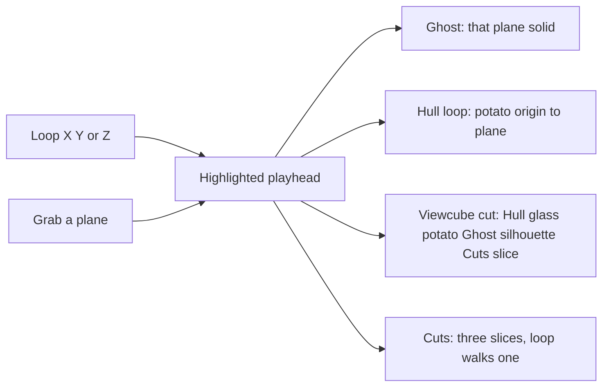

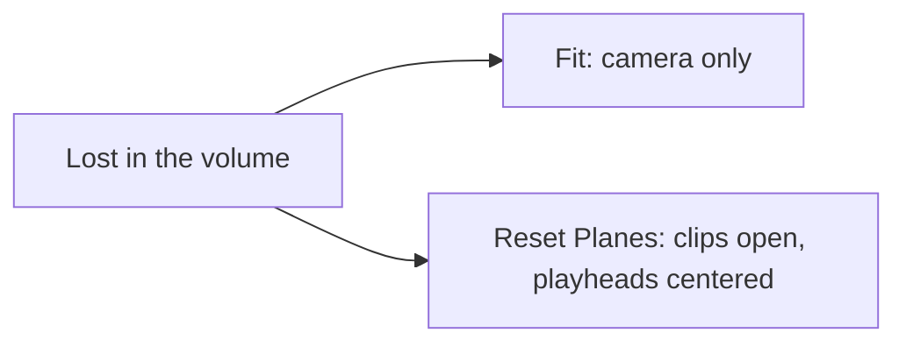

## Source

| Control | Meaning |
|---------|---------|
| Source | **Game of Life**, **Lighter Ignition**, **Brain MRI Low**, **Brain MRI High**, **Load NumPy** (ids `conway` / `ignition` / `mni152-low` / `mni152`; `npy` is a picker action, not a lasting kind). Game of Life shows kind, blurb, and **Play**. Pattern, Speed, seed, grid, and Edit live under **Setup**. After a successful load, **Own cube** appears in the list. Drag-and-drop onto the volume always works. Streamer stays hidden. Each example has a one-line blurb. **About Data** sits on the Source fold. **Guide** (desktop button right of the brand chip) is Look; arrows point at the step. Door: `?src=ignition` / `?src=mni152-low` (`brain`) / `?src=mni152` (High) / `?src=conway` (allow-list; aliases `lighter`, `brain`). Quality Low/Medium/High is the renderer, not the MRI grid. |
| Play / Speed | Conway **Play** in the slim Source chrome. Generator **Speed** is under Setup. Not the View loop. |
| Loading | Short spinner on the Source fold and a canvas overlay while a source, pattern, grid, or cube is switching. |

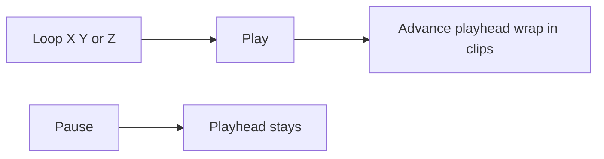

### Conway addon

| Control | Meaning |
|---------|---------|
| Pattern | BLITZ seeds; first control in Conway **Setup**. Gosper gun needs grid ≥ 48. **Random** shows a **Fill** slider (sparse ↔ dense). |
| Step | One generation (also pauses) |
| Edit | Paint cells on the focus plane (only at Now) |
| Reset | Same pattern and seed |
| Seed | New RNG seed, then reset |
| Grid | 16…64; rebuilds the world |
| Wrap | Torus vs hard edges |
| Stop when stable | Pause into Inspect after 5 generations in a short cycle (period 1–15): stills and oscillators. Wrapping gliders keep running. A glider on a hard edge dies, then the empty board pauses — leave Wrap on. Default on. |

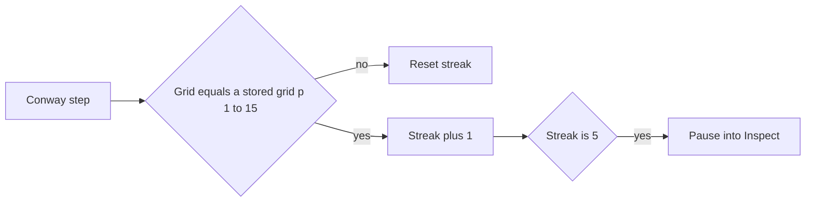

### Count stack (EVT)

Curated demos **Lighter Ignition**, **Brain MRI Low**, and **Brain MRI High**
are Source options. Low is a 2× mean bin (~3 MB); High is native grid
(~23 MB). Visitor aliases `brain` / `mri` open Low.
Load a `(T × H × W)` `.npy` count cube from **Source → Load NumPy** or
drop it onto the volume. A header-first gate shows shape, dtype, payload,
and cell count. About **500k** occupied-scale cells is the comfort cap
(warn; reduce or analyze in BLITZ). Optional 2/4/8 binning skips an axis
shorter than the factor (one Z plane still bins X/Y), uses **mean**
(downsample) or **max** (keep peaks), and a **Plasma** preview of the
first output plane. A taller-than-wide plane rotates 90° first, then
scales to the dialog width. Confirming **Load** raises **Cube cap** to
drawn instances (dense **hull**, sparse occupied cells) when that is
above the current setting. Game of Life Play keeps 200 000; Pause fits
the tape.
Curated demos skip the gate.
The WOLKE **Stream** / Connect chrome stays later (hidden; no sidecar on
Pages). See [`backlog.md`](../backlog.md). Visitor copy:
[`docs/welcome.md`](welcome.md).

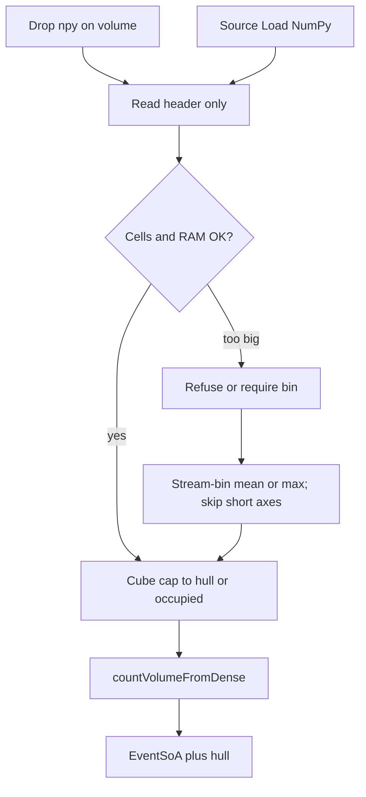

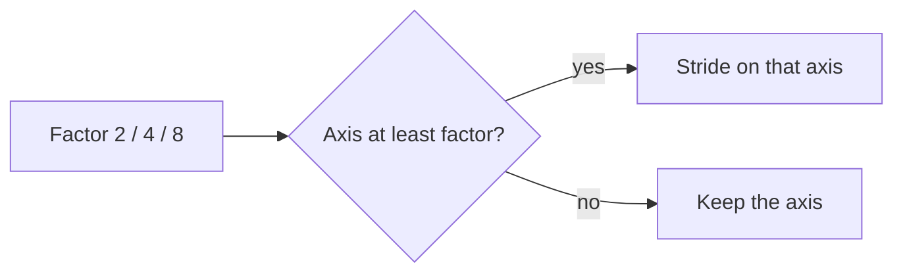

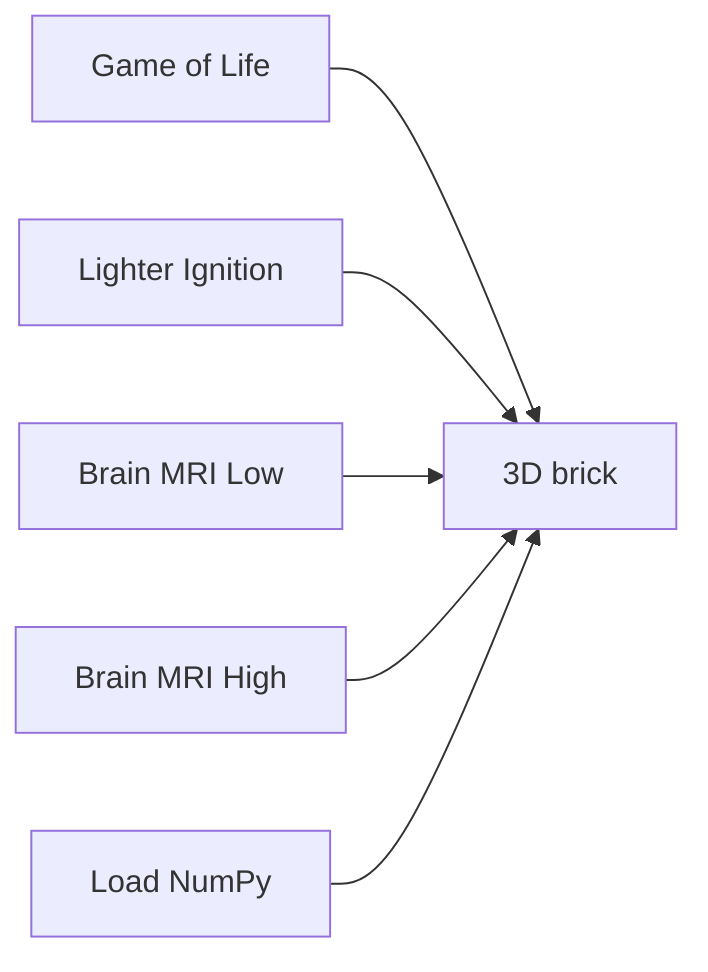

Count stacks open in Inspect (the recording is already complete). **Play**
walks the marked loop axis (default Z) from oldest to Now and wraps
inside the inspect clips. Color maps the **Min/Max** window onto **Scale**
(default DONNER: window-low = cyan … window-high = coral). Trim 1% on
load clips outliers. **Hide** drops cubes below a value (dense hull
rebuilds). Empty pixels (count 0) are not cubes.

## Color coding (View)

Color and cube fill are display. Conway supplies still / osc / unsettled /
base (Moving remains a LUT slot when Color coding is off). A count stack
supplies a color window onto **Scale** (DONNER / Gray / Inferno / Plasma /
Turbo). **Hide** is occupancy, not the window. Size stays Gap / Cube cap.
Polarity is later. Source stats stay in **Source**.

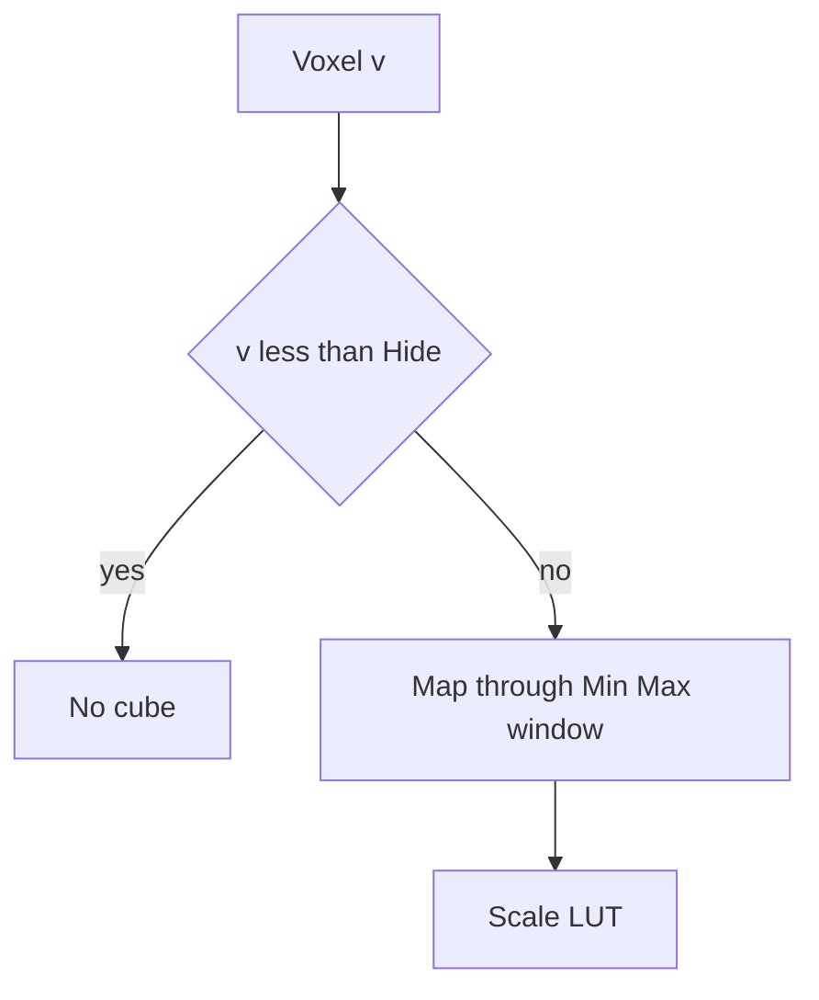

| Control | Meaning |
|---------|---------|
| Color coding | On: occupancy class colors. Off: one occupancy color. Conway only. |
| Scale | Count / MNI palette. DONNER is cyan → gold → coral. Gray / Inferno / Plasma / Turbo are the usual scientific palettes. |
| Min / Max | Color window. Values at the ends saturate. Legend ticks show dataset min/max; the middle label is this window. |
| Trim | 0% = strict dataset min/max. 1% (default) / 2% clip both tails of positive `v` once at load. Manual Min/Max sets Custom. |
| Hide | Drop cubes with `v` below this value (`0` = off). Dense bricks rebuild the hull so the surface shrinks; sparse clouds skip those cubes. Not an ingest cap. |
| Stability | Conway **Size by age**. Off: equal cubes. On: **Start** fill at age 0, **Tail** gens along Z to full size. Hidden for MNI / count. |

The **axis-colored frames** are the three slice planes (X `#5b8cff`, Y
`#e8c547`, Z `#3ecf8e`). Inspect also draws **clip rings** on all three
axes at the AABB cuts. Playhead rings sit slightly inside the box; clips
sit further in so they do not share a side with a playhead. Playhead bars are thicker
and brighter than clips. A clip on the playhead index is hidden. Hover a
**frame edge** (about 28 px rim, **move** cursor) to light that whole ring
and drag it along the axis in screen space; the fill is not a hit target. Three
HUD rails stay as a dimmer second path (max at the top of Z). **Hide
center** hides playhead frames and the slice grid; **Hide outer** hides
clip / bound frames. Both live under the viewcube on desktop (AR: **More**). Default is
both visible. A viewcube cut still shows the
current plane. Crop is
the intersection of the three clip windows. **Hull** (default) draws the
outer hull solid; grab a **playhead** edge (or the rail) to peek the cut
through a glass hull — same for Ignition and MRI. Grab a **clip**
edge and the volume stays hull so you can stake the crop. **Loop** in Hull
grows a potato: hull from the axis origin through the playhead, current
plane as the cut, +side and clip edges hidden. In a viewcube cut that
potato is **glass** so the slice stays readable and thickness shimmers.
**Ghost** is
the glass hull plus the **highlighted** plane (Loop X/Y/Z or grab a frame
picks that plane). Scrubbing that plane keeps the glass mesh; only the
solid cut is rebuilt. In a cut the silhouette stays the full brick.
**Cuts** is three orthogonal
slices only, no hull (one plane in a viewcube cut). Shade lives on the Look strip. **Decay** is off
(later / opt-in Z/time fade on sparse stacks). The CAD viewcube (desktop,
above the Look strip) enters a
fitted 2D cut; shade still chooses glass potato, full silhouette, or
slice only. Wheel zooms, right-drag pans, Shift+wheel pages and the
camera tracks the playhead; the **same face** pages the stack; a click on
the cut does nothing; **B** leaves the cut (not the same as Parallax off
in 3D). Zoom and pan stay in the cut.

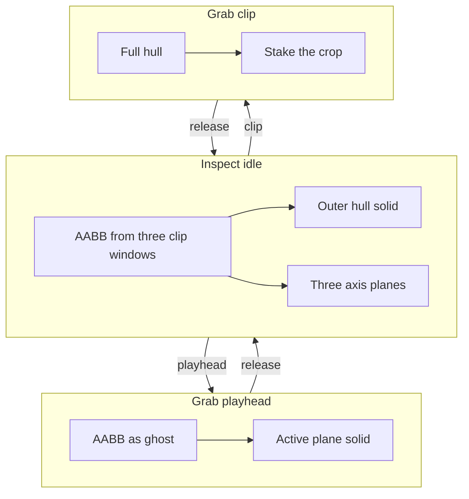

Live: slices newer than the focus sit **above**
the plane, translucent.

**Parallax** off is orthographic at the current look (no vanishing point)
and still shows the slab. Click a **face** of the viewcube (desktop; hover
lights the frame) to enter a 2D **cut** on that axis: ortho, that plane's
frame and cell grid, shade as in 3D (glass potato / full silhouette /
slice only). Wheel zooms, Shift+wheel pages the stack and the camera
tracks. A click on the cut does nothing. **B** leaves the cut; zoom and
pan stay until you leave.

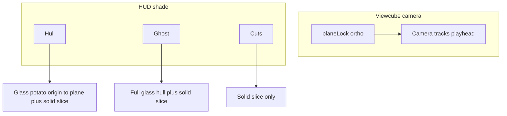

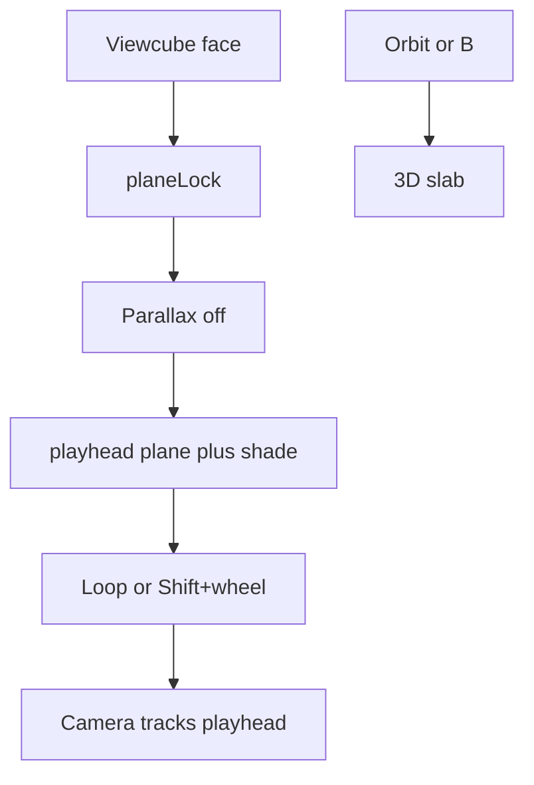

Worldline **isolation** is
deferred (later: rectangle select). Edit stays on the Z playfield at Now.

Inspect **Z slab** (3D-slicer):

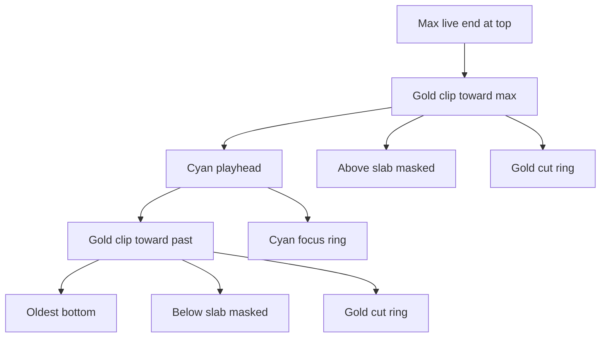

Inspect **X/Y slab** (same gold grips):

```mermaid
flowchart TB
  cyan[Cyan playhead]
  sparse[Sparse: ghost toward gold]
  dense[Dense count: same as Z]
  gone[Gold grips: not drawn]
  cyan --> sparse --> gone
  cyan --> dense --> gone
```

On narrow viewports **Source ▸** and **View ▸** are separate folds (same
IA as desktop). Conway **Play** sits next to **AR**; **Loop** stays under
the slice rails. Play collapses the Source sheet. The same fold sheets apply in landscape on a phone
(coarse pointer, short viewport) so Source does not jump into a third
layout. The Z stack is a bottom timeline. Look shortcuts (Hull / Ghost / Cuts / Fit)
sit top-right. FPS is a chip on that Look strip (no cube); tap it for the spark / DEV Bench card. Conway GEN /
LIVE / RATE appear only while Conway Play is on. Conway **Pattern** lives
under **Setup** in Source; **Random** shows **Fill**. While a sheet is open the stack hides so the
picker is not covered.

```mermaid
flowchart LR
  subgraph toggles [Viewcube]
    hc[Hide center]
    ho[Hide outer]
  end
  hc -->|hides| playhead[Playhead frames and slice grid]
  ho -->|hides| clips[Clip / bound frames]
  playhead -.->|viewcube cut still shows| cut[Current plane]
```

## HUD (right rail)

Desktop: Look strip under the viewcube (Hull / Ghost / Cuts, Fit, then Hide
center / Hide outer), then a thin Z stack to the right. Play /
Loop, Speed, and loop axis sit under the rails, above the footer. Conway
live stats (GEN / LIVE / RATE) pop in only while Conway Play is on.
FPS is a small overlay on the viewcube. Sparkline, FPS/AVG/1%, and DEV Bench
open as a card next to the cube (not in the View sheet). Display is cyan.
Phone: Look strip top-right (no viewcube). FPS chip still there; Guide hidden.

| Line | Block |
|------|-------|
| sparkline | Display — recent frame times (60 fps reference line) |
| FPS / AVG / 1% / 0.1% / FR | Display — instant, rolling average, slowest-percent FPS, frame time |
| INST | Display — instanced cubes (`trunc` if SoA capped) |
| FOC | Display — playhead generation (also beside the Z-stack handle) |
| PLAY / PAUSE | Display |
| ORTHO | Display — parallax off |
| GEN | Conway live overlay — simulation head (only while Play) |
| LIVE | Conway live overlay — live cells on the focus slice |
| RATE | Conway live overlay — generations/s while playing |
| EDIT | Conway live overlay — present in edit mode |

**Slice stack:** three rails — max at the top of Z, a tick per stored
step, label beside the handle. Desktop: max at the top. Phone: three
tracks, max at the right. Wheel over a rail (or Shift+wheel on the canvas)
scrubs the **active** inspect axis. **Play** on a volume walks the
**loop** axis (Source X/Y/Z), which can differ from the viewcube.

If INST hits the cap (`trunc`), live: lower Depth or Grid; inspect: the
tape is denser than the Cube cap envelope (newest slices kept). RATE is
not frame rate. FPS, 1%/0.1% lows, and the sparkline are wall-clock
frame times; they are not clamped to 10. **1%** / **0.1%** are the mean
FPS of the slowest 1% / 0.1% of the last ~1000 frames — hitch, not AVG.

## Visual mapping

**Geometry** is time (**Z**). **Color** is dynamics along each `(x, y)` worldline,
not a second clock. An oscillator does **not** cycle hue along Z; it
cycles **occupancy** (cubes present / absent). Mixing extra hues would
fight the class colors.

| Kind | Color | Typical Conway |
|------|-------|----------------|
| Still | gold | block, beehive, blinker core (always on) — activity stays put |
| Oscillator | cyan | blinker tips, toad, beacon, longer-period occupancy — **only when live**, in place |
| Moving | BLITZ coral | LUT slot when Color coding is off; occupancy no longer tags translating ships |
| Unsettled | violet | soup, births/deaths that are not yet still or periodic |
| Base | gray | gens 0–1, and the first cube of each `(x, y)` worldline |

```mermaid
flowchart TD
  live[Live cell at t]
  live --> wu{t less than 2 or first live on this xy}
  wu -->|yes| base[Base gray]
  wu -->|no| prev{Live at t-1}
  prev -->|yes| still[Still gold]
  prev -->|no| per{Occupancy period 2 to 15}
  per -->|yes| osc[Oscillator cyan]
  per -->|no| unset[Unsettled violet]
```

Default pattern is **R-pentomino**. Boot runs **12** generations, then
stays **paused** (Play grows further).
Teaching order if you switch seeds: Blinker → Toad/Beacon → Glider.
A glider reads as gold/cyan occupancy on the cells it crosses.

Decay is off (later / opt-in). When on it only darkens older **Z** slices;
it does not change hue or cube size.
**Size / fill** (Conway) reads stamped stability along Z. **Size by age**
on: **Start** is cube fill at age 0; **Tail** is gens along Z to full size.
Off: equal cubes. Count / MNI keep occupancy size; color maps the
Min/Max window onto Scale. Hide drops low-value cubes. Size sliders do not rebuild the tape.

Moving and Unsettled stay at Start. Base cubes
stay full size so the first slices are not a false “shrink”.

These classes fill the Conway demonstrator. A
count stack uses a different LUT: **Scale** plus a Min/Max window
(DONNER / Gray / Inferno / Plasma / Turbo). Polarity (and occupancy / states) will not reuse
still/osc/unsettled.

The gold **frame** is the playfield edge. The cell lattice sits on the
**active** cyan plane.

## Later

- **Public host (Phase 2, shipped):** Live at
  [`https://donner.mess.engineering/`](https://donner.mess.engineering/).
  Do not start Dataset Contract or a PointRenderer on that host.
- **Source off the rail:** later, the Source fold leaves the viewer chrome;
  generator is its own surface.
- **Thin View:** teaching View keeps Parallax / Align to Z / Quality / Gap / Depth (and maybe
  cache). Dense Encoding can still slim further.
- **Isolation later:** rectangle select on the playfield (not cube double-click). AR poke already isolates the standing plane. Numbered axes with units come back later; the overlay is off.
- Polarity / occupancy / states encodings (count rungs are in)
- NPZ, packed WOLKE selection / `viewer_index`, BLITZ widget sync, in-browser EVT3
- **Streamer later:** WOLKE Connect stays hidden (no sidecar on Pages). Load NumPy / drop `.npy` + header gate is in.
- **MRI / scalar volume later.** Dense count `.npy` (occupancy > 15 %)
  already opens a mid-volume slab with enclosed voxels hidden. Dedicated
  kind + `ScalarVolume` wait on the Dataset Contract. Do not embed
  NiiVue. Volume texture / raymarch later if that slab is not enough.
  See [`architecture.md`](../architecture.md#mri-volume-later).
- **XR-A is in** (phone ceiling): WebXR `immersive-ar` passthrough.
  Enter AR shows no brick. Floor hit-test starts immediately (gold
  reticle on a horizontal floor plane; tap to spawn). **Reset Anchor**
  despawns and returns to search. No auto-lock, no timeout, no
  viewer-front preview. The brick sits on the plane; **Size** scales;
  **Yaw** turns around the standing axis. Table footprint maps to
  40 cm; **Play** grows up from the floor. **Floor** X / Y / Z picks which product axis grows out of the
  plane. Phone chrome after spawn is three inspect rails, Conway
  Play next to AR, Hull / Ghost / Cuts top-right, **More** (Loop, Hide,
  Reset Planes, Quality), Size,
  Yaw, Floor, Reset Anchor, Exit on `#xr-overlay`. **AR** only if
  `navigator.xr` supports
  it. Phone HTTPS is `https://lab.ole.icu/` (`start:lan` upstream);
  mkcert is fallback. After a Chrome update, check site **Augmented
  reality** (not blocked) and that the response has
  `Permissions-Policy: xr-spatial-tracking=(self), camera=(self)`. LAN HTML/JS/CSS
  are `Cache-Control: no-store`.
- **XR-C-0 is in:** Quest uses the same session but **without** `dom-overlay`
  and **without** the in-world Play/stand/Exit plate. Stick yaws; both grips
  pinch size. Grab a bounding frame to slide the volume in the room.
  Bounding frames stay on; poke a cube to isolate the
  standing plane. **URL door query is in** (`?src=` / `?quality=`). QR
  print, path `/ignition`, and AR-from-QR stay later. Do not start a points renderer
  in the same slice as further XR work.
- **Face is in:** the Face button is always visible when the camera
  exists. `?face=1` enters. Phone/webcam + MediaPipe, not WebXR. Ghost
  Brain MRI Low follows the head. **Selfie** toggles the user camera.
  After lock the overlay keeps oval + lips + pupils; if the mesh drops,
  keep the last pose until the face returns. No Recapture, no millimetre
  sliders, no Size, no XYZ rails in Face. World AR shows **Tap to place**
  when the gold reticle is visible. Occlusion mesh stays later. Quest is
  unchanged.
