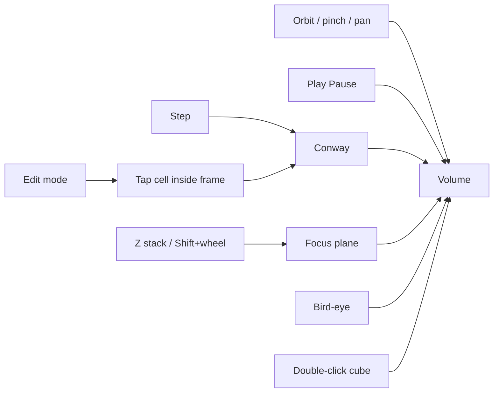
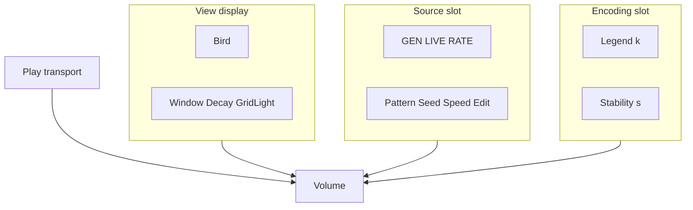
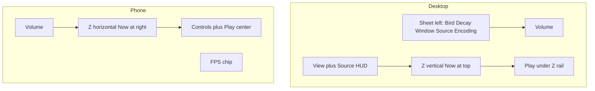

# DONNER UI

The 3D volume is the product. Chrome is a thin M.E.S.S. HUD: Orbitron for
brand and control labels, Inter for running text, dark `#0b0f14` field,
gold `#ffc53d` accent, cyan `#00fff2` for live telemetry. No dashboard
layout.

Play is a **display** transport: it advances the volume. It sits outside
the control sheet (desktop: under the Z rail; phone: bottom center).
While Conway is the source, the same button also steps the generator.

The left sheet is three blocks — **View** (always), **Source** (addon;
today Conway, including GEN/LIVE/RATE on the right HUD), **Encoding**
(how points look; Conway fills the legend and Stability). GEN does not
live in Encoding.

Isolation is not a sheet mode. Double-click a cube (double-tap on phone)
keeps that `(x, y)` worldline.

## Camera

| Input | Action |
|-------|--------|
| Drag / one-finger | Orbit |
| Wheel / pinch | Zoom |
| Right-drag / two-finger | Pan |
| Shift+wheel | Scrub focus into the past / back to now |
| **Z** stack | Scrub the generation stack. Desktop: right rail, Now at top, past at bottom. Phone: bottom timeline, Now at the right, past at the left. Wheel over it also steps. |
| Space | Play / pause |
| `E` | Edit mode (pauses, snaps focus to Now) |
| `B` | Bird-eye (orthographic top view) |
| Double-click cube | Isolate that `(x, y)` worldline (toggle). Phone: double-tap. |
| Escape | Leave isolation, or leave bird-eye |
| `.` or `N` | Simulation step |
| `[` / `↓` | Focus one generation into the past |
| `]` / `↑` | Focus toward Now |
| Home | Focus Now |
| `R` | Reset |

## Display (DONNER)

| Control | Meaning |
|---------|---------|
| Play / Pause | Advance the volume. Outside the sheet. With Conway as source, this also steps the generator. |
| Bird | Orthographic top-down onto the **focus slice** only; pan / pinch |
| Decay | Fade of slices **below** the focus plane |
| Grid light | Brightness of the cell grid and focus-plane fill |
| Window | Instantiated time span from the simulation head (8–96). Not a Life log. |
| **Z stack** | Playhead. Thin tick rail. **Now** snaps to the head. Time sits beside the handle. Desktop: vertical, Now at top. Phone: horizontal, Now at the right. |

## Source (Conway addon)

| Control | Meaning |
|---------|---------|
| Step | One generation (also pauses) |
| Edit | Paint cells on the focus plane (only at Now) |
| Reset | Same pattern and seed |
| Seed | New RNG seed, then reset |
| Pattern | BLITZ seeds; Gosper gun needs grid ≥ 48 |
| Speed | Target generations per second (1–60) |
| Grid | 16…64; rebuilds the world |
| Wrap | Torus vs hard edges |

## Encoding (slot; Conway fills it)

Color and cube fill are display slots. Conway currently supplies still /
osc / transit / warmup and Stability **None / Time / Focus**. An event
source will supply a different LUT (polarity) and may drop these fill
modes. The sheet **Encoding** block is that slot; GEN / LIVE / RATE stay
in **Source**.

| Control | Meaning |
|---------|---------|
| Stability | **None** — equal cube size (occupancy). **Time** (default) — fill = stability already reached at that generation. **Focus** — fill = stability on the focus plane, whole column. Hover the control for details. |

The gold **frame** is the playfield edge. Numbered **X/Y** sit on the
**right**. Time is the **Z stack slider** beside the HUD (Now at the top),
not a 3D gizmo. Hovering the plane draws two thin lines to X and Y,
a gold square on the cell, and a pale cage around the cube on that
slice when the cell is live. Slices newer than the focus sit **above**
the plane, translucent.

**Bird** looks straight down with an orthographic camera (no parallax).
**Isolation** dims every cell except one worldline: double-click (phone:
double-tap) a **visible cube**, not an empty cell. The same cube again or
Escape clears. Edit is unchanged: pause, plane at Now (Z stack at Now, or
Home), tap inside the frame.

On narrow viewports the control sheet is behind **Controls ▸**, Play sits
bottom-center, the Z stack is a bottom timeline, and telemetry collapses
to an **FPS chip** (tap to open the View card). Source GEN / LIVE / RATE
stay in the Source sheet.

## HUD (right rail)

Desktop: two cards, then a thin Z stack to their right, Play under the
stack. Display is cyan; source is muted. Phone: FPS chip top-right; tap
to expand the View card. Source stats live in the Source sheet.

| Line | Block |
|------|-------|
| sparkline | Display — recent frame times (60 fps reference line) |
| FPS / AVG / FR | Display — instant, rolling average, frame time |
| INST | Display — instanced cubes (`trunc` if SoA capped) |
| FOC | Display — playhead generation (also beside the Z-stack handle) |
| PLAY / PAUSE | Display |
| BIRD / ISO | Display — view state |
| GEN | Source — simulation head |
| LIVE | Source — live cells on the focus slice |
| RATE | Source — measured generation rate while playing |
| EDIT | Source — present in edit mode |

**Z stack:** thin rail — **Now**, a tick per stored step, generation
beside the handle. Desktop: Now at the top, deepest past at the bottom.
Phone: Now at the right, past at the left. Wheel over the stack (or
Shift+wheel on the canvas) still scrubs.

If INST hits the cap, lower Window or Grid before judging FPS. RATE is
not frame rate. FPS and the sparkline are wall-clock frame times; they
are not clamped to 10.

## Visual mapping

**Geometry** is time (**Z**). **Color** is dynamics along each `(x, y)` worldline,
not a second clock. An oscillator does **not** cycle hue along Z; it
cycles **occupancy** (cubes present / absent). Mixing extra hues would
fight the class colors.

| Kind | Color | Typical Conway |
|------|-------|----------------|
| Still | gold | block, beehive, blinker core (always on) — activity stays put |
| Oscillator | cyan | blinker tips, toad, beacon — **only when live**, in place |
| Transit | BLITZ coral | glider tube, births/deaths, soup — the space-time **curve** |
| Warmup | gray | generations 0 and 1 — too little history to class |

Default pattern is **Blinker**. Teaching order: Blinker → Toad/Beacon →
Glider. A glider must read as a coral trail, not mixed cyan/gold: those
classes mean the pattern sat still. Cyan on a glider was a false friend
(the ship crawling over the same cell).

Decay only darkens older slices; it does not change hue or cube size.
**Size / fill** depends on **Stability**:

- **None** — every live cell the same size (truth view for occupancy)
- **Time** (default) — duration already reached at that generation (taper)
- **Focus** — duration on the focus plane, whole `(x, y)` column

Cap is 16 generations. Transit stays smaller in Time/Focus. Warmup cubes
stay full size so the first slices are not a false “shrink”.

These classes fill the **encoding slot** for the Conway demonstrator. The
later live path is event-camera data; polarity (and other encodings) will
not reuse this still/osc/transit legend by default.

The gold **frame** is the playfield edge. **Grid light** sets how bright the
cell lattice is.

## Later

- Event-camera source behind the same `EventSoA`; polarity encoding (not still/osc/transit)
- Optional 1%/0.1% FPS lows on the display sparkline
- WebXR, BLITZ sync, in-browser EVT3
