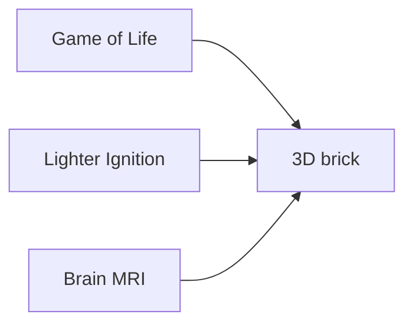
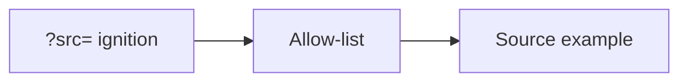

# Welcome to DONNER

DONNER is a browser 3D/XR explorer for structured data in the **WETTER**
suite. Open the page, drag to orbit the brick. You do not need GitHub
to use it.

It is **not** a medical device. It is **not** a Game of Life product —
Life is the generator example so the renderer has something to draw.

## Examples

Pick **Source** on the left (phone: the Source fold).

- **Game of Life** — a generator. Each cube is a living cell. **Z** is
  generations. The example starts paused. **Play** grows the stack.
  **Loop** (under the rails) walks a cut of that tape.
- **Lighter Ignition** — event-camera **counts** of a lighter strike.
  Sparse XY; **Z** is time. **Loop** scrubs the recording. ~4 MB download.
- **Brain MRI** — example T1 atlas (ICBM 152). All three axes are space.
  **Loop** walks a cut. Not a patient scan. ~23 MB download.

No other demos ship in this preview. Live file/stream ingest stays later.
Further example cubes should stay **sparse** (lots of zeros, like Lighter
Ignition ~3 % occupancy). Dense bricks like Brain MRI are the expensive
case — keep those rare.

## Share URL

The address bar follows the example (allow-list only, no file paths):

- `?src=conway` — Game of Life (default; may be omitted)
- `?src=ignition` or `?src=lighter`
- `?src=mni152` or `?src=brain`
- `?quality=medium` (default; omitted) · `high` · `low`

Example: `?src=ignition&quality=high`

## Look (desktop first)

- Drag to orbit, scroll to zoom, right-drag to pan.
- **View** is look, color, and **Quality**. Starts at **Medium**. Choppy
  on a laptop iGPU? Quality → **Low**. Discrete GPU? **High**.
- **Hull / Ghost / Cuts**. Grab a colored frame edge to peek a plane.
- Game of Life **Play** is the generator. **Loop** is the playhead.

Phone: one-finger orbit, pinch zoom; plane sliders instead of frame grab.

## Credit

App: GPL-3.0. Brain MRI derived from ICBM 152 Nonlinear 2009 (McGill)
via NiiVue demo images (BSD-2-Clause). Lighter Ignition is an author
recording. Full text: [`data/NOTICE.md`](../data/NOTICE.md).
