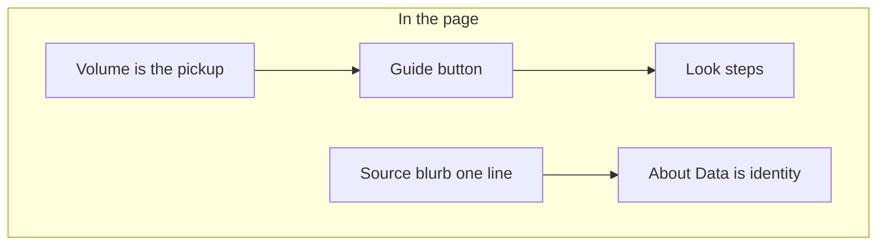
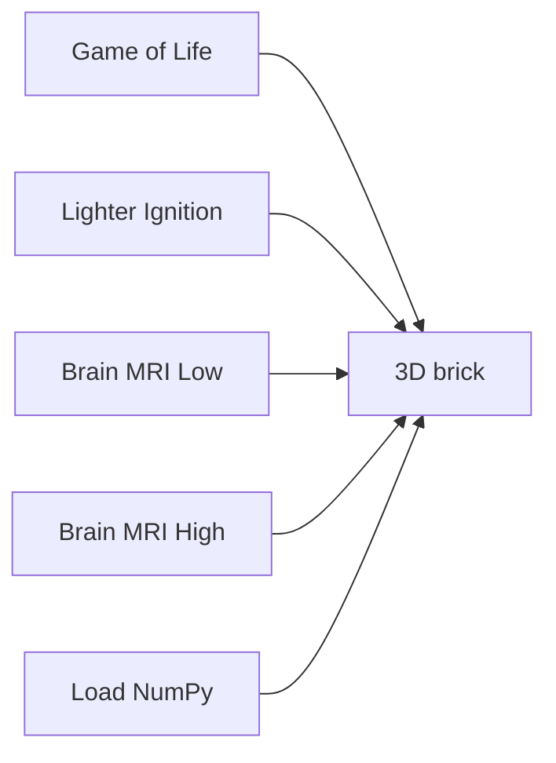
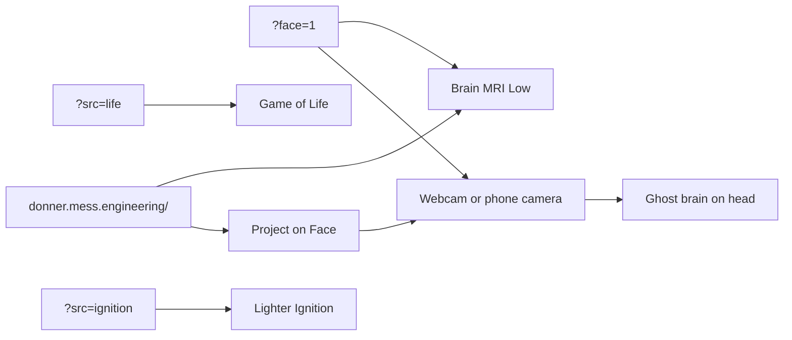
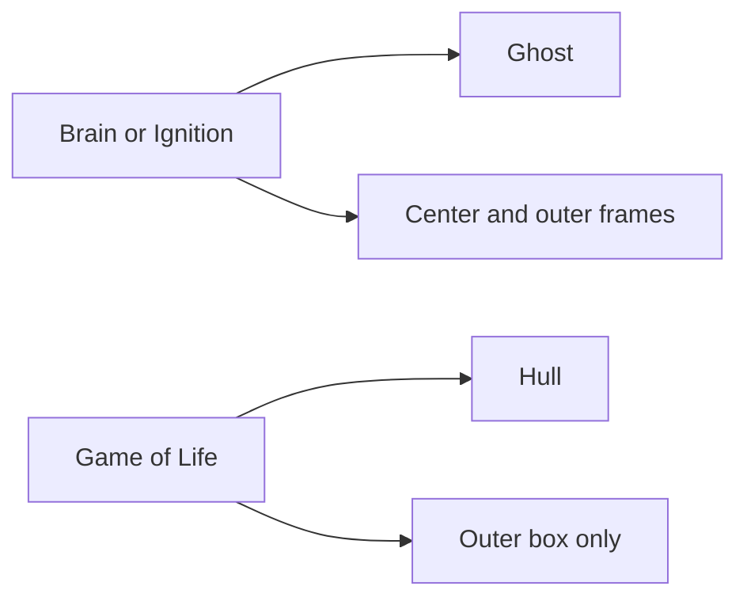

# Welcome to DONNER

DONNER is a browser 3D/XR explorer for structured data in the **WETTER**
suite. Open the page, drag to orbit the brick. On desktop, **Guide** sits to the
right of the brand chip: an opt-in Look walkthrough with arrows on the
controls. Source and View unfold while it runs. **About Data** (Source
fold, next to the heading) and footer **About** are identity: examples,
share URL, credit. You do not need GitHub to use it.

It is **not** a medical device. It is **not** a Game of Life product —
Life is the generator example so the renderer has something to draw.

## Guide

Seven steps. Desktop only (hidden on a phone). The button does not start
the walkthrough on its own. Clicking **Guide** expands Source and View
and draws gold arrows at the controls.

1. **Orbit** — Drag to orbit, scroll to zoom, right-drag to pan. Phone:
   one-finger orbit, pinch zoom.
2. **Source** — Pick **Source** on the left (phone: the Source fold):
   Game of Life, Lighter Ignition, or Brain MRI Low / High. Game of Life keeps
   **Play** here; Pattern and grid sit under **Setup**.
3. **Play vs Loop** — Game of Life **Play** grows the stack. **Loop**,
   under the rails, walks a cut of that tape. Ignition and Brain MRI
   Low / High scrub with Loop.
4. **Rails** — Colored X / Y / Z playheads. Grab a matching frame edge
   in the volume. Loop axis sits under the rails.
5. **Viewcube** — Face-click for an ortho cut. **Hide center** /
   **Hide outer**. Brain starts with both frames on. Phone uses the rails;
   the cube is desktop-only.
6. **Inspect** — Hull / Ghost / Cuts. Grab a colored frame edge to peek.
7. **Look** — Quality (starts at Medium), Parallax, Fit, Reset Planes.

The one-line Source blurb still changes with the example. View keeps the
short orbit line; Inspect keeps the short rail hint.

## Examples

Pick **Source** on the left (phone: the Source fold).

- **Game of Life** — a generator. Each cube is a living cell. **Z** is
  generations. Boot runs 12 generations, then stays paused so the brick
  has depth. **Play** grows the stack further.
  **Loop** (under the rails) walks a cut of that tape. Starts in **Hull**,
  with Hide center on and the outer box kept so the playfield reads.
  Share as `?src=life`.
- **Lighter Ignition** — event-camera **counts** of a lighter strike.
  Sparse XY; **Z** is time. **Loop** scrubs the recording. ~4 MB download.
  Starts in **Ghost**. First door for event-camera visitors: `?src=ignition`.
- **Brain MRI Low** — example T1 atlas (ICBM 152), 2× mean-binned.
  All three axes are space. **Loop** walks a cut. Not a patient scan.
  ~3 MB download. **Visitor default** (bare URL). Starts in **Ghost** with
  center and outer frames on.
  **Project on Face** hangs this overlay on the laptop webcam or a phone camera.
- **Brain MRI High** — the same atlas at native grid. ~23 MB download.
  Starts in **Ghost**.

Load a `(T × H × W)` `.npy` count cube from Source → **Load NumPy**, or
drop the file onto the volume from any source. The gate shows shape,
dtype, payload, and cell count. About 500k cells is the comfort cap —
reduce, or analyze in BLITZ. Binning skips a short axis (one Z plane still
bins X/Y). Mean downsamples; max keeps peaks. The gate shows a Plasma
preview of the first output plane. A taller-than-wide plane rotates 90°
first, then scales to the dialog width. Confirming Load raises Cube cap
to drawn instances (dense hull, sparse occupied cells) when that is
higher. Game of Life Play keeps the 200 000 default; Pause
raises Cube cap to the tape so a long run is not truncated. Streamer / sidecar Connect is not on this static host.

Further example cubes should stay **sparse** (lots of zeros, like Lighter
Ignition ~3 % occupancy). Dense bricks like Brain MRI High are the expensive
case; Brain MRI Low is the visitor default.

## Share URL

The address bar follows the example (allow-list only, no file paths).
Bare URL is Brain MRI Low.

- Bare URL or `?src=brain` / `?src=mri` — Brain MRI Low (visitor default)
- `?src=life` or `?src=conway` / `?src=gol` — Game of Life
- `?src=ignition` or `?src=lighter` — Lighter Ignition
- `?src=mni152` or `?src=mri-high` — Brain MRI High
- `?face=1` — enter Face (Brain Ghost on the camera). Lab millimetre
  fit is still parsed from old links; it is not written back.
- `?quality=medium` (default; omitted) · `high` · `low`

Example: `?src=ignition&quality=high`

## Credit

App: GPL-3.0. Brain MRI derived from ICBM 152 Nonlinear 2009 (McGill)
via NiiVue demo images (BSD-2-Clause). Lighter Ignition is an author
recording. Full text: [`data/NOTICE.md`](../data/NOTICE.md).
