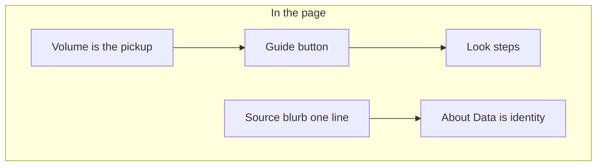
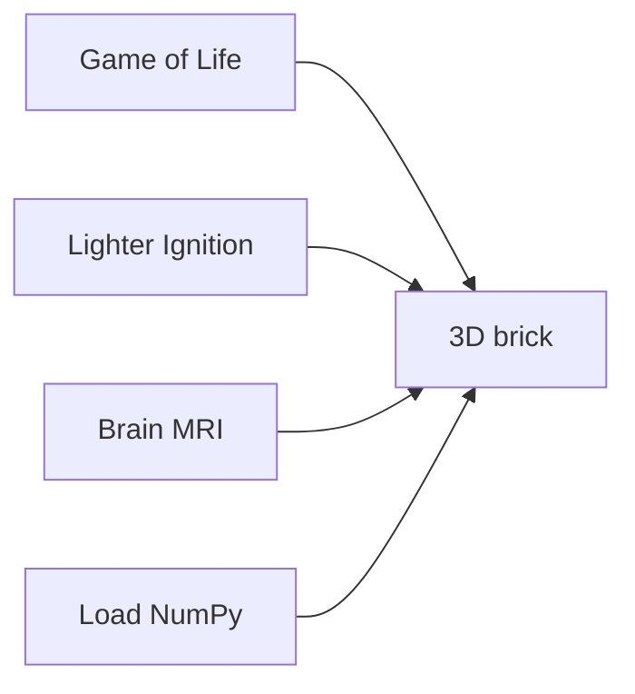
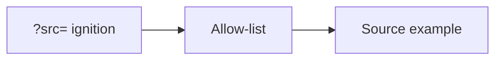

# Welcome to DONNER

DONNER is a browser 3D/XR explorer for structured data in the **WETTER**
suite. Open the page, drag to orbit the brick. **Guide** sits to the
right of the brand chip: an opt-in Look walkthrough with arrows on the
controls. Source and View unfold while it runs. **About Data** (Source
fold, next to the heading) and footer **About** are identity: examples,
share URL, credit. You do not need GitHub to use it.

It is **not** a medical device. It is **not** a Game of Life product —
Life is the generator example so the renderer has something to draw.

## Guide

Seven steps. The button does not start the walkthrough on its own.
Clicking **Guide** expands Source and View (phone: the fold that holds
the current step) and draws gold arrows at the controls.

1. **Orbit** — Drag to orbit, scroll to zoom, right-drag to pan. Phone:
   one-finger orbit, pinch zoom.
2. **Source** — Pick **Source** on the left (phone: the Source fold):
   Game of Life, Lighter Ignition, or Brain MRI. Game of Life keeps
   **Play** here; Pattern and grid sit under **Setup**.
3. **Play vs Loop** — Game of Life **Play** grows the stack. **Loop**,
   under the rails, walks a cut of that tape. Ignition and Brain MRI
   scrub with Loop.
4. **Rails** — Colored X / Y / Z playheads. Grab a matching frame edge
   in the volume. Loop axis sits under the rails.
5. **Viewcube** — Face-click for an ortho cut. **Hide center** /
   **Hide outer**. Phone uses the rails; the cube is desktop-only.
6. **Inspect** — Hull / Ghost / Cuts. Grab a colored frame edge to peek.
7. **Look** — Quality (starts at Medium), Parallax, Fit, Reset Planes.

The one-line Source blurb still changes with the example. View keeps the
short orbit line; Inspect keeps the short rail hint.

## Examples

Pick **Source** on the left (phone: the Source fold).

- **Game of Life** — a generator. Each cube is a living cell. **Z** is
  generations. Boot runs 12 generations, then stays paused so the brick
  has depth. **Play** grows the stack further.
  **Loop** (under the rails) walks a cut of that tape.
- **Lighter Ignition** — event-camera **counts** of a lighter strike.
  Sparse XY; **Z** is time. **Loop** scrubs the recording. ~4 MB download.
- **Brain MRI** — example T1 atlas (ICBM 152). All three axes are space.
  **Loop** walks a cut. Not a patient scan. ~23 MB download.

Load a `(T × H × W)` `.npy` count cube from Source → **Load NumPy**, or
drop the file onto the volume from any source. The gate shows shape,
dtype, payload, and cell count. About 500k cells is the comfort cap —
reduce, or analyze in BLITZ. Binning skips a short axis (one Z plane still
bins X/Y). Mean downsamples; max keeps peaks. The gate shows a Plasma
preview of the first output plane, scaled to the dialog width. Streamer / sidecar Connect is not on this static host.

Further example cubes should stay **sparse** (lots of zeros, like Lighter
Ignition ~3 % occupancy). Dense bricks like Brain MRI are the expensive
case — keep those rare.

## Share URL

The address bar follows the example (allow-list only, no file paths):

- `?src=conway` — Game of Life (default; may be omitted)
- `?src=ignition` or `?src=lighter`
- `?src=mni152` or `?src=brain`
- `?quality=medium` (default; omitted) · `high` · `low`

Example: `?src=ignition&quality=high`

## Credit

App: GPL-3.0. Brain MRI derived from ICBM 152 Nonlinear 2009 (McGill)
via NiiVue demo images (BSD-2-Clause). Lighter Ignition is an author
recording. Full text: [`data/NOTICE.md`](../data/NOTICE.md).
